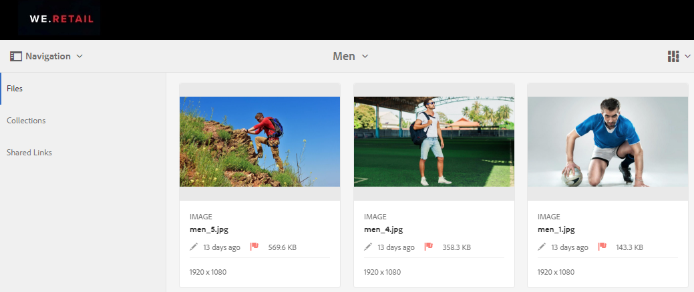
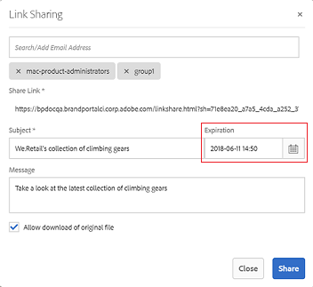
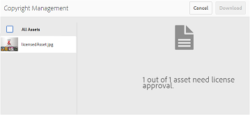
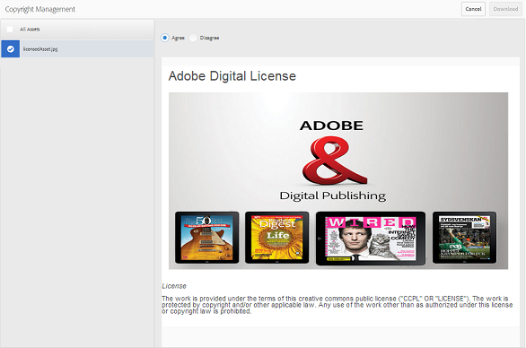
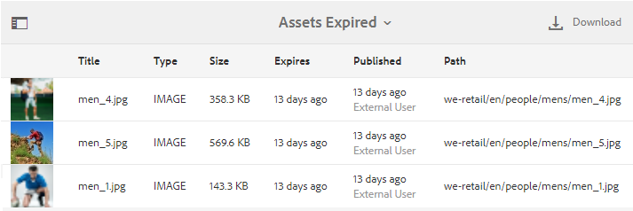

# Gestion des droits numériques des ressources {#manage-digital-rights-of-assets}

La sécurisation de la distribution et de l’utilisation des ressources créatives et des documents de marque est essentielle pour protéger votre marque. Ce processus peut être appliqué en associant une date (et une heure) d’expiration aux ressources approuvées publiées d’AEM vers Brand Portal, ou en attribuant une licence pour l’utilisation conditionnelle de ces ressources. En outre, Brand Portal vous permet de spécifier une date d’expiration pour les liens vers les ressources partagées à partir de Brand Portal.

Lisez la suite pour savoir comment les ressources sont sécurisées sur Brand Portal et comprendre les autorisations d’utilisation associées.

## Expiration de ressources {#asset-expiration}

L’expiration de ressources est une façon efficace de contrôler l’utilisation des ressources approuvées sur Brand Portal à travers une organisation. Toutes les ressources publiées à partir d’AEM Assets sur Brand Portal peuvent avoir une date d’expiration qui limite l’utilisation de ces ressources par différents rôles d’utilisateur.

### Autorisations d’utilisation liées aux ressources expirées {#usage-permissions-expired-assets}

Dans Brand Portal, les administrateurs peuvent afficher, télécharger et ajouter des ressources expirées aux collections. Toutefois, les éditeurs et les observateurs peuvent uniquement afficher et ajouter des ressources expirées aux collections.

Les administrateurs peuvent publier les ressources expirées sur Brand Portal à partir d’AEM Assets. Toutefois, les ressources expirées ne peuvent pas être partagées à l’aide d’un lien provenant de Brand Portal. Si vous sélectionnez une ressource expirée dans un dossier contenant à la fois des ressources expirées et non expirées, l’action **[!UICONTROL Partager le lien]** n’est pas disponible. En revanche, si vous sélectionnez un dossier contenant des ressources expirées et non expirées, les actions [!UICONTROL Partager] et **[!UICONTROL Partager le lien]** sont disponibles.

>[!NOTE]
>
>Un dossier peut toujours être partagé en tant que lien, même s’il contient des ressources expirées. Dans ce cas, le lien ne répertorie pas les ressources expirées et seules les ressources non expirées sont partagées.

Le tableau suivant montre les autorisations d’utilisation des ressources expirées :

|   | **[!UICONTROL Partager le lien]** | **[!UICONTROL Téléchargement]** | **[!UICONTROL Propriétés]** | **[!UICONTROL Ajouter à la collection]** | **[!UICONTROL Supprimer]** |
|---|---|---|---|---|---|
| **[!UICONTROL Administrateur]** | Non disponible | Disponible | Disponible | Disponible | Disponible |
| **[!UICONTROL Éditeur]** | Non disponible | Non disponible | Disponible | Disponible | Non disponible |
| **[!UICONTROL Observateur]** | Non disponible | Non disponible | Disponible | Disponible | Non disponible |
| **[!UICONTROL Utilisateur invité]** | Non disponible | Non disponible | Disponible | Disponible | Non disponible |

>[!NOTE]
>
>Si les observateurs et les éditeurs téléchargent un dossier contenant des ressources expirées et non expirées, seules les ressources non expirées sont téléchargées. Si un dossier contient seulement des ressources expirées, un dossier vide est téléchargé.

### État d’expiration des ressources {#expiration-status-of-assets}

Vous pouvez voir l’état d’expiration des ressources dans leur **[!UICONTROL mode Carte]**. Un indicateur rouge sur la carte indique que la ressource a expiré.

>[!NOTE]
>
>Les vues Liste et Colonnes n’affichent pas le statut d’expiration des ressources.

## Expiration des liens de ressources {#asset-link-expiration}

Lors du partage de ressources par le biais de liens, les administrateurs et les éditeurs peuvent définir une date et une heure d’expiration en utilisant le champ **[!UICONTROL Expiration]** dans la boîte de dialogue **[!UICONTROL Partage de lien]**. L’expiration par défaut d’un lien est de sept jours à compter de la date de partage du lien.

Cela garantit que les ressources partagées en tant que liens expirent à la date et à l’heure définies par les administrateurs et les éditeurs de Brand Portal. De plus, les ressources ne peuvent plus être affichées et téléchargées au-delà de la date d’expiration. Pour protéger vos ressources approuvées contre les utilisateurs externes, définissez une date d’expiration sur les liens partagés afin de vous assurer qu’ils ne sont pas exposés à des entités inconnues au-delà d’une heure spécifiée.

Pour plus d’informations sur le partage de lien, voir [Partage de ressources en tant que lien](../using/brand-portal-link-share.md).

## Ressources sous licence {#licensed-assets}

Les ressources sous licence sont sujettes à l’acceptation d’un accord de licence avant leur téléchargement à partir de Brand Portal. Ce contrat pour les ressources sous licence est conclu lorsque vous téléchargez directement la ressource à partir de Brand Portal ou au moyen d’un lien partagé. Qu’elles aient expiré ou non, tous les utilisateurs peuvent afficher les ressources protégées par une licence. Toutefois, le téléchargement et l’utilisation des ressources sous licence expirées sont limités. Pour en savoir plus sur le comportement des ressources sous licence expirées et sur les activités autorisées basées sur les rôles utilisateur, reportez-vous à la section [&#x200B; Autorisations d’utilisation des ressources expirées &#x200B;](../using/manage-digital-rights-of-assets.md#usage-permissions-expired-assets).

Les ressources protégées par une licence sont accompagnées d’un [contrat de licence](https://experienceleague.adobe.com/en/docs/experience-manager-65/content/assets/administer/drm), ce qui est fait en définissant la propriété des métadonnées de la ressource dans [!DNL Experience Manager Assets].

Une ressource est considérée comme protégée si elle contient l’une des propriétés de métadonnées suivantes (ou les deux) :

* `xmpRights:WebStatement` : cette propriété fait référence au chemin d’accès de la page qui contient le contrat de licence de la ressource. `xmpRights:WebStatement` doit être un chemin d’accès valide dans le référentiel.
* `adobe_dam:restrictions` : la valeur de cette propriété est un contenu HTML brut qui spécifie le contrat de licence.

Si vous choisissez de télécharger des ressources protégées par une licence, vous êtes redirigé vers la page **[!UICONTROL Gestion des droits d’auteur]** en fonction des propriétés des métadonnées.

| `adobe_dam:restrictions` | `xmpRights:WebStatement` | Gestion des droits d’auteur |
| --- | --- | --- |
| Oui | - | L’interface s’affiche à la fois dans Assets et dans Brand Portal. |
| - | Oui (chemin non valide) | Pas d’interface |
| Oui | Oui (chemin non valide) | Pas d’interface |
| Oui | Oui (chemin valide) | L’interface s’affiche dans Assets ou Brand Portal selon que le chemin d’accès est valide pour Assets ou Brand Portal (ou les deux). |

Ici, vous devez sélectionner la ressource à télécharger et accepter le contrat de licence associé. Si vous n’en acceptez pas les termes, le bouton **[!UICONTROL Télécharger]** est désactivé.

Si la sélection contient plusieurs ressources protégées, sélectionnez-en une à la fois, acceptez le contrat de licence et procédez au téléchargement de la ressource.

## Génération d’un rapport sur les ressources expirées {#generate-report-about-expired-assets}

Les administrateurs peuvent générer et télécharger un rapport répertoriant toutes les ressources expirées pendant une période spécifique. Ce rapport comprend des informations détaillées concernant les ressources expirées (ex. : taille, type, chemin d’accès dans la hiérarchie de ressources, et dates d’expiration et de publication). Les colonnes de ce rapport peuvent être personnalisées pour afficher plus de données selon les besoins des utilisateurs.

Pour plus d’informations sur la fonctionnalité des rapports, voir [&#x200B; Utilisation des rapports &#x200B;](../using/brand-portal-reports.md#work-with-reports).
