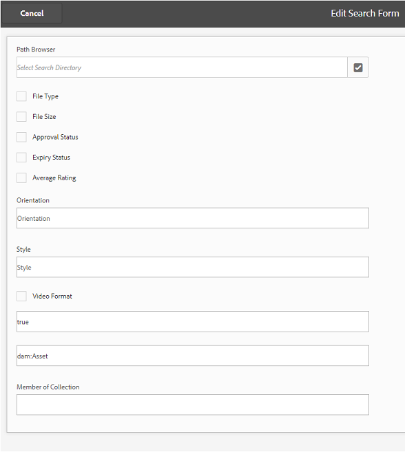
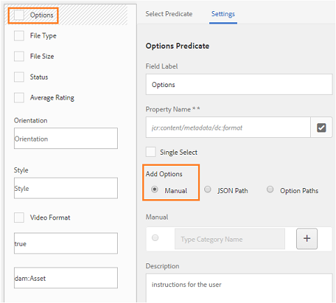

# Publication de paramètres prédéfinis, de schémas et de facettes sur Brand Portal {#publish-presets-schema-and-facets-to-brand-portal}

The article delves into publishing image presets, metadata schemas, and custom search facets from [!DNL AEM] Author instance to [!DNL Brand Portal]. Publishing capability enables organizations to reuse the image presets, metadata schemas, and search facets created/modified at [!DNL AEM] Author instance thereby reducing duplicate efforts.

>[!NOTE]
>
>The capability to publish image presets, metadata schema, and search facets from [!DNL AEM] Author instance to [!DNL Brand Portal] is available [!DNL AEM 6.2 SP1-CFP7] and [!DNL AEM 6.3 SP 1-CFP 1 (6.3.1.1)] onwards.

## Publication des paramètres d’image prédéfinis sur Brand Portal {#publish-image-presets-to-brand-portal}

Les paramètres d’image prédéfinis sont un ensemble de commandes de redimensionnement et de formatage qui sont appliqués à l’image au moment de sa livraison. Les paramètres d’image prédéfinis peuvent être créés et modifiés sur [!DNL Brand Portal]. Alternatively, if [!DNL AEM] Author instance is running in dynamic media mode then users can create presets at the [!DNL AEM] Author and publish them to [!DNL AEM Assets Brand Portal], and avoid re-creating the same presets at [!DNL Brand Portal].\
Une fois que le paramètre prédéfini est créé, il est répertorié en tant que rendu dynamique sur le rail de rendus des détails de ressources et la boîte de dialogue de téléchargement.

>[!NOTE]
>
>Si [!DNL AEM] l'instance Auteur n'est pas exécutée en [!DNL Dynamic Media] mode (le client n'a pas acheté [!DNL Dynamic Media]), le rendu [!UICONTROL Pyramid TIFF] des ressources ne sera pas créé au moment du transfert. Les paramètres d'image prédéfinis ou dynamiques fonctionnent sur [!UICONTROL Pyramid TIFF] d'un fichier. Ainsi, si [!UICONTROL Pyramid TIFF] n'est pas disponible sur [!DNL AEM] l'instance d'auteur, il n'est pas disponible [!DNL Brand Portal] également. Par conséquent, aucun rendu dynamique n'est présent dans le rail des rendus de la page des détails de la ressource et le téléchargement des dialogues.

To publish image presets to [!DNL Brand Portal]:

1. In [!DNL AEM] Author instance, tap/ click the [!DNL AEM] logo to access the global navigation console and tap/ click the Tools icon and navigate to **[!UICONTROL Assets]** &gt; **[!UICONTROL Image Presets]**.
2. Select the image preset or multiple image presets from the list of image presets and click/ tap **[!UICONTROL Publish to Brand Portal]**.

>[!NOTE]
>
>When users click **[!UICONTROL Publish to Brand Portal]** the image presets are queued for publishing. Nous conseillons aux utilisateurs de surveiller le journal des agents de réplication pour vérifier si la publication a réussi.

Pour annuler la publication d'un paramètre d'image prédéfini de [!DNL Brand Portal]:

1. In [!DNL AEM] Author instance, tap/ click the [!DNL AEM] logo to access the global navigation console and tap/click the Tools icon and navigate to **[!UICONTROL Assets]** &gt; **[!UICONTROL Image Presets]**.
2. Sélectionnez un paramètre d’image prédéfini et ensuite **[!UICONTROL Supprimer de Brand Portal]parmi les options disponibles dans la partie supérieure.**

## Publication d’un schéma de métadonnées sur Brand Portal  {#publish-metadata-schema-to-brand-portal}

Le schéma de métadonnées décrit la mise en page et les propriétés qui sont affichées sur la page de propriétés d’une ressource/de collections.

 

If users have edited the default schema on [!DNL AEM] Author instance and are willing to use the same schema as default schema on the [!DNL Brand Portal], they can simply publish the metadata schema forms to [!DNL Brand Portal]. In such a scenario, the default schema at [!DNL Brand Portal] is over-ridden by the default schemas published from [!DNL AEM] Author instance.

If users have created a custom schema on [!DNL AEM] Author instance, they can publish the custom schema to [!DNL Brand Portal] instead of re-creating the same custom schema there. Les utilisateurs peuvent alors appliquer ce schéma personnalisé à n’importe quel dossier/collection dans [!DNL Brand Portal].

>[!NOTE]
>
>Default schemas cannot be published to the [!DNL Brand Portal] if they are locked at the [!DNL AEM] instance (that is they are unedited).

>[!NOTE]
>
>If a folder has a schema applied on [!DNL AEM] Author instance, the same schema must also exist on the [!DNL Brand Portal] to maintain the consistency in the asset properties page on [!DNL AEM] Author and [!DNL Brand portal].

To publish a metadata schema from [!DNL AEM] Author instance to [!DNL Brand Portal]:

1. In [!DNL AEM] Author instance, tap/ click the AEM logo to access the global navigation console and tap/click the Tools icon and navigate to **[!UICONTROL Assets]** &gt; **[!UICONTROL Metadata Schemas]**.
2. Sélectionnez un schéma de métadonnées et ensuite **[!UICONTROL Publier sur Brand Portal]parmi les options disponibles dans la partie supérieure.**

>[!NOTE]
>
>When users click **[!UICONTROL Publish to Brand Portal]**, the metadata schemas are queued for publishing. Nous conseillons aux utilisateurs de surveiller le journal des agents de réplication pour vérifier si la publication a réussi.

To unpublish a metadata schema from [!DNL Brand Portal]:

1. In [!DNL AEM] Author instance, tap/ click the [!DNL AEM] logo to access the global navigation console and tap/click the Tools icon and navigate to **[!UICONTROL Assets]** &gt; **[!UICONTROL Metadata Schemas]**.
2. Sélectionnez un schéma de métadonnées et ensuite **[!UICONTROL Supprimer de Brand Portal]parmi les options disponibles dans la partie supérieure.**

## Publication de facettes de recherche sur Brand Portal {#publish-search-facets-to-brand-portal}

Les formulaires de recherche fournissent aux utilisateurs la fonctionnalité de [recherche facettée](../using/brand-portal-search-facets.md) sur [!DNL Brand Portal]. Search facets impart greater granularity to searches on [!DNL Brand Portal]. Tous les [prédicats ajoutés](https://helpx.adobe.com/experience-manager/6-5/assets/using/search-facets.html#AddingaPredicate) dans le formulaire de recherche sont disponibles pour les utilisateurs en tant que facettes de recherche dans les filtres de recherche.

If you are willing to use custom search form **[!UICONTROL Assets Admin Search Rail]** from [!DNL AEM] Author instance, then instead of re-creating the same form on [!DNL Brand Portal] you can publish the customized search form from [!DNL AEM] Author instance to [!DNL Brand Portal].

>[!NOTE]
>
>Locked search form **[!UICONTROL Assets Admin Search Rail]** on AEM Assets cannot be published to [!DNL Brand Portal] unless it is edited. Once edited and published to [!DNL Brand Portal], this search form overrides the search form on [!DNL Brand Portal].

To publish the edited search facet from [!DNL AEM] Author instance to [!DNL Brand Portal]:

1. Tap/click the [!DNL AEM] logo, and then go to **[!UICONTROL Tools]** &gt; **[!UICONTROL General]** &gt; **[!UICONTROL Search Forms]**.
2. Sélectionnez le formulaire de recherche modifié et ensuite **[!UICONTROL Publier sur Brand Portal]**.

   >[!NOTE]
   >
   >When users click **[!UICONTROL Publish to Brand Portal]**, the search facets are queued for publishing. Nous conseillons aux utilisateurs de surveiller le journal des agents de réplication pour vérifier si la publication a réussi.

To unpublish search forms from [!DNL Brand Portal]:

1. In [!DNL AEM] Author instance, tap/ click the [!DNL AEM] logo to access the global navigation console and tap/click the Tools icon and navigate to **[!UICONTROL General]** &gt; **[!UICONTROL Search Forms]**.
2. Sélectionnez le formulaire de recherche et ensuite **[!UICONTROL Supprimer de Brand Portal]parmi les options disponibles dans la partie supérieure.**

>[!NOTE]
>
>L'action **[!UICONTROL Annuler la publication de Portal Portal]** laisse le formulaire de recherche par défaut sur le portail de marque et ne rétablit pas le dernier formulaire de recherche utilisé avant la publication.

### Restrictions {#limitations}

1. Few search predicates are not applicable to search filters on the [!DNL Brand Portal]. When these search predicates are published as part of the search form from [!DNL AEM] Author instance to [!DNL Brand Portal], they are filtered out. Users, therefore, see less number of predicates in the published form at the [!DNL Brand Portal]. Voir [Prédicats de recherche applicables aux filtres sur Brand Portal](../using/brand-portal-search-facets.md#list-of-search-predicates).

2. For [!UICONTROL Options] predicate, if a user is using any custom path to read options at AEM Author instance, it won't work at the Brand Portal. Ces chemins et options supplémentaires ne sont pas publiés sur Brand Portal avec le formulaire de recherche. In this case, users can select the **[!UICONTROL Manual]** option in **[!UICONTROL Add Options]** within **[!UICONTROL Options Predicate]** to add these options manually at [!DNL Brand Portal].

