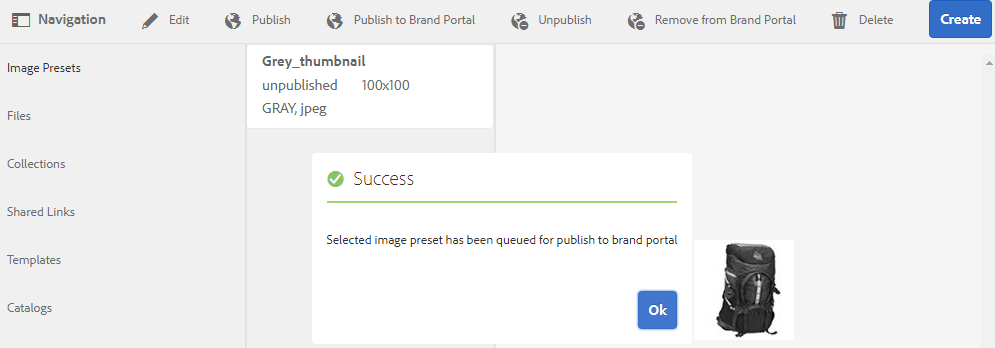
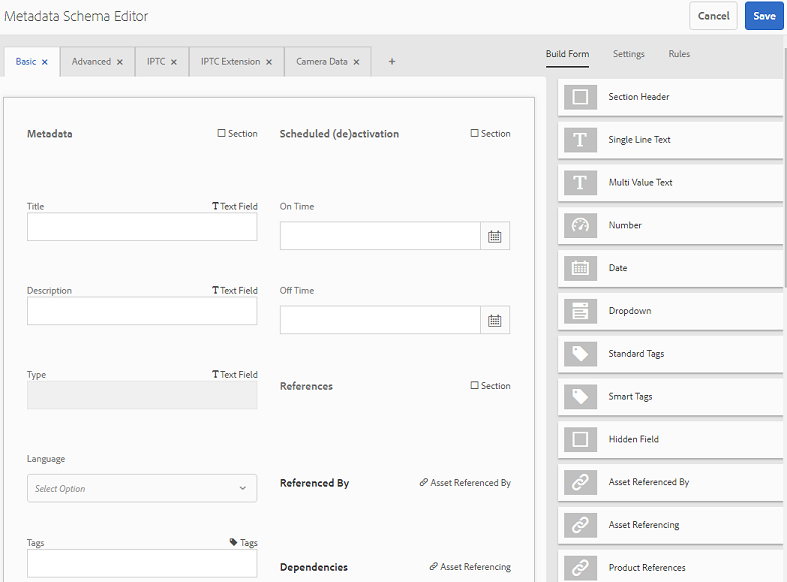
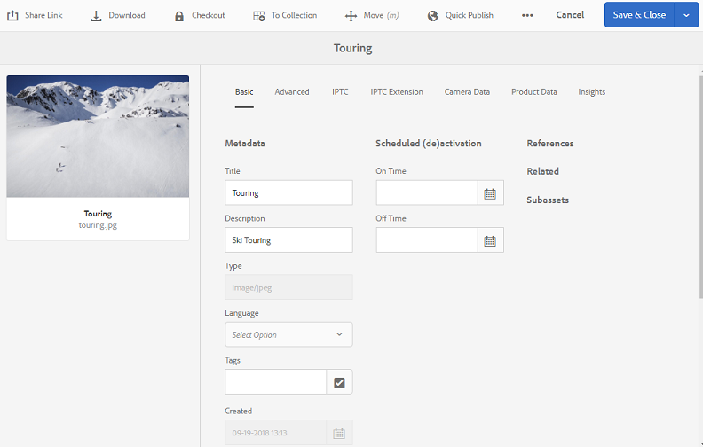
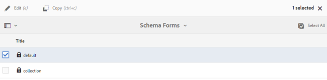
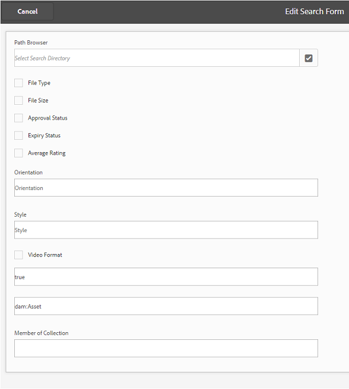
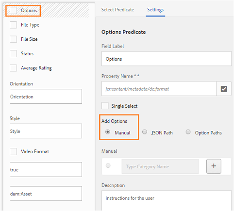

# Publication de paramètres prédéfinis, de schémas et de facettes sur Brand Portal {#publish-presets-schema-and-facets-to-brand-portal}

L’article est consacré à la publication des paramètres d’image prédéfinis, des schémas de métadonnées et des facettes de recherche personnalisées sur Brand Portal à partir de l’instance de création AEM. La fonctionnalité de publication permet aux entreprises de réutiliser les paramètres d’image prédéfinis, les schémas de métadonnées et les facettes de recherche créés ou modifiés sur une instance de création AEM. Cette approche réduit les efforts redondants.

>[!NOTE]
>
>La possibilité de publier des paramètres prédéfinis d’image, un schéma de métadonnées et des facettes de recherche à partir de l’instance d’auteur AEM sur Brand Portal est disponible à partir d’AEM 6.2 SP1-CFP7 et d’AEM 6.3 SP 1-CFP 1 (6.3.1.1).

## Publication des paramètres d’image prédéfinis sur Brand Portal {#publish-image-presets-to-brand-portal}

Les paramètres d’image prédéfinis sont un ensemble de commandes de redimensionnement et de formatage qui sont appliqués à l’image au moment de sa diffusion. Les paramètres d’image prédéfinis peuvent être créés et modifiés sur Brand Portal. Si une instance de création AEM est en cours d’exécution en mode Dynamic Media, les utilisateurs peuvent également créer des paramètres prédéfinis dans l’instance de création AEM et les publier dans AEM Assets Brand Portal. Cette approche évite de recréer les mêmes paramètres prédéfinis sous Brand Portal.
Une fois le paramètre prédéfini créé, il est répertorié en tant que rendu dynamique dans le rail de rendus des détails de la ressource et dans la boîte de dialogue de téléchargement.

>[!NOTE]
>
>Si l’instance d’auteur AEM n’est pas en cours d’exécution en mode **[!UICONTROL Dynamic Media]** (le client n’a pas acheté Dynamic Media), le rendu **[!UICONTROL Pyramid TIFF]** des ressources n’est pas créé au moment du chargement. Les paramètres d’image prédéfinis ou les rendus dynamiques fonctionnent sur **[!UICONTROL Pyramid TIFF]** d’une ressource. Par conséquent, si **[!UICONTROL Pyramid TIFF]** n’est pas disponible sur l’instance d’auteur AEM, il n’est pas disponible sur Brand Portal. Par conséquent, aucun rendu dynamique n’est présent dans le rail de rendus de la page des détails de la ressource et de la boîte de dialogue de téléchargement.

Pour publier des paramètres d’image prédéfinis sur Brand Portal :

1. Dans l’instance d’auteur AEM, cliquez sur le logo AEM pour accéder à la console de navigation globale, cliquez sur l’icône Outils , puis accédez à **[!UICONTROL Assets > Paramètres d’image prédéfinis]**.
1. Sélectionnez le ou les paramètres d’image prédéfinis dans la liste des paramètres d’image prédéfinis et cliquez sur **[!UICONTROL Publier sur Brand Portal]**.

>[!NOTE]
>
>Lorsque les utilisateurs cliquent sur **[!UICONTROL Publier sur Brand Portal]**, les paramètres d’image prédéfinis sont mis en file d’attente pour publication. Nous conseillons de surveiller le journal des agents de réplication pour contrôler la réussite de la publication.

Pour dépublier un paramètre d’image prédéfini sur Brand Portal :

1. Dans l’instance d’auteur AEM, cliquez sur le logo AEM pour accéder à la console de navigation globale, puis cliquez sur l’icône **[!UICONTROL Outils]** et accédez à **[!UICONTROL Assets > Paramètres d’image prédéfinis]**.
1. Sélectionnez un paramètre d’image prédéfini puis **[!UICONTROL Supprimer de Brand Portal]** parmi les options disponibles dans la partie supérieure.

## Publication d’un schéma de métadonnées sur Brand Portal {#publish-metadata-schema-to-brand-portal}

Le schéma de métadonnées décrit la mise en page et les propriétés affichées sur la page de propriétés d’une ressource ou de collections.

 

Si les utilisateurs et utilisatrices ont modifié le schéma par défaut sur une instance d’auteur AEM et souhaitent utiliser le même schéma que celui par défaut sur Brand Portal, publiez les formulaires de schéma de métadonnées dans Brand Portal. Dans un tel scénario, les schémas par défaut publiés à partir de l’instance d’auteur AEM remplacent le schéma par défaut dans Brand Portal.

Si un schéma personnalisé a été créé sur l’instance de création AEM, il peut être publié sur Brand Portal au lieu d’être recréé à cet endroit. Les utilisateurs peuvent alors appliquer ce schéma personnalisé à n’importe quel dossier/collection dans Brand Portal.

>[!NOTE]
>
>Les schémas par défaut ne peuvent pas être publiés dans le Brand Portal s’ils ont été verrouillés au niveau de l’instance AEM. En d’autres termes, ils ne sont pas modifiés.

>[!NOTE]
>
>Si un schéma est appliqué à un dossier sur l’instance d’auteur AEM, le même schéma doit également exister sur le Brand Portal. Cela permet de maintenir la cohérence de la page des propriétés de la ressource dans l’instance de création AEM et Brand Portal.

Pour publier un schéma de métadonnées sur Brand Portal à partir d’une instance de création AEM :

1. Dans l’instance d’auteur AEM, cliquez sur le logo AEM pour accéder à la console de navigation globale, cliquez sur l’icône Outils et accédez à **[!UICONTROL Assets > Schémas de métadonnées]**.
1. Sélectionnez un schéma de métadonnées puis **[!UICONTROL Publier sur Brand Portal]** parmi les options disponibles dans la partie supérieure.

>[!NOTE]
>
>Quand vous cliquez sur **[!UICONTROL Publier sur Brand Portal]**, les schémas de métadonnées sont placés en file d’attente pour publication. Nous conseillons de surveiller le journal des agents de réplication pour contrôler la réussite de la publication.

Pour dépublier un schéma de métadonnées dans Brand Portal :

1. Dans l’instance d’auteur AEM, cliquez sur le logo AEM pour accéder à la console de navigation globale, cliquez sur l’icône Outils et accédez à **[!UICONTROL Assets > Schémas de métadonnées]**.
1. Sélectionnez un schéma de métadonnées puis **[!UICONTROL Supprimer de Brand Portal]** parmi les options disponibles dans la partie supérieure.

## Publication de facettes de recherche sur Brand Portal {#publish-search-facets-to-brand-portal}

Les formulaires de recherche fournissent aux utilisateurs la fonctionnalité de [recherche facettée](../using/brand-portal-search-facets.md) sur Brand Portal. Les facettes de recherche permettent d’effectuer des recherches plus précises sur Brand Portal. Tous les [prédicats ajoutés](https://experienceleague.adobe.com/en/docs/experience-manager-65/content/assets/administer/search-facets) dans le formulaire de recherche sont disponibles pour les utilisateurs en tant que facettes de recherche dans les filtres de recherche.

Pour utiliser un formulaire de recherche personnalisé sur le **[!UICONTROL Rail de recherche d’administration d’]** à partir de l’instance d’auteur AEM, publiez-le directement sur Brand Portal au lieu de le recréer.

>[!NOTE]
>
>Pour publier un formulaire de recherche verrouillé sur le **[!UICONTROL Rail de recherche d’administration d’]** d’AEM Assets vers Brand Portal, vous devez d’abord le modifier. Une fois modifié et publié, ce formulaire de recherche remplace le formulaire existant dans Brand Portal.

Pour publier la facette de recherche modifiée sur Brand Portal à partir de l’interface AEM Author :

1. Cliquez sur le logo AEM, puis accédez à **[!UICONTROL Outils > Général > Rechercher dans Forms]**.
1. Sélectionnez le formulaire de recherche modifié et ensuite **[!UICONTROL Publier sur Brand Portal]**.

   >[!NOTE]
   >
   >Quand les utilisateurs cliquent sur **[!UICONTROL Publier sur Brand Portal]**, les facettes de recherche sont placées en file d’attente pour publication. Nous conseillons de surveiller le journal des agents de réplication pour contrôler la réussite de la publication.

Pour dépublier des formulaires de recherche dans Brand Portal :

1. Dans l’instance d’auteur AEM, cliquez sur le logo AEM pour accéder à la console de navigation globale, puis cliquez sur l’icône Outils et accédez à **[!UICONTROL Général > Rechercher dans Forms]**.
1. Sélectionnez le formulaire de recherche et ensuite **[!UICONTROL Supprimer de Brand Portal]** parmi les options disponibles dans la partie supérieure.

>[!NOTE]
>
>L’action **[!UICONTROL Dépublier à partir de Brand Portal]** laisse le formulaire de recherche par défaut sur Brand Portal et ne restaure pas le dernier formulaire de recherche utilisé avant la publication.

### Restrictions {#limitations}

1. Peu de prédicats de recherche ne s’appliquent pas aux filtres de recherche sur Brand Portal. Quand ces prédicats de recherche sont publiés en tant qu’élément du formulaire de recherche sur Brand Portal à partir de l’instance AEM Author, ils sont filtrés. En conséquence, les utilisateurs voient moins de prédicats dans le formulaire publié sur Brand Portal. Voir [Prédicats de recherche applicables aux filtres sur Brand Portal](../using/brand-portal-search-facets.md#list-of-search-predicates).

1. Dans le cas du [!UICONTROL prédicat d’options], si un utilisateur utilise un chemin d’accès personnalisé pour lire les options sur une instance d’auteur AEM, il ne fonctionne pas sous Brand Portal. Ces chemins et options supplémentaires ne sont pas publiés sur Brand Portal avec le formulaire de recherche. Dans ce cas, les utilisateurs peuvent sélectionner l’option **[!UICONTROL Manuel]** sous **[!UICONTROL Ajouter des options]** dans **[!UICONTROL Options du prédicat]** pour ajouter ces options manuellement sur Brand Portal.

