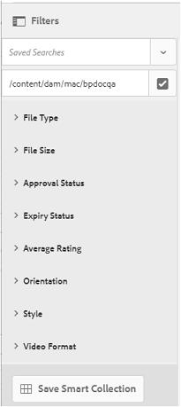

# Publication de paramètres prédéfinis, de schémas et de facettes sur Brand Portal {#publish-presets-schema-and-facets-to-brand-portal}

L’article est consacré à la publication des paramètres d’image prédéfinis, des schémas de métadonnées et des facettes de recherche personnalisées sur Brand Portal à partir de l’instance d’auteur AEM. La fonction de publication permet aux entreprises de réutiliser les paramètres d'image prédéfinis, les schémas de métadonnées et les facettes de recherche créées/modifiées à l'instance Auteur d'AEM, ce qui réduit les efforts en double.

>[!NOTE]
>
>La fonction de publication des paramètres d’image prédéfinis, des schémas de métadonnées et des facettes de recherche sur Brand Portal à partir de l’instance d’auteur AEM est disponible à partir d’AEM 6.2 SP1-CFP7 et d’AEM 6.3 SP1-CFP1 (6.3.1.1).

## Publication des paramètres d’image prédéfinis sur Brand Portal {#publish-image-presets-to-brand-portal}

Les paramètres d’image prédéfinis sont un ensemble de commandes de redimensionnement et de formatage qui sont appliqués à l’image au moment de sa livraison. Les paramètres d’image prédéfinis peuvent être créés et modifiés sur Brand Portal. Sinon, si l'instance d'auteur AEM est en mode multimédia dynamique, les utilisateurs peuvent créer des paramètres prédéfinis sur l'auteur AEM et les publier sur le portail de marque AEM Assets et éviter de recréer les mêmes paramètres prédéfinis sur le portail de marque.\
Une fois que le paramètre prédéfini est créé, il est répertorié en tant que rendu dynamique sur le rail de rendus des détails de ressources et la boîte de dialogue de téléchargement.

>[!NOTE]
>
>Si l'instance d'auteur AEM n'est pas en mode multimédia [!UICONTROL dynamique] (le client n'a pas acheté de contenu multimédia dynamique), le rendu [!UICONTROL Pyramid TIFF] des ressources ne sera pas créé au moment du transfert. Image presets or dynamic renditions work on [!UICONTROL Pyramid TIFF] of an asset, so if [!UICONTROL Pyramid TIFF] is not available on AEM Author instance then it is not available on Brand Portal as well. Par conséquent, aucun rendu dynamique n'est présent dans le rail des rendus de la page des détails de la ressource et le téléchargement des dialogues.

Pour publier des paramètres d’image prédéfinis sur Brand Portal :

1. In AEM Author instance, tap/ click the AEM logo to access the global navigation console and tap/ click the Tools icon and navigate to **[!UICONTROL Assets]** &gt; **[!UICONTROL Image Presets]**.
2. Select the image preset or multiple image presets from the list of image presets and click/ tap **[!UICONTROL Publish to Brand Portal]**.

>[!NOTE]
>
>When users click **[!UICONTROL Publish to Brand Portal]** the image presets are queued for publishing. Nous conseillons aux utilisateurs de surveiller le journal des agents de réplication pour vérifier si la publication a réussi.

Pour annuler la publication d'un paramètre d'image prédéfini depuis le portail de marque :

1. In AEM Author instance, tap/ click the AEM logo to access the global navigation console and tap/click the **[!UICONTROL Tools]** icon and navigate to **[!UICONTROL Assets &gt; Image Presets]**.
2. Sélectionnez un paramètre d’image prédéfini et ensuite **[!UICONTROL Supprimer de Brand Portal]parmi les options disponibles dans la partie supérieure.**

## Publication d’un schéma de métadonnées sur Brand Portal  {#publish-metadata-schema-to-brand-portal}

Le schéma de métadonnées décrit la mise en page et les propriétés qui sont affichées sur la page de propriétés d’une ressource/de collections.

 

Si les utilisateurs ont modifié le schéma par défaut sur l'instance d'auteur AEM et sont prêts à utiliser le même schéma que le schéma par défaut sur le portail de marque, ils peuvent simplement publier les formulaires de schéma de métadonnées sur le portail de marque. Dans ce cas, le schéma par défaut sur le portail de marque est dépassé par les schémas par défaut publiés à partir de l'instance d'auteur AEM.

Si les utilisateurs ont créé un schéma personnalisé sur l'instance d'auteur AEM, ils peuvent publier le schéma personnalisé sur Brand Portal au lieu de recréer le même schéma personnalisé. Les utilisateurs peuvent alors appliquer ce schéma personnalisé à n’importe quel dossier/collection dans Brand Portal.

>[!NOTE]
>
>Les schémas par défaut ne peuvent pas être publiés sur le portail de marque s'ils sont verrouillés dans l'instance AEM (ils ne sont pas modifiés).

>[!NOTE]
>
>Si un schéma est appliqué à l'instance d'auteur AEM, le même schéma doit également exister sur le portail de marque pour préserver la cohérence de la page des propriétés de ressource sur l'auteur AEM et le portail de marque.

Pour publier un schéma de métadonnées sur Brand Portal à partir d’une instance d’auteur AEM :

1. In AEM Author instance, tap/ click the AEM logo to access the global navigation console and tap/click the Tools icon and navigate to **[!UICONTROL Assets &gt; Metadata Schemas]**.
2. Sélectionnez un schéma de métadonnées et ensuite **[!UICONTROL Publier sur Brand Portal]parmi les options disponibles dans la partie supérieure.**

>[!NOTE]
>
>When users click **[!UICONTROL Publish to Brand Portal]**, the metadata schemas are queued for publishing. Nous conseillons aux utilisateurs de surveiller le journal des agents de réplication pour vérifier si la publication a réussi.

Pour annuler la publication d’un schéma de métadonnées sur Brand Portal :

1. In AEM Author instance, tap/ click the AEM logo to access the global navigation console and tap/click the Tools icon and navigate to **[!UICONTROL Assets &gt; Metadata Schemas]**.
2. Sélectionnez un schéma de métadonnées et ensuite **[!UICONTROL Supprimer de Brand Portal]parmi les options disponibles dans la partie supérieure.**

## Publication de facettes de recherche sur Brand Portal {#publish-search-facets-to-brand-portal}

Les formulaires de recherche fournissent aux utilisateurs la fonctionnalité de [recherche facettée](../using/brand-portal-search-facets.md) sur Brand Portal. Les facettes de recherche contribuent davantage à la granularité des recherches sur le portail de marque. Tous les [prédicats ajoutés](https://helpx.adobe.com/experience-manager/6-5/assets/using/search-facets.html#AddingaPredicate) dans le formulaire de recherche sont disponibles pour les utilisateurs en tant que facettes de recherche dans les filtres de recherche.

If you are willing to use custom search form **[!UICONTROL Assets Admin Search Rail]** from AEM Author instance, then instead of re-creating the same form on Brand Portal you can publish the customized search form from AEM Author instance to Brand Portal.

>[!NOTE]
>
>Locked search form **[!UICONTROL Assets Admin Search Rail]** on AEM Assets cannot be published to Brand Portal unless it is edited. Une fois édité et publié sur Brand Portal, ce formulaire de recherche remplace le formulaire de recherche sur Brand Portal.

Pour publier la facette de recherche modifiée sur Brand Portal à partir de l’interface d’auteur AEM :

1. Tap/click the AEM logo, and then go to **[!UICONTROL Tools]** &gt; **[!UICONTROL General]** &gt; **[!UICONTROL Search Forms]**.
2. Sélectionnez le formulaire de recherche modifié et ensuite **[!UICONTROL Publier sur Brand Portal]**.

   >[!NOTE]
   >
   >When users click **[!UICONTROL Publish to Brand Portal]**, the search facets are queued for publishing. Nous conseillons aux utilisateurs de surveiller le journal des agents de réplication pour vérifier si la publication a réussi.

Pour annuler la publication de formulaires de recherche sur Brand Portal :

1. In AEM Author instance, tap/ click the AEM logo to access the global navigation console and tap/click the Tools icon and navigate to **[!UICONTROL General &gt; Search Forms]**.
2. Sélectionnez le formulaire de recherche et ensuite **[!UICONTROL Supprimer de Brand Portal]parmi les options disponibles dans la partie supérieure.**

>[!NOTE]
>
>L'action **[!UICONTROL Annuler la publication de Portal Portal]** laisse le formulaire de recherche par défaut sur le portail de marque et ne rétablit pas le dernier formulaire de recherche utilisé avant la publication.

### Restrictions {#limitations}

1. Peu de dictionnaires de recherche ne sont pas applicables aux filtres de recherche sur le portail de marque. Quand ces prédicats de recherche sont publiés en tant qu’élément du formulaire de recherche sur Brand Portal à partir de l’instance d’auteur AEM, ils sont filtrés. Les utilisateurs affichent donc moins de prédicats dans le formulaire publié sur le portail de marque. Voir [Prédicats de recherche applicables aux filtres sur Brand Portal](../using/brand-portal-search-facets.md#list-of-search-predicates).

2. For [!UICONTROL Options Predicate], if a user is using any custom path to read options at AEM Author instance, it won't work at the Brand Portal. Ces chemins et options supplémentaires ne sont pas publiés sur Brand Portal avec le formulaire de recherche. In this case, users can select the **[!UICONTROL Manual]** option in **[!UICONTROL Add Options]** within **[!UICONTROL Options Predicate]** to add these options manually at Brand Portal.

