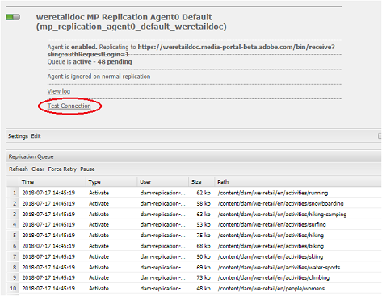

# Dépannage des problèmes de publication en parallèle sur Brand Portal {#troubleshoot-issues-in-parallel-publishing-to-brand-portal}

Brand Portal est configuré avec Experience Manager Assets, de sorte que les ressources de marque approuvées soient automatiquement ingérées (ou publiées) à partir de l’instance de création Experience Manager Assets. Une fois [configuré](../using/configure-aem-assets-with-brand-portal.md), l’auteur Experience Manager utilise un agent de réplication pour répliquer une ou plusieurs ressources sélectionnées vers Brand Portal Cloud Service pour l’utilisation approuvée par les utilisateurs de Brand Portal. Plusieurs agents de réplication sont utilisés dans Experience Manager 6.2 SP1-CFP5, Experience Manager CFP 6.3.0.2 et les versions ultérieures pour permettre une publication parallèle à grande vitesse.

>[!NOTE]
>
>Pour une configuration réussie de Experience Manager Assets Brand Portal avec Experience Manager Assets, Adobe recommande d’effectuer la mise à niveau vers Experience Manager 6.4.1.0. Experience Manager 6.4 présente une limitation, en ce sens qu’il renvoie une erreur lors de la configuration d’Experience Manager Assets avec Brand Portal et entraîne l’échec de la réplication.

Lors de la configuration d’un service cloud pour Brand Portal sous **[!UICONTROL /etc/cloudservice]** tous les utilisateurs et jetons nécessaires sont générés automatiquement et enregistrés dans le référentiel. La configuration du Cloud Service est créée, de même que les utilisateurs des services requis pour la réplication et les agents de réplication pour répliquer le contenu. Cette étape crée quatre agents de réplication. Ainsi, lorsque vous publiez de nombreuses ressources d’Experience Manager sur Brand Portal, celles-ci sont placées en file d’attente et distribuées entre ces agents de réplication de manière cyclique.

Cependant, la publication peut échouer par intermittence en raison de tâches Sling volumineuses, d’une augmentation du volume d’**[!UICONTROL E/S]** réseau et disque sur l’instance de création Experience Manager, ou d’un ralentissement des performances de l’instance de création Experience Manager. Adobe recommande de tester la connexion avec un ou plusieurs agents de réplication avant de commencer la publication.

## Résolution des problèmes lors de la première publication : validation de la configuration de publication {#troubleshoot-failures-in-first-time-publishing-validating-your-publish-configuration}

Pour valider vos configurations de publication :

1. Vérifier les logs d’erreurs
1. Vérifiez que l’agent de réplication est créé.
1. Test de la connexion

**Fin des journaux lors de la création du Cloud Service**

Vérifiez les journaux des révisions. Vérifiez si l’agent de réplication est créé ou non. Si la création de l’agent de réplication échoue, modifiez le service cloud en y apportant des modifications mineures. Validez et vérifiez une nouvelle fois si l’agent de réplication est créé. Si tel n’est pas le cas, modifiez à nouveau le service.

Si, lors de la modification répétée du service cloud , il n’est pas correctement configuré, signalez un ticket Daycare.

**Test de la connexion avec les agents de réplication**

Affichez le journal, si des erreurs sont détectées dans le journal de réplication :

1. Contactez le service clientèle.

1. Essayez à nouveau le [nettoyage](../using/troubleshoot-parallel-publishing.md#clean-up-existing-config) et créez une nouvelle fois la configuration de publication.

<!--
Comment Type: remark
Last Modified By: Mini Gulati (mgulati)
Last Modified Date: 2018-06-21T22:56:21.256-0400

?? check and compare public key. At times public key is different

?? another thing to check in /useradmin

-->

## Nettoyage des configurations de publication existantes dans Brand Portal {#clean-up-existing-config}

La publication échoue souvent avec une erreur « 401 non autorisé », car l’utilisateur (par exemple, `mac-<tenantid>-replication`) ne dispose pas de la clé privée la plus récente et aucune autre erreur n’est signalée dans les journaux de l’agent de réplication. Vous pouvez éviter le dépannage en créant une configuration. Pour que la nouvelle configuration fonctionne correctement, nettoyez les éléments suivants dans la configuration auteur d’Experience Manager :

1. Accédez à `localhost:4502/crx/de/` (à condition que vous exécutiez l’instance d’auteur sur `localhost:4502:`)
i. Supprimer `/etc/replication/agents.author/mp_replication`
ii. Supprimer `/etc/cloudservices/mediaportal/<config_name>`

1. Accédez à localhost:4502/useradmin :\
   i. Rechercher un utilisateur `mac-<tenantid>replication`
ii. Supprimer cet utilisateur

Maintenant, tout le système est nettoyé. Vous pouvez maintenant essayer de créer une configuration de service cloud tout en utilisant l’application JWT existante. Il n’est pas nécessaire de créer une application, mais vous devez mettre à jour la clé publique à partir de la configuration cloud créée.

>[!NOTE]
>
>Ne modifiez aucun paramètre généré automatiquement.

## Problème de visibilité des clients d’applications JWT sur Developer Connection {#developer-connection-jwt-application-tenant-visibility-issue}

Si, sur `https://legacy-oauth.cloud.adobe.io/`, toutes les organisations (clients) pour lesquelles les utilisateurs actuels sont hébergés par l’administrateur système sont répertoriées. Si vous ne trouvez pas le nom de l’organisation ici ou si vous ne pouvez pas créer d’application pour un client requis ici, vérifiez si vous disposez des droits suffisants (d’administrateur système).

Il existe un problème connu sur cette interface utilisateur : pour n’importe quel client, seuls les dix premiers programmes sont visibles. Quand vous créez l’application, restez sur cette page et marquez l’URL d’un signet. N’accédez pas à la page de liste de l’application et recherchez l’application que vous avez créée. Vous pouvez accéder directement à cette URL marquée d’un signet et mettre à jour ou supprimer l’application si nécessaire.

L’application JWT pourrait ne pas être répertoriée convenablement. Il est donc conseillé de noter ou de marquer d’un signet l’URL lors de la création d’une application JWT.

## La configuration courante cesse de fonctionner {#running-configuration-stops-working}

<!--
Comment Type: draft

If the running configuration stops working, either of the following two possibilities
<g class="gr_ gr_15 gr-alert gr_gramm gr_inline_cards gr_run_anim Grammar multiReplace" data-gr-id="15" id="15" style="font-size: 12px;">
are
</g> there:

1.
<g class="gr_ gr_14 gr-alert gr_gramm gr_inline_cards gr_run_anim Grammar only-ins doubleReplace replaceWithoutSep" data-gr-id="14" id="14">
Connection
</g> has failed, or

2. Publish has failed with permission to dam-replication-service denied, while connection has passed 

If the connection has failed [1], the
<g class="gr_ gr_10 gr-alert gr_spell gr_inline_cards gr_run_anim ContextualSpelling ins-del multiReplace" data-gr-id="10" id="10">
fail safe
</g> way to fix it is to <a href="../using/troubleshoot-parallel-publishing.md#main-pars-header-1664955658">clean up</a> the existing Brand Portal publish configuration and recreate a publish configuration. 

However, if the
<g class="gr_ gr_18 gr-alert gr_spell gr_inline_cards gr_run_anim ContextualSpelling" data-gr-id="18" id="18">
publish
</g> has failed with
<g class="gr_ gr_16 gr-alert gr_gramm gr_inline_cards gr_run_anim Grammar only-ins doubleReplace replaceWithoutSep" data-gr-id="16" id="16">
permission
</g> denied to dam-replication-service, raise a support ticket.

-->

Si un agent de réplication (qui publiait correctement sur Brand Portal) cesse de traiter les tâches de publication, vérifiez les journaux de réplication. Experience Manager intègre une fonction de réessai automatique qui permet de retenter automatiquement la publication d’une ressource particulière suite à un échec. En cas de problème intermittent, tel qu’une erreur réseau, une nouvelle tentative peut réussir.

En cas d’échecs de publication continus et de blocage de la file d’attente, vérifiez la **[!UICONTROL connexion de test]**. Essayez de résoudre les erreurs signalées.

En fonction des erreurs, il est conseillé de consigner un ticket d’assistance, afin que l’équipe d’ingénieurs Brand Portal puisse vous aider à résoudre les problèmes.

## Jeton de configuration Brand Portal IMS expiré {#token-expired}

Si votre environnement Brand Portal s’arrête brusquement, il est possible que les configurations IMS ne fonctionnent pas correctement. Le système indique une configuration IMS non intègre et affiche un message d’erreur (similaire à ce qui suit) indiquant que votre jeton d’accès a expiré.

`com.adobe.granite.auth.oauth.AccessTokenProvider failed to get access token from authorization server status: 400 response: Unknown macro: {"error"}`

Pour résoudre ce problème, Adobe vous recommande d’enregistrer et de fermer manuellement la configuration IMS et de vérifier à nouveau son intégrité. Si les configurations ne fonctionnent pas, supprimez les configurations existantes et créez-en une.

## Configuration des agents de réplication pour éviter l’erreur de délai d’expiration de connexion {#connection-timeout}

En règle générale, la tâche de publication échoue avec une erreur de délai d’expiration si plusieurs requêtes en attente se trouvent dans la file d’attente de réplication. Pour résoudre ce problème, assurez-vous que les agents de réplication sont configurés pour éviter la temporisation.

Pour configurer les agents de réplication, procédez comme suit :

1. Connectez-vous à votre instance de création AEM Assets.
1. Dans le panneau **Outils**, accédez à **[!UICONTROL Déploiement]** > **[!UICONTROL Réplication]**.
1. Sur la page Réplication, cliquez sur **[!UICONTROL `Agents on author`]**. Vous voyez les quatre agents de réplication de votre client Brand Portal.
1. Cliquez sur l’URL de l’agent de réplication et cliquez sur **[!UICONTROL Modifier]**.
1. Dans Paramètres d’agent, cliquez sur l’onglet **[!UICONTROL Étendu]**.
1. Cochez la case **[!UICONTROL Fermer la connexion]**.
1. Répétez les étapes 4 à 7 pour configurer les quatre agents de réplication.
1. Redémarrez le serveur.
