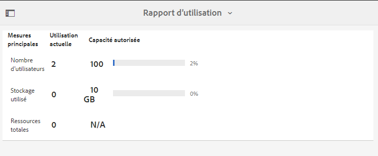
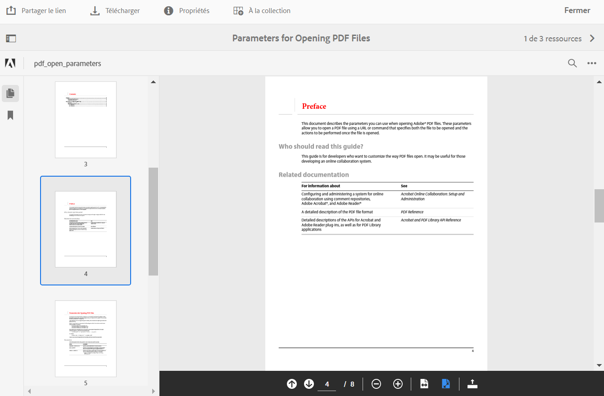
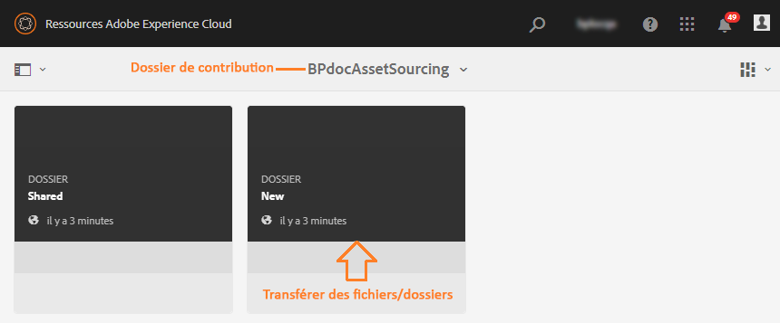
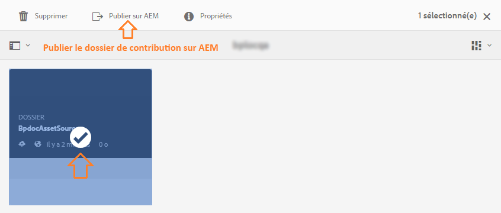

# Nouveautés d’Experience Manager Assets Brand Portal {#what-s-new-in-aem-assets-brand-portal}

Adobe Experience Manager Assets Brand Portal permet d’acquérir, de contrôler et de distribuer facilement et en toute sécurité des ressources créatives approuvées destinées à des tiers externes et aux collaborateurs de l’entreprise sur différents appareils. Brand Portal améliore l’efficacité du partage des ressources, accélère la mise sur le marché des ressources et réduit les risques de non-conformité et d’accès non autorisé. Adobe a pour objectif d’améliorer l’expérience globale de Brand Portal. Vous trouverez ci-dessous un aperçu des nouvelles fonctionnalités et améliorations.

## Changements de la version 2022.05.0 {#what-changed-in-May-2022}

Brand Portal exécute désormais des tâches automatiques toutes les douze heures afin de supprimer toutes les ressources Brand Portal publiées sur AEM. Par conséquent, vous n’avez pas besoin de supprimer manuellement les ressources du dossier Contribution pour que la taille du dossier reste inférieure à la limite de seuil. Vous pouvez également surveiller le statut des tâches de suppression exécutées automatiquement à l’aide de l’option **[!UICONTROL Outils]** > **[!UICONTROL Statut de la contribution des ressources]** > **[!UICONTROL Rapports de suppression]** dans Brand Portal. Le rapport relatif à une tâche fournit les détails suivants :

* Heure de début de la tâche.
* Heure de fin de la tâche.
* Statut de la tâche.
* Total des ressources incluses dans une tâche.
* Nombre total de ressources supprimées dans une tâche
* Stockage total mis à disposition suite à l’exécution de la tâche

Vous pouvez également afficher plus de détails sur chaque ressource incluse dans une tâche de suppression. Des détails tels que le titre, la taille, l’auteur, le statut de suppression et la durée de suppression de la ressource sont inclus dans le rapport.

En outre, Brand Portal 2022.05.0 comprend des correctifs pour les problèmes critiques. Consultez les dernières [Notes de mise à jour de Brand Portal](brand-portal-release-notes.md).

## Changements dans la version 2022.02.0 {#what-changed-in-Feb-2022}

Brand Portal 2022.02.0 est une version interne qui comprend des correctifs pour les problèmes critiques. Consultez les dernières [Notes de mise à jour de Brand Portal](brand-portal-release-notes.md).

## Changements dans la version 2021.10.0 {#what-changed-in-october-2021}

Brand Portal 2021.10.0 est une version interne qui comprend des correctifs pour les problèmes critiques. Consultez les dernières [Notes de mise à jour de Brand Portal](brand-portal-release-notes.md).

## Changements dans la version 2021.08.0 {#what-changed-in-august-2021}

Brand Portal 2021.08.0 est une nouvelle version interne qui présente les profils Entreprise pour les clients Grands comptes et Équipes afin de permettre aux organisations de mieux contrôler leurs ressources. Les utilisateurs disposent désormais de droits spécifiques à une organisation pour les nouvelles organisations et les organisations migrées. Lors de la migration, tous les comptes Adobe ID existants sont migrés vers les Business ID.

* Des Business ID pour toutes les organisations nouvelles et existantes une fois migrées.
* Les Business ID ne nécessitent aucune configuration spécifique, comme la demande d’un domaine ou la configuration d’une connexion unique.
* Vous pouvez ajouter des utilisateurs avec n’importe quelle adresse e-mail, y compris les domaines de messagerie publics tels que gmail.com ou outlook.com.

**Impact sur les utilisateurs de Brand Portal**

La migration n’a aucune incidence sur votre jeu de données, vos ressources, vos utilisateurs ou les paramètres existants. La seule modification interne qui a lieu pendant la migration est le droit de votre organisation existante aux profils Entreprise.

>[!NOTE]
>
>Les profils Entreprise sont actuellement utilisables pour les nouvelles organisations créées après le 16 août 2021.
>
>Jusqu’à la fin de la migration de votre organisation, vous pourrez continuer à utiliser les Adobe ID, Enterprise ID et Federated ID pour accéder à l’organisation.

### Articles de référence {#reference-articles}

* [Présentation des profils Adobe](https://helpx.adobe.com/fr/enterprise/kb/introducing-adobe-profiles.html)

* [Gestion des profils Adobe](https://helpx.adobe.com/fr/enterprise/using/manage-adobe-profiles.html)

* [Mise à jour de l’expérience de connexion pour les utilisateurs et les administrateurs](https://helpx.adobe.com/fr/enterprise/using/storage-for-business.html#new-admin-sign-in-exp)

* [Restriction de connexion pendant la migration](https://helpx.adobe.com/fr/enterprise/kb/account-temporarily-unavailable.html)

* [Gestion des utilisateurs dans Admin Console](https://helpx.adobe.com/fr/enterprise/using/manage-users-individually.html)

* [Gestion des profils de produit pour les utilisateurs Grands comptes](https://helpx.adobe.com/fr/enterprise/using/manage-product-profiles.html#assign-users)

* [Propriété d’un domaine](https://helpx.adobe.com/fr/enterprise/admin-guide.html/enterprise/using/set-up-identity.ug.html#directory-trusting)

<!--   
### Add new users to T2E organization   {#add-users-to-T2E-org}

On adding a new user in Admin Console for a new or migrated T2E organization, the user will have to perform an additional step **Join Team** to get entitled to the T2E organization. 

The user is entitled only if the user chooses to **Join Team**, otherwise the user won't get access to the selected T2E organization in Brand Portal. 

>[!NOTE]
>
>The workflow is not applicable to the existing Brand Portal users.

### Additional screen while navigating to Admin Console   {#navigate-to-admin-console}

The administrators will have to perform an additional step of selecting the T2E organization while navigating from Brand Portal to Admin Console. The workflow applies on the new and migrated T2E organizations.   

Selection of the T2E organization is a one-time activity and is not required everytime the administrator navigates from Brand Portal to Admin Console.

1. Log in to a T2E organization in Brand Portal as administrator.
1. Go to **[!UICONTROL Tools]** > **[!UICONTROL Users]** > **[!UICONTROL Management]** and click on the link **[!UICONTROL Launch Admin Console]**. 

   Or, go to **[!UICONTROL Unified Shell]** > **[!UICONTROL Administration]** and click on the link **[!UICONTROL Launch Admin Console]**. 
1. Search the T2E organization to login to Admin Console.

   

### Restriction during migration of an organization   {#login-restriction}

When an organization is undergoing T2E migration, the users of that organization will not be able to login to Brand Portal. The following error message appears on the screen. However, the migration won't impact the active user session until the token expires. 

Once the migration is complete, the users can login to Brand Portal. The users will receive an email notification containing the entitlement changes. If the users are entitled to more than one organization, they will have to select the organization at the time of login. 
-->

<!--
For a new or migrated T2E orgnization, the users will have an organization specific entitlement. A user can have multiple entitlements with the same email id for different T2E organizations. 
-->

## Changements dans la version 2021.06.0 {#what-changed-in-june-2021}

Brand Portal 2021.06.0 est une version interne qui comprend des correctifs pour les problèmes critiques. Consultez les dernières [Notes de mise à jour de Brand Portal](brand-portal-release-notes.md).

## Changements dans la version 2021.02.0 {#what-changed-in-feb-2021}

La version 2021.02.0 de Brand Portal propose une amélioration qui intègre le workflow d’activation de Brand Portal sur AEM Assets as a Cloud Service, qui facilite la fonctionnalité d’approvisionnement des ressources sur AEM Assets as a Cloud Service, qui améliore l’expérience de téléchargement des ressources et qui inclut des correctifs critiques. Cette version permet également aux administrateurs de configurer le comportement de téléchargement par défaut des dossiers, des collections et des ressources téléchargées en masse au niveau du client. Le **[!UICONTROL rapport d’utilisation]** de Brand Portal a également été modifié pour refléter les utilisateurs actifs de Brand Portal.

### Activation de Brand Portal sur AEM Assets as a Cloud Service {#bp-automation-on-cloud-service}

AEM Assets as a Cloud Service peut désormais disposer d’une instance préconfigurée de Brand Portal. L’utilisateur de Cloud Manager peut activer Brand Portal sur l’instance AEM Assets as a Cloud Service.

Auparavant, AEM Assets as a Cloud Service était configuré manuellement avec Brand Portal à l’aide d’Adobe Developer Console.

L’utilisateur de Cloud Manager déclenche le workflow d’activation qui crée les configurations requises en arrière-plan et active Brand Portal sur la même organisation IMS que dans l’instance AEM Assets as a Cloud Service.

Pour activer Brand Portal sur votre instance AEM Assets as a Cloud Service :

1. Connectez-vous à Adobe Cloud Manager et accédez à **[!UICONTROL Environnements]**.
1. Sélectionnez les environnements (un par un) dans la liste. Une fois que vous avez trouvé l’environnement associé à Brand Portal, cliquez sur le bouton **[!UICONTROL Activer Brand Portal]** pour lancer le workflow d’activation.
1. Une fois que le client Brand Portal est activé, son statut passe à Activé.

Consultez [Activation de Brand Portal sur AEM Assets as a Cloud Service](https://experienceleague.adobe.com/docs/experience-manager-cloud-service/assets/brand-portal/configure-aem-assets-with-brand-portal.html?lang=fr).

### Approvisionnement des ressources sur AEM Assets as a Cloud Service {#asset-sourcing-on-cloud-service}

La fonction d’approvisionnement des ressources est désormais disponible sur AEM Assets as a Cloud Service. Les fonctionnalités sont activées par défaut pour tous les utilisateurs du service cloud. Les utilisateurs autorisés de Brand Portal peuvent contribuer à l’approvisionnement des ressources en téléchargeant de nouvelles ressources dans les dossiers de contribution et en publiant le dossier de contribution de Brand Portal vers AEM Assets as a Cloud Service. Les administrateurs peuvent examiner et approuver la contribution des utilisateurs de Brand Portal afin de les distribuer à d’autres utilisateurs de Brand Portal.

Auparavant, l’approvisionnement des ressources n’était disponible que sur AEM Assets (On-Premise et Managed Service).

Voir [Approvisionnement des ressources dans Brand Portal](https://experienceleague.adobe.com/docs/experience-manager-brand-portal/using/asset-sourcing-in-brand-portal/brand-portal-asset-sourcing.html?lang=fr).

### Téléchargement de ressources {#asset-download-setting}

Outre les **[!UICONTROL Paramètres de téléchargement]** existants, les administrateurs de Brand Portal peuvent désormais configurer le paramètre **[!UICONTROL Téléchargement de ressources]**. Ce paramètre permet aux administrateurs de contrôler le comportement de téléchargement par défaut des dossiers, des collections et des ressources téléchargées en masse (plus de 20 ressources) au niveau du client.

<!--
Earlier, all the asset renditions were directly downloaded in a zip folder in case of folder, collection, and bulk download of assets. As the **[!UICONTROL Download]** dialog is skipped for folders or collections, there was no mechanism to control the downloading behaviour of the assets. Due to this, the users were finding it difficut to search for a particular asset rendition from a folder containing huge bunch of downloaded renditions. 
-->

Auparavant, tous les rendus de ressources étaient directement téléchargés dans un dossier zip. La boîte de dialogue **[!UICONTROL Télécharger]** était ignorée pour les dossiers et les collections, et il n’existait aucune méthode pour contrôler le comportement de téléchargement des ressources, ce qui rendait difficile la recherche d’un rendu particulier à partir d’un grand nombre de téléchargements.

Le paramètre **[!UICONTROL Téléchargement de ressources]** permet désormais de créer un dossier distinct pour chaque ressource lors du téléchargement des dossiers, des collections ou du téléchargement en masse des ressources.

Si le paramètre **[!UICONTROL Téléchargement de ressources]** est désactivé, les dossiers ou collections sont téléchargés dans un dossier zip contenant tous les rendus de ressources sous le même dossier, à l’exception du téléchargement des ressources à l’aide du lien de partage.

Connectez-vous à votre client Brand Portal en tant qu’administrateur et accédez à **[!UICONTROL Outils]** > **[!UICONTROL Télécharger]**. Les administrateurs peuvent activer le paramètre **[!UICONTROL Téléchargement de ressources]** pour créer un dossier distinct pour chaque ressource lors du téléchargement de dossiers, de collections et de téléchargements en masse de ressources.

Consultez [Téléchargement des ressources à partir de Brand Portal](https://experienceleague.adobe.com/docs/experience-manager-brand-portal/using/download/brand-portal-download-assets.html?lang=fr).
<!--
### Download using Share link {#download-using-share-link}

The default behavior of downloading the assets using share link is now independent of the **[!UICONTROL Download Settings]**. A separate folder is created for each asset while downloading the assets using share link. 
-->

### Rapport d’utilisation {#usage-report}

Le **[!UICONTROL rapport d’utilisation]** de Brand Portal a été modifié pour refléter uniquement les utilisateurs actifs de Brand Portal. Les utilisateurs de Brand Portal qui ne sont affectés à aucun profil de produits dans Admin Console sont considérés comme des utilisateurs inactifs et ne sont pas reflétés dans le **[!UICONTROL rapport d’utilisation]**.

Auparavant, les utilisateurs actifs comme inactifs figuraient dans le rapport d’utilisation.

## Changements dans la version 2020.10.0 {#what-changed-in-oct-2020}

La version 2020.10.0 de Brand Portal est une version améliorée qui se concentre sur la simplification de l’expérience de téléchargement des ressources et comprend des correctifs critiques. Cette amélioration inclut un nouveau workflow pour le téléchargement de ressources, des options supplémentaires pour exclure les rendus, le téléchargement direct depuis le panneau **[!UICONTROL Rendus]**, la configuration pour autoriser l’accès et le téléchargement de droits pour un groupe d’utilisateurs spécifique, ainsi qu’une navigation facilitée vers les fichiers, les collections et les liens partagés de toutes les pages de Brand Portal. Consultez les dernières [Notes de mise à jour de Brand Portal](brand-portal-release-notes.md).

### Expérience de téléchargement simplifiée {#download-dialog}

Auparavant, la boîte de dialogue **[!UICONTROL Télécharger]** s’affichait avec plusieurs options, telles que créer un dossier distinct pour chaque ressource, envoyer une ressource par e-mail, sélectionner une ressource d’origine, des rendus personnalisés, des rendus dynamiques, exclure les rendus système et activer l’accélération du téléchargement. Cela était ambigu pour les utilisateurs non techniques ou nouveaux, particulièrement lorsque plusieurs ressources ou dossiers étaient sélectionnés pour le téléchargement. En outre, l’utilisateur ne pouvait pas afficher tous les rendus de ressources ni exclure un rendu personnalisé ou dynamique spécifique.

La nouvelle boîte de dialogue **[!UICONTROL Télécharger]** généralise le processus de sélection et de filtrage des ressources, ce qui permet aux utilisateurs de Brand Portal de prendre des décisions efficaces lors du téléchargement des rendus de ressources. Il liste toutes les [**[!UICONTROL ressources]**](brand-portal-download-assets.md) sélectionnées et leurs rendus en fonction de la configuration et des paramètres de **[!UICONTROL téléchargement]**.

>[!NOTE]
>
>Le **[!UICONTROL téléchargement rapide]** est désormais activé par défaut pour tous les utilisateurs et IBM Aspera Connect 3.9.9 (`https://www.ibm.com/docs/en/aspera-connect/3.9.9`) doit être installé dans l’extension de leur navigateur avant de télécharger les ressources à partir de Brand Portal.

<!--
If any of the **[!UICONTROL Custom Rendition]** or **[!UICONTROL System Rendition]** is enabled in the [**[!UICONTROL Download]**](brand-portal-download-assets.md) configuration and **[!UICONTROL Download]** settings are enabled for the group users, the new **[!UICONTROL Download]** dialog appears with all the renditions of the selected assets or folders containing assets in a list view. 
-->

Dans la boîte de dialogue **[!UICONTROL Télécharger]**, les utilisateurs peuvent :

* afficher tous les rendus disponibles de toutes les ressources dans la liste de téléchargement ;
* exclure les rendus des ressources qui ne sont pas nécessaires pour le téléchargement ;
* appliquer le même jeu de rendus à tous les types de ressource similaires en un seul clic ;
* appliquer différents ensembles de rendus pour différents types de ressources ;
* créer un dossier distinct pour chaque ressource ;
* télécharger les ressources sélectionnées et leurs rendus.

Le workflow de téléchargement reste le même pour les ressources uniques ou multiples, les dossiers contenant des ressources, les ressources qui sont ou non sous licence, ainsi que le téléchargement de ressources à l’aide d’un lien de partage. Consultez la [procédure de téléchargement des ressources à partir de Brand Portal](https://experienceleague.adobe.com/docs/experience-manager-brand-portal/using/download/brand-portal-download-assets.html).

### Navigation rapide  {#quick-navigation}

Auparavant, l’option nécessaire pour afficher **[!UICONTROL Fichiers]**, **[!UICONTROL Collections]** et **[!UICONTROL Liens partagés]** était masquée et il fallait plusieurs clics pour que l’utilisateur puisse passer à une autre vue.

Dans Brand Portal 2020.10.0, les utilisateurs peuvent accéder en un seul clic à **[!UICONTROL Fichiers]**, **[!UICONTROL Collections]** et **[!UICONTROL Liens partagés]** à partir de toutes les pages de Brand Portal en utilisant les liens de navigation rapide.

### Panneau de rendu amélioré {#rendition-panel}

Auparavant, les utilisateurs ne pouvaient afficher que la ressource d’origine et ses rendus dans le panneau **[!UICONTROL Rendus]** si l’un des **[!UICONTROL rendus personnalisés]** ou le **[!UICONTROL rendu système]** était activé dans la configuration de **[!UICONTROL téléchargement]**. En outre, les utilisateurs devaient télécharger tous les rendus de ressources, car il n’existait aucun filtre pour exclure des rendus personnalisés ou dynamiques spécifiques qui n’étaient pas requis.

<!--
Earlier, if any of the custom or system renditions was enabled in the **[!UICONTROL Download]** settings, an additional **[!UICONTROL Download]** dialog appeared on clicking the **[!UICONTROL Download]** button wherein the user had to manually select the set of renditions (original asset, custom renditions, dynamic renditions) to download.
There was no filter to exclude specific custom or dynamic renditions which were not required for download.
-->

Dans Brand Portal 2020.10.0, les utilisateurs peuvent exclure des rendus spécifiques et [télécharger directement les rendus sélectionnés à partir du panneau Rendus](brand-portal-download-assets.md#download-assets-from-asset-details-page) de la page de détails de la ressource sans avoir à ouvrir la boîte de dialogue **[!UICONTROL Télécharger]**.

<!-- 
In Brand Portal 2020.10.0, direct download and exclude renditions features are introduced in the **[!UICONTROL Renditions]** panel on the asset details page. All the renditions (original asset, custom renditions, dynamic renditions) under the rendition panel are now associated with a check box and are enabled by default. 

The user can clear the check boxes to exclude the renditions which are not required for download. And can click on the **[!UICONTROL Download]** button in the **[!UICONTROL Renditions]** panel to directly download the selected set of renditions in a zip folder without having to open the **[!UICONTROL Download]** dialog.
-->

### Configuration des paramètres de téléchargement {#download-permissions}

Outre les configurations de **[!UICONTROL téléchargement]** existantes, les administrateurs de Brand Portal peuvent configurer des paramètres pour différents groupes d’utilisateurs afin d’afficher ou de télécharger la ressource d’origine et ses rendus à partir de la page d’information de la ressource.

Connectez-vous à votre client Brand Portal en tant qu’administrateur et accédez à **[!UICONTROL Outils]** > **[!UICONTROL Utilisateurs]**.

Dans la page **[!UICONTROL Rôles utilisateur]**, accédez à l’onglet **[!UICONTROL Groupes]** pour configurer la vue ou les paramètres de téléchargement des groupes d’utilisateurs.

Auparavant, les paramètres étaient disponibles uniquement pour restreindre le nombre d’utilisateurs du groupe pouvant télécharger la ressource d’origine.

L’onglet **[!UICONTROL Groupes]** de la page **[!UICONTROL Rôles utilisateur]** permet aux administrateurs de configurer les paramètres d’affichage et de téléchargement :

* Si les paramètres **[!UICONTROL Télécharger l’original]** et **[!UICONTROL Télécharger les rendus]** sont activés, les utilisateurs du groupe sélectionné peuvent afficher et télécharger les ressources d’origine et leurs rendus.
* Si les deux paramètres sont désactivés, les utilisateurs peuvent uniquement afficher les ressources d’origine. Les rendus de ressources ne sont pas visibles par les utilisateurs sur la page des détails de la ressource.
* Si seul le paramètre **[!UICONTROL Télécharger l’original]** est activé, les utilisateurs peuvent afficher et télécharger uniquement les ressources d’origine à partir de la page des détails de la ressource.
* Si seul le paramètre **[!UICONTROL Télécharger les rendus]** est activé, les utilisateurs peuvent afficher la ressource d’origine, mais ne peuvent pas la télécharger. Cependant, l’utilisateur peut afficher et télécharger les rendus de ressources.

Consultez [Configuration du téléchargement de ressource](https://experienceleague.adobe.com/docs/experience-manager-brand-portal/using/download/brand-portal-download-assets.html#configure-download-permissions).

>[!NOTE]
>
>Si un utilisateur est ajouté à plusieurs groupes, et si l’un de ces groupes présente des restrictions, les restrictions s’appliquent à cet utilisateur.

<!--
>Restrictions to access the original asset and their renditions do not apply to administrators even if they are members of restricted groups.
 >
 >The users can always download assets and their renditions from the repository using a `curl` request even if the download configurations are turned-off.
 >
-->

## Changements dans la version 6.4.7 {#what-changed-in-647}

La version 6.4.7 de Brand Portal intègre la visionneuse de document, améliore l’expérience de téléchargement des ressources et inclut des correctifs critiques. Consultez les dernières [Notes de mise à jour de Brand Portal](brand-portal-release-notes.md).

<!--
Brand Portal 6.4.7 release brings in the Document Viewer, leverages the Brand Portal administrators to configure asset download, and centers top customer requests. See latest [Brand Portal Release Notes](brand-portal-release-notes.md).
-->

### Visionneuse de document {#doc-viewer}

La visionneuse de document améliore l’expérience d’affichage des PDF. Elle offre une expérience similaire à celle d’Adobe Document Cloud lors de l’affichage des fichiers PDF dans Brand Portal.

Auparavant, seules des options limitées étaient disponibles pour consulter les fichiers PDF.

Avec la visionneuse de document, les utilisateurs de Brand Portal peuvent désormais afficher les pages et les signets, rechercher du texte sur une page, effectuer un zoom avant ou arrière, naviguer vers les pages précédentes et suivantes, basculer vers une page spécifique, ajuster à la fenêtre ou à l’écran, ainsi que masquer ou afficher la barre d’outils.

>[!NOTE]
>
>L’expérience d’affichage des autres formats de documents reste inchangée.

### Expérience de téléchargement {#download-configurations}

Le processus de téléchargement des ressources a été repensé de façon à simplifier l’expérience de l’utilisateur lorsqu’il [télécharge des ressources à partir de Brand Portal](brand-portal-download-assets.md).

Le workflow actuel de téléchargement de ressources à partir de Brand Portal est nécessairement suivi de l’apparition d’une boîte de dialogue **[!UICONTROL Télécharger]** avec plusieurs options de téléchargement.

Dans Brand Portal 6.4.7, les administrateurs de Brand Portal peuvent configurer les paramètres de **[!UICONTROL Téléchargement]** des ressources. Les configurations disponibles sont les suivantes :

* **[!UICONTROL Téléchargement rapide]**
* **[!UICONTROL Rendus personnalisés]**
* **[!UICONTROL Rendus du système]**

L’administrateur Brand Portal peut activer n’importe quelle combinaison pour configurer le téléchargement de ressources.

<!--In Brand Portal 6.4.7, fast download, custom renditions, and system renditions are the three configurations available.-->

* Si les configurations **[!UICONTROL Rendus personnalisés]** et **[!UICONTROL Rendus du système]** sont désactivées, les rendus originaux des ressources sont téléchargés sans boîte de dialogue supplémentaire, ce qui simplifie le téléchargement pour les utilisateurs de Brand Portal.

* Si **[!UICONTROL Rendus personnalisés]** ou **[!UICONTROL Rendus du système]** est activé, la boîte de dialogue **[!UICONTROL Télécharger]** s’affiche, et la ressource d’origine ainsi que ses rendus sont téléchargés. L’activation de la configuration **[!UICONTROL Téléchargement rapide]** accélère le processus de téléchargement.

En fonction de la configuration, le workflow de téléchargement reste le même pour les ressources uniques ou multiples, les dossiers contenant des ressources, les ressources qui sont ou non sous licence, ainsi que le téléchargement de ressources à l’aide du lien de partage.

## Changements dans la version 6.4.6 {#what-changed-in-646}

Dans Brand Portal 6.4.6, le canal d’autorisation entre AEM Assets et Brand Portal a été modifié. Brand Portal est désormais pris en charge sur AEM Assets as a Cloud Service, AEM Assets 6.3 et versions ultérieures. Jusqu’à AEM Assets 6.3, Brand Portal était configuré dans l’interface utilisateur classique via la passerelle OAuth héritée, qui fait appel à l’échange de jetons JWT pour obtenir un jeton d’accès IMS en vue de l’autorisation. AEM Assets est désormais configuré avec Brand Portal via Adobe Developer Console, qui fournit un jeton IMS pour autoriser votre client Brand Portal.

<!-- The steps to configure integration are different depending on your AEM version, and whether you are configuring for the first-time, or upgrading the existing integration:
-->

<!--
  
   | **AEM Version** |**New Integration** |**Upgrade Integration** |
|---|---|---|
| **AEM 6.5** |[Create new integration](../using/brand-portal-configure-integration-65.md) |[Upgrade existing integration](../using/brand-portal-configure-integration-65.md#upgrade-integration-65) | 
| **AEM 6.4** |[Create new integration](../using/brand-portal-configure-integration-64.md) |[Upgrade existing integration](../using/brand-portal-configure-integration-64.md#upgrade-integration-64) | 
| **AEM 6.3** |[Create new integration](../using/brand-portal-configure-integration-63.md) |[Upgrade existing integration](../using/brand-portal-configure-integration-63.md#upgrade-integration-63) | 
| **AEM 6.2** | | 

   -->

Les étapes de configuration d’AEM Assets avec Brand Portal sont différentes selon votre version d’AEM et selon que vous effectuez une configuration pour la première fois ou une mise à niveau des configurations existantes :

<!--| **AEM Version** |**New Configuration** |**Upgrade Configuration** |
|---|---|---|
| **AEM 6.5 (6.5.4.0 and above)** |[Create configuration](../using/brand-portal-configure-integration-65.md) |[Upgrade configuration](../using/brand-portal-configure-integration-65.md#upgrade-integration-65) | 
| **AEM 6.4 (6.4.8.0 and above)** |[Create configuration](../using/brand-portal-configure-integration-64.md) |[Upgrade configuration](../using/brand-portal-configure-integration-64.md#upgrade-integration-64) | 
| **AEM 6.3 (6.3.3.8 and above)** |[Create configuration](../using/brand-portal-configure-integration-63.md) |[Upgrade configuration](../using/brand-portal-configure-integration-63.md#upgrade-integration-63) | 

-->

<!-- AEM Assets configuration with Brand Portal on Adobe I/O is supported on:
* AEM 6.5.4.0 and above
* AEM 6.4.8.0 and above
* AEM 6.3.3.8 and above -->

| **Version d’AEM** | **Nouvelle configuration** | **Mise à niveau de la configuration** |
|---|---|---|
| **AEM Assets as a Cloud Service** | [Création d’une configuration](https://experienceleague.adobe.com/docs/experience-manager-cloud-service/assets/brand-portal/configure-aem-assets-with-brand-portal.html) | - |
| **AEM 6.5 (6.5.4.0 et versions ultérieures)** | [Création d’une configuration](https://experienceleague.adobe.com/docs/experience-manager-65/assets/brandportal/configure-aem-assets-with-brand-portal.html?lang=fr) | [Mise à niveau de la configuration](https://experienceleague.adobe.com/docs/experience-manager-65/assets/brandportal/configure-aem-assets-with-brand-portal.html?lang=fr#upgrade-integration-65) |
| **AEM 6.4 (6.4.8.0 et versions ultérieures)** | [Création d’une configuration](https://experienceleague.adobe.com/docs/experience-manager-64/assets/brandportal/configure-aem-assets-with-brand-portal.html?lang=fr) | [Mise à niveau de la configuration](https://experienceleague.adobe.com/docs/experience-manager-64/assets/brandportal/configure-aem-assets-with-brand-portal.html?lang=fr#upgrade-integration-64) |
| **AEM 6.3 (6.3.3.8 et versions ultérieures)** | [Création d’une configuration](https://helpx.adobe.com/fr/experience-manager/6-3/assets/using/brand-portal-configuring-integration.html) | [Mise à niveau de la configuration](https://helpx.adobe.com/fr/experience-manager/6-3/assets/using/brand-portal-configuring-integration.html#Upgradeconfiguration) |
| **AEM 6.2** | Contactez le service clientèle | Contactez le service clientèle |

>[!NOTE]
>
>Il est recommandé de mettre à jour votre instance AEM vers le dernier Service Pack.

Consultez les dernières [Notes de mise à jour de Brand Portal](brand-portal-release-notes.md).

Voir [FAQ Brand Portal](brand-portal-faqs.md).

## Changements dans la version 6.4.5 {#what-changed-in-645}

Brand Portal 6.4.5 est une version qui vise à offrir aux utilisateurs de Brand Portal (agences/équipes externes) la possibilité de charger du contenu vers Brand Portal et de le publier sur AEM Assets, sans qu’il faille accéder à l’environnement de création. Cette fonctionnalité, qui est appelée **[Approvisionnement des ressources dans Brand Portal](brand-portal-asset-sourcing.md)**, améliore l’expérience client en permettant aux utilisateurs de contribuer et de partager des ressources avec d’autres utilisateurs de Brand Portal répartis dans le monde entier.

### Approvisionnement des ressources dans Brand Portal {#asset-sourcing-in-bp}

L’approvisionnement des ressources permet aux utilisateurs d’AEM (administrateurs/non-administrateurs) de créer des dossiers avec une propriété **Contribution des ressources** supplémentaire, en s’assurant que les dossiers s’ouvrent lorsque des utilisateurs Brand Portal envoient des ressources. Cela déclenche automatiquement un workflow qui crée deux sous-dossiers supplémentaires, appelés NEW et SHARED, dans le dossier **Contribution** nouvellement créé.

L’utilisateur d’AEM définit ensuite les exigences en chargeant un résumé relatif aux types de ressources à ajouter au dossier de contribution, ainsi qu’un ensemble de ressources de base, dans le dossier **SHARED**, afin de s’assurer que les utilisateurs de Brand Portal disposent des informations de référence dont ils ont besoin. L’administrateur peut alors octroyer aux utilisateurs actifs de Brand Portal l’accès au dossier de contribution avant de publier le nouveau dossier **Contribution** sur Brand Portal.

Dès que l’utilisateur a fini d’ajouter du contenu dans le dossier **NEW**, il peut republier le dossier de contribution dans l’environnement d’auteur AEM. Notez que l’importation du nouveau contenu publié dans AEM Assets et la prise en compte de cette opération peuvent prendre quelques minutes.

En outre, toutes les fonctionnalités existantes restent inchangées. Les utilisateurs de Brand Portal peuvent afficher, rechercher et télécharger des ressources à partir du dossier de contribution, ainsi que des autres dossiers autorisés. Quant aux administrateurs, ils peuvent partager le dossier de contribution de manière plus avancée, modifier les propriétés et ajouter des ressources aux collections.

>[!NOTE]
>
>L’approvisionnement des ressources dans Brand Portal est pris en charge dans AEM 6.5.2.0 et versions ultérieures.
>
>Cette fonctionnalité n’est pas prise en charge dans les versions antérieures : AEM 6.3 et AEM 6.4.

### Chargement de ressources dans le dossier de contribution {#upload-assets-in-bp}

Les utilisateurs de Brand Portal qui disposent des autorisations appropriées peuvent transférer individuellement des ressources ou des dossiers (fichier .zip) contenant plusieurs ressources vers le dossier de contribution. Un utilisateur peut charger plusieurs ressources dans un dossier de contribution. Cependant, un seul dossier peut être créé à la fois.

Notez que les utilisateurs de Brand Portal peuvent uniquement charger des ressources vers le dossier **NEW**. Le dossier **SHARED** est destiné à la distribution des exigences et des ressources de base.

### Publication du dossier de contribution sur AEM Assets {#publish-assets-to-aem}

Une fois le chargement terminé dans le dossier **NEW**, les utilisateurs de Brand Portal peuvent republier le dossier de contribution dans AEM. L’importation des ressources ou du contenu publiés dans AEM Assets et la prise en compte de cette opération peuvent prendre quelques minutes. Voir [Publication du dossier de contribution sur AEM Assets](brand-portal-publish-contribution-folder-to-aem-assets.md).

## Changements dans la version 6.4.4 {#what-changed-in-644}

La version 6.4.4 de Brand Portal est axée sur les améliorations apportées à la recherche de texte et les principales demandes des clients. Consultez les dernières [Notes de mise à jour de Brand Portal](brand-portal-release-notes.md).

### Améliorations de la recherche

Brand Portal 6.4.4 et les versions ultérieures prennent en charge la recherche de texte partielle sur le prédicat de propriété du panneau de filtrage. Pour permettre la recherche de texte partielle, vous devez activer l’option **Recherche partielle** dans le prédicat Propriété du formulaire de recherche.

Lisez les sections suivantes pour en savoir plus sur la recherche de texte partielle et la recherche par caractères génériques.

#### Recherche par expression partielle {#partial-phrase-search}

Vous pouvez maintenant rechercher des ressources en spécifiant uniquement une partie (c’est-à-dire un mot ou deux) de l’expression recherchée dans le volet de filtrage.

**Cas d’utilisation**
La recherche par expression partielle s’avère utile lorsque vous n’êtes pas sûr de la combinaison exacte des mots apparaissant dans l’expression recherchée.

Par exemple, si votre formulaire de recherche dans Brand Portal utilise le prédicat de propriété pour une recherche partielle sur le titre des ressources, la spécification du terme **champ** renvoie toutes les ressources contenant le mot champ dans l’expression de leur titre.

#### Recherche par caractères génériques {#wildcard-search}

Brand Portal permet d’utiliser un astérisque (&#42;) dans la requête de recherche avec une partie du mot de l’expression recherchée.

Cas d’utilisation. Si vous n’êtes pas sûr des mots exacts apparaissant dans l’expression recherchée, vous pouvez utiliser une recherche par caractères génériques pour remplir les trous de votre requête.

Par exemple, la requête **climb&#42;** renvoie toutes les ressources avec des mots commençant par les caractères **climb** dans leur titre si le formulaire de recherche dans Brand Portal utilise le prédicat de propriété pour une recherche partielle sur le titre des ressources.

De même, la spécification de :

* **&#42;climb** renvoie toutes les ressources ayant des mots se terminant par les caractères **climb** dans l’expression de leur titre.

* **&#42;climb&#42;** renvoie toutes les ressources avec des mots comprenant les caractères **climb** dans l’expression de leur titre.

>[!NOTE]
>
>Lorsque vous cochez la case **Recherche partielle**, l’option **Ignorer la casse** est sélectionnée par défaut.

## Changements dans la version 6.4.3 {#what-changed-in}

La version 6.4.3 de Brand Portal propose aux organisations un alias alternatif en plus de leur ID de client dans l’URL d’accès à Brand Portal, une nouvelle configuration de hiérarchie de dossiers, des améliorations de la prise en charge des vidéos, la publication programmée à partir de l’instance d’auteur AEM vers Brand Portal ainsi que des améliorations opérationnelles. Elle répond également à des demandes des clients.

### Navigation dans la hiérarchie de dossiers pour les non-administrateurs

Les administrateurs peuvent maintenant configurer la façon dont les dossiers s’affichent pour les utilisateurs non-administrateurs (éditeurs, observateurs et utilisateurs invités) lors de leur connexion. La configuration [Activer la hiérarchie de dossiers](../using/brand-portal-general-configuration.md) a été ajoutée dans **Paramètres généraux** au sein du panneau des outils d’administration. Si la configuration est :

* **activée**, l’arborescence de dossiers à partir du dossier racine est visible pour les utilisateurs non-administrateurs, ce qui leur procure une expérience de navigation semblable à celle des administrateurs ;
* **désactivée**, seuls les dossiers partagés sont affichés sur la page de destination.

La fonctionnalité [Activer la hiérarchie de dossiers](../using/brand-portal-general-configuration.md) (lorsqu’elle est activée) vous aide à différencier les dossiers portant les mêmes noms, mais qui sont partagés depuis différentes hiérarchies. Lorsqu’ils se connectent, les utilisateurs non-administrateurs voient maintenant les dossiers parents (et ancêtres) virtuels des dossiers partagés.

Les dossiers partagés sont organisés au sein des répertoires respectifs dans des dossiers virtuels. Vous pouvez identifier ces dossiers virtuels grâce à leur icône de cadenas.

La miniature par défaut des dossiers virtuels est l’image de miniature du premier dossier partagé.

### Recherche dans un chemin ou une hiérarchie de dossiers spécifique

Le prédicat **Explorateur de chemins d’accès** a été introduit dans le formulaire de recherche pour permettre la recherche de ressources dans un répertoire spécifique. Le chemin de recherche par défaut du prédicat pour l’Explorateur de chemins d’accès est `/content/dam/mac/<tenant-id>/`, mais il peut être configuré en modifiant le formulaire de recherche par défaut.

* Les utilisateurs administrateurs peuvent utiliser l’explorateur de chemins d’accès pour accéder à n’importe quel répertoire de dossiers sur Brand Portal.
* Les utilisateurs non-administrateurs peuvent utiliser l’explorateur de chemins d’accès pour accéder uniquement aux dossiers partagés avec eux, et revenir vers les dossiers parents.

   `/content/dam/mac/<tenant-id>/folderA/folderB/folderC`, par exemple, est partagé avec un utilisateur non administrateur. L’utilisateur peut rechercher des ressources dans le folderC à l’aide de l’explorateur de chemins d’accès. Cet utilisateur peut également accéder à folderB et folderA (puisqu’il s’agit de parents du folderC partagé avec l’utilisateur).

Vous pouvez maintenant restreindre la recherche de ressources au sein d’un dossier spécifique auquel vous avez accédé, au lieu de partir du dossier racine.

La recherche sous ces dossiers renvoie des résultats provenant seulement des ressources qui ont été partagées avec l’utilisateur.

### Prise en charge des rendus vidéo Dynamic Media

Les utilisateurs dont l’instance d’auteur AEM est en mode hybride Dynamic Media peuvent prévisualiser et télécharger les rendus Dynamic Media, en plus des fichiers vidéo originaux.

Pour autoriser la prévisualisation et le téléchargement des rendus Dynamic Media sur des comptes de client spécifiques, les administrateurs doivent spécifier **Configuration Dynamic Media** (URL du service vidéo (URL de la passerelle DM) et ID d’enregistrement pour récupérer la vidéo dynamique) dans la configuration **Vidéo** à partir du panneau des outils d’administration.

Les vidéos Dynamic Media peuvent être prévisualisées sur :

* la page des détails de la ressource ;
* l’affichage de la carte de la ressource ;
* la page de prévisualisation du partage de lien.

Les codes des vidéos Dynamic Media peuvent être téléchargés à partir de :

* Brand Portal
* Lien partagé

### Publication planifiée sur Brand Portal

Le workflow de publication des ressources (et dossiers) de l’instance d’auteur d’[AEM (6.4.2.0)](https://experienceleague.adobe.com/docs/experience-manager-64/release-notes/sp-release-notes.html?lang=fr) sur Brand Portal peut être planifié à des date et heure ultérieures.

De façon similaire, les ressources publiées peuvent être supprimées du portail à une date ultérieure, en planifiant le workflow Annuler la publication sur Brand Portal.

### Alias de client configurable dans l’URL

Les organisations peuvent obtenir une URL de portail personnalisée comprenant un préfixe alternatif dans l’URL. Pour obtenir un alias pour le nom de client dans leur URL de portail existante, les organisations doivent entrer en contact avec le service clientèle.

Seul le préfixe de l’URL Brand Portal peut être personnalisé et non l’URL entière.\
Par exemple, une entreprise avec le domaine existant **geomettrix.brand-portal.adobe.com** peut demander et obtenir la création de **geomettrixinc.brand-portal.adobe.com**.

Cependant, l’instance d’auteur AEM peut uniquement être [configurée](https://experienceleague.adobe.com/docs/experience-manager-65/assets/brandportal/configure-aem-assets-with-brand-portal.html) avec l’URL d’ID du client et non avec l’URL (alternative) d’alias de client.

Les organisations peuvent répondre à leurs besoins en matière de branding en personnalisant l’URL de leur portail, au lieu de se contenter de l’URL fournie par Adobe.

### Amélioration de l’expérience de téléchargement

La version offre une simplifie l’expérience de téléchargement simplifiée avec un nombre réduit de clics et d’avertissements lors du :

* choix du téléchargement des rendus seuls (et non des ressources originales) ;
* téléchargement des ressources quand l’accès aux rendus originaux est restreint.

## Changements dans la version 6.4.2 {#what-changed-in-1}

La version 6.4.2 de Brand Portal propose tout un ensemble de fonctionnalités visant à répondre aux besoins de distribution de ressources des organisations. Ces fonctionnalités permettent aussi aux organisations de toucher un grand nombre d’utilisateurs répartis à travers le monde grâce à l’accès des invités et à une expérience optimale facilitée par des téléchargements accélérés. Brand Portal fournit également un meilleur contrôle aux organisations par le biais de nouvelles configurations pour les administrateurs et de nouveaux rapports, et il répond aux demandes des clients.

### Accès des invités

AEM Brand Portal permet à des invités d’accéder au portail. Un utilisateur invité ne requiert pas d’identifiants pour accéder au portail et il peut consulter et télécharger tous les dossiers et collections publics. Les utilisateurs invités peuvent ajouter des ressources à leur Lightbox (collection privée) et les télécharger. Ils peuvent aussi voir les prédicats de recherche de balises intelligentes ou non définis par les administrateurs. La session d’invité ne permet pas aux utilisateurs de créer des collections et des recherches enregistrées, ni de les partager à nouveau, d’accéder aux paramètres de collections et de dossiers et de partager les ressources en tant que liens.

Dans une entreprise, les sessions d’invités multiples simultanées sont permises, mais limitées à 10 % du nombre total d’utilisateurs de cette entreprise.

Une session d’invité reste active pendant deux heures. Par conséquent, l’état de Lightbox est également conservé jusqu’à deux heures à compter de l’heure de début de la session. Au bout de deux heures, la session d’invité doit redémarrer et l’état de Lightbox est donc perdu.

### Accélération des téléchargements

Les utilisateurs de Brand Portal peuvent utiliser des téléchargements rapides reposant sur IBM Aspera Connect pour obtenir des vitesses jusqu’à 25 fois plus rapides et profiter d’une expérience de téléchargement transparente quelle que soit leur situation géographique. Pour télécharger les ressources plus rapidement à partir de Brand Portal ou du lien partagé, les utilisateurs doivent sélectionner l’option **Activer l’accélération des téléchargements** dans la boîte de dialogue de téléchargement, à condition que l’accélération des téléchargements soit activée dans leur organisation.

Pour activer l’accélération des téléchargements reposant sur IBM Aspera, les administrateurs doivent sélectionner l’option **Activer l’accélération des téléchargements** (qui est désactivée par défaut) dans [Paramètres généraux](brand-portal-general-configuration.md#allow-download-acceleration) au niveau du panneau des outils d’administration. Pour connaître les conditions préalables et les étapes de dépannage afin de télécharger des fichiers de ressources plus rapidement à partir de Brand Portal et de liens partagés, consultez le [Guide d’accélération des téléchargements à partir de Brand Portal](../using/accelerated-download.md#main-pars-header).

### Rapport sur les connexions des utilisateurs

Un nouveau rapport a été ajouté pour suivre les connexions des utilisateurs. Le rapport **Connexions des utilisateurs** peut être essentiel pour permettre aux entreprises de réaliser un audit et de garder un œil sur les administrateurs délégués et d’autres utilisateurs de Brand Portal.

Le rapport consigne les noms d’affichage, les adresses électroniques, les rôles (administrateur, observateur, éditeur et invité), les groupes, la dernière connexion, l’état d’activité et le nombre de connexions de chaque utilisateur à partir du déploiement de Brand Portal 6.4.2 jusqu’au moment de la génération du rapport. Les administrateurs peuvent exporter le rapport au format .csv. Utilisé avec les autres rapports, le rapport Connexions des utilisateurs permet aux entreprises de contrôler plus étroitement les interactions des utilisateurs avec les ressources de marque approuvées, assurant ainsi le respect des directives des bureaux de conformité d’entreprise.

### Accès aux rendus originaux

Les administrateurs peuvent restreindre l’accès des utilisateurs aux fichiers images originaux (.jpeg, .tiff, .png, .bmp, .gif, .pjpeg, x-portable-anymap, x-portable-bitmap, x-portable-graymap, x-portable-pixmap, x-rgb, x-xbitmap, x-xpixmap, x-icon, image/photoshop, image/x-photoshop, .psd, image/vnd.adobe.photoshop) et accorder l’accès aux rendus de basse résolution téléchargés à partir de Brand Portal ou d’un lien partagé. Cet accès peut être contrôlé au niveau de groupe d’utilisateurs depuis l’onglet Groupes de la page Rôles utilisateur du panneau des outils d’administration.

* Par défaut, tous les utilisateurs peuvent télécharger les rendus originaux, car l’option Accès à l’original est activée pour tous.
* Les administrateurs doivent désélectionner les cases correspondantes afin d’empêcher un groupe d’utilisateurs d’accéder aux rendus originaux.
* Si un utilisateur est membre de plusieurs groupes, mais qu’un seul de ces groupes est sujet à des restrictions, celles-ci s’appliquent à cet utilisateur.
* Les restrictions ne s’appliquent pas aux administrateurs, même s’ils sont membres de groupes aux droits restreints.
* Les autorisations de l’utilisateur partageant des ressources sous forme de liens s’appliquent aux utilisateurs qui téléchargent des ressources à partir de liens partagés.

### Chemin de hiérarchie de dossiers en modes Carte et Liste

En mode Carte, les cartes de dossiers affichent désormais des informations sur la hiérarchie de dossiers pour les utilisateurs non-administrateurs (éditeur, observateur et utilisateur invité). Cette fonctionnalité permet aux utilisateurs de connaître l’emplacement des dossiers auxquels ils accèdent par rapport à la hiérarchie parente.

Les informations sur la hiérarchie de dossiers sont particulièrement utiles pour différencier des dossiers portant des noms similaires à d’autres dossiers partagés à partir d’une hiérarchie de dossiers distincte. Si les utilisateurs non-administrateurs ne connaissent pas la structure de dossiers des ressources partagées avec eux, les ressources/dossiers aux noms similaires peuvent paraître déroutants.

* Les chemins affichés sur les cartes respectives sont tronqués pour s’adapter à la taille de celles-ci. Les utilisateurs peuvent toutefois afficher le chemin complet sous forme d’info-bulle en pointant la souris sur le chemin tronqué.

Le mode Liste affiche le chemin du dossier des ressources dans une colonne pour tous les utilisateurs de Brand Portal.

### Option Aperçu pour afficher les propriétés des ressources

Brand Portal fournit aux utilisateurs non -administrateurs (éditeurs, observateurs et utilisateurs invités) l’option Aperçu qui leur permet d’afficher les propriétés de ressources/dossiers sélectionnés. L’option Aperçu est visible :

1. dans la barre d’outils supérieure lors de la sélection d’une ressource/d’un dossier ;
2. dans le menu déroulant, lors de la sélection du sélecteur de rail.

S’ils choisissent l’option Aperçu lorsqu’une ressource/un dossier est sélectionné, les utilisateurs peuvent voir le titre, le chemin et l’heure de création de la ressource. En revanche, sur la page des détails de la ressource, l’option Aperçu permet aux utilisateurs d’afficher les métadonnées de la ressource.

## Nouvelles configurations

Six nouvelles configurations ont été ajoutées pour permettre aux administrateurs d’activer/de désactiver les fonctionnalités suivantes sur les clients spécifiques :

* Autoriser l’accès des invités
* Autoriser les utilisateurs à demander l’accès à Brand Portal
* Autoriser les administrateurs à supprimer des ressources de Brand Portal
* Autoriser la création de collections publiques
* Autoriser la création de collections dynamiques publiques
* Autoriser l’accélération des téléchargements

Les configurations ci-dessus sont disponibles sous Accès et Paramètres généraux dans le panneau des outils d’administration.

### Interface utilisateur Adobe I/O pour configurer les intégrations OAuth

À compter de la version 6.4.2, Brand Portal utilise l’interface Legacy OAuth (`https://legacy-oauth.cloud.adobe.io/`) pour créer l’application JWT qui rend possible la configuration des intégrations OAuth de façon à permettre l’intégration d’AEM Assets à Brand Portal. Auparavant, l’IU de configuration des intégrations OAuth était hébergée à l’adresse `https://marketing.adobe.com/developer/`. Pour en savoir plus sur l’intégration d’AEM Assets à Brand Portal pour publier des ressources et des collections sur Brand Portal, consultez [Configuration de l’intégration d’AEM Assets à Brand Portal](https://experienceleague.adobe.com/docs/experience-manager-64/assets/brandportal/configure-aem-assets-with-brand-portal.html).

## Améliorations de la recherche

Les administrateurs peuvent rendre les prédicats de propriétés non sensibles à la casse en utilisant le prédicat de propriété mis à jour qui dispose d’une case à cocher pour l’option Ignorer la casse. Cette option est disponible pour les prédicats de propriété et les prédicats de propriété à plusieurs valeurs.\
Toutefois, la recherche non sensible à la casse est comparativement plus lente que la recherche par défaut de prédicat de propriété. La multiplication de prédicats non sensibles à la casse dans le filtre de recherche peut ralentir la recherche. Il est donc conseillé d’utiliser la fonction de recherche non sensible à la casse judicieusement.

## Changements dans la version 6.4.1 {#what-changed-in-2}

Brand Portal 6.4.1 est une version de mise à niveau de la plate-forme qui contient plusieurs nouvelles fonctionnalités et des améliorations essentielles en termes de navigation et de recherche, ainsi que des améliorations de performances visant à offrir une expérience client optimale.

### Améliorations de la navigation

* Nouveau rail d’arborescence de contenu pour naviguer rapidement au sein d’une hiérarchie de ressources.

* Nouveaux raccourcis clavier comme _(p)_ pour accéder à la page Propriétés, _(e)_ pour la fonction Modifier et _(Ctrl+c)_ pour Copier.
* Amélioration du défilement et de l’expérience de chargement différé en modes Carte et Liste afin de parcourir un grand nombre de ressources.
* Amélioration du mode Carte avec la prise en charge de cartes de différentes dimensions en fonction du paramètre d’affichage.

* Le mode Carte affiche maintenant un horodatage lorsque vous pointez sur le libellé de la date.

* Amélioration du mode Colonne avec l’option **Plus de détails** affichée sous la capture instantanée de la ressource, ce qui vous permet d’accéder à la page des détails d’une ressource.

* Le mode Liste affiche maintenant par défaut le nom de fichier des ressources dans la première colonne, en plus des informations suivantes : paramètres régionaux, type de ressource, dimensions, taille, évaluation et publication. La nouvelle option **Paramètres d’affichage** peut être utilisée pour configurer la quantité de détails à afficher en mode Liste.

* Amélioration apportée aux détails des ressources avec la possibilité d’effectuer des allers et retours entre les ressources à l’aide des nouveaux boutons de navigation et d’afficher le nombre de ressources.

* Possibilité de prévisualiser les fichiers audio, téléchargés depuis AEM, dans la page des détails des ressources.
* Nouvelle fonctionnalité Ressources associées dans les propriétés des ressources. Les ressources associées à d’autres ressources sources/dérivées dans AEM et publiées sur Brand Portal préservent désormais leurs relations intactes dans Brand Portal, avec des liens vers les ressources associées dans la page des propriétés.
* Introduction d’une nouvelle configuration pour limiter la création de collections publiques par les utilisateurs n’étant pas administrateurs. Les entreprises peuvent collaborer avec l’équipe du service clientèle pour configurer cette fonctionnalité sur des comptes spécifiques.

### Améliorations de la recherche

* Introduction d’une fonctionnalité permettant de revenir à la même position dans les résultats de recherche, après avoir accédé à un élément de recherche, sans avoir à relancer la requête.
* Nouveau compteur de résultats de recherche pour afficher le nombre de résultats d’une recherche.
* Amélioration du filtre de recherche par type de fichier avec la possibilité de filtrer les résultats de recherche en fonction de types MIME plus précis, tels que .jpg, .png et .psd, par rapport aux options antérieures Images, Documents et Multimédia.
* Améliorations des filtres de recherche pour les collections avec des horodatages précis au lieu de la fonctionnalité précédente de curseur temporel.
* Introduction de nouveaux filtres Type d’accès dans la recherche des collections publiques et non publiques.

### Optimisations des téléchargements

* Un seul fichier volumineux est directement téléchargé, sans créer de fichier compressé, afin d’améliorer la vitesse et le débit.
* La limite de téléchargement par taille de fichier pour la fonction de partage de lien est de **1** Go.

* Les utilisateurs peuvent maintenant choisir de télécharger uniquement les fichiers personnalisés et originaux et de bloquer les rendus prêts à l’emploi, lors du téléchargement de ressources à partir de Brand Portal ou via la fonctionnalité de liens partagés.

### Améliorations des performances

* Vitesse de téléchargement des ressources jusqu’à 100 % plus rapide.
* Réponse de la recherche des ressources jusqu’à 40 % plus efficace.
* Performances de navigation jusqu’à 40 % plus réactives.

**Remarque** : Les améliorations citées sont celles constatées lors des tests effectués en laboratoire.

### Amélioration des fonctionnalités de création de rapports

**Introduction du rapport Lien partagé**
Introduction d’un nouveau rapport afin de fournir des informations sur les liens partagés. Le rapport Partage de liens répertorie toutes les URL vers les ressources partagées avec des utilisateurs internes et externes à l’organisation pendant la période spécifiée. Il indique également si le lien a été partagé, par qui et sa date d’expiration.

**Modification du point d’entrée pour accéder au rapport Utilisation**
Le rapport d’utilisation est maintenant consolidé avec d’autres rapports. Il est désormais consultable dans la console Rapports de ressources. Pour accéder à la console Rapports de ressources, naviguez jusqu’à **Créer/gérer des rapports** dans le panneau des outils d’administration.

**Amélioration de l’expérience des utilisateurs avec la création de rapports**
L’interface de création de rapports sur Brand Portal est devenue plus intuitive et offre un bien meilleur plus de contrôle aux entreprises. Hormis la création de divers rapports, les administrateurs peuvent désormais reconsulter les rapports générés et les télécharger ou les supprimer, car ils sont enregistrés dans Brand Portal.

Chaque rapport créé peut être personnalisé en ajoutant ou en supprimant des colonnes par défaut. De plus, des colonnes personnalisées peuvent être ajoutées aux rapports Téléchargement, Expiration et Publication pour contrôler leur degré de précision.

### Améliorations des outils d’administration

Amélioration du sélecteur de propriété dans les outils d’administration pour les métadonnées, la recherche et les rapports avec le type et la fonctionnalité de navigation afin de simplifier l’expérience de l’administrateur.

### Autres améliorations

* Les ressources publiées sur Brand Portal depuis AEM 6.3.2.1 et AEM 6.4 peuvent maintenant être disponibles publiquement pour des utilisateurs standard de Brand Portal., Pour cela, il suffit de en cochant cocher la case Publication de dossier public dans la boîte de dialogue de réplication d’AEM Assets Brand Portal.

* Lorsqu’une personne demande a demandé la permission d’accéder l’accès à Brand Portal, les administrateurs en sont informés par des e-mails de demande d’accès, en plus des notifications de la zone de notification de Brand Portal.

## Changements dans la version 6.3.2 {#what-changed-in-3}

Brand Portal 6.3.2 comprend des fonctionnalités nouvelles et améliorées qui répondent aux principales demandes des clients, ainsi que des améliorations de performances générales.

### Demande d’accès à Brand Portal {#request-access-to-brand-portal}

Les utilisateurs peuvent maintenant demander l’accès à Brand Portal à l’aide de la nouvelle option **Besoin d’un accès** disponible sur l’écran de connexion de Brand Portal.

Selon qu’ils disposent ou non d’un Adobe ID, les utilisateurs peuvent suivre le workflow adéquat pour envoyer une demande. Les administrateurs de produit Brand Portal reçoivent ces demandes dans la zone de notification et accordent l’accès via Adobe Admin Console.

Pour plus d’informations, voir [Demande d’accès à Brand Portal](../using/brand-portal.md#requestaccesstobrandportal).

### Amélioration apportée au rapport sur les ressources téléchargées {#enhancement-in-the-assets-downloaded-report}

Le rapport sur les ressources téléchargées comporte désormais le nombre de téléchargements de ressources par utilisateur pendant la période (date et heure) spécifiée. Les utilisateurs peuvent télécharger ce rapport au format .csv et compiler des données telles que le nombre total de téléchargements pour une ressource sous licence.

Pour plus d’informations, reportez-vous aux étapes 3 et 6 dans [Création et gestion de rapports supplémentaires](../using/brand-portal-reports.md#createandmanageadditionalreports).

### Notification de maintenance de Brand Portal {#brand-portal-maintenance-notification}

Brand Portal affiche désormais une bannière de notification quelques jours avant une activité de maintenance. Exemple de notification :

Pour plus d’informations, voir [Notification de maintenance de Brand Portal](https://experienceleague.adobe.com/docs/experience-manager-brand-portal/using/introduction/brand-portal.html?lang=fr).

### Amélioration des ressources sous licence partagées à l’aide de la fonctionnalité de partage de liens {#enhancement-for-licensed-assets-shared-using-the-link-share-feature}

Lorsque vous téléchargez des ressources sous licence à l’aide de la fonctionnalité de partage de liens, vous êtes désormais invité à accepter le contrat de licence de ces ressources.

Pour plus d’informations, voir l’étape 12 dans [Partage de ressources en tant que lien](../using/brand-portal-link-share.md#shareassetsasalink).

### Amélioration du sélecteur d’utilisateur {#user-picker-enhancement}

Les performances du sélecteur d’utilisateur ont été améliorées afin de prendre en compte les besoins des clients avec une base d’utilisateurs volumineuse.

### Modifications du branding Experience Cloud {#experience-cloud-branding-changes}

Brand Portal se conforme désormais à la nouvelle valorisation de marque Adobe Experience Cloud.

## Changements dans la version 6.3.1 {#what-changed-in-4}

Brand Portal 6.3.1 comprend de nouvelles fonctionnalités améliorées orientées vers l’alignement de Brand Portal sur AEM.

### Mise à niveau de l’interface utilisateur {#upgraded-user-interface}

Pour aligner l’expérience utilisateur de Brand Portal sur AEM, Adobe passe à l’interface utilisateur Coral 3. Ce changement améliore l’utilisation générale, y compris la navigation et l’aspect.

#### Amélioration de l’expérience de navigation {#enhanced-navigational-experience}

* Accès rapide aux outils d’administration par le biais du nouveau logo Adobe :

* Navigation dans le produit via un recouvrement :

* Accès rapide aux dossiers parents :

* Recherche et accès rapides au contenu et aux outils requis :

### Amélioration de la navigation {#enhanced-browsing-experience}

* Nouveau mode Colonnes pour parcourir les dossiers imbriqués :

 

* Dans la liste des ressources contenues dans un dossier, les dernières ressources téléchargées apparaissent en début de liste.

### Amélioration de la recherche {#enhanced-search-experience}

* La nouvelle fonctionnalité de recherche Omni permet d’accélérer l’accès au contenu, aux fonctionnalités ou aux balises pertinents par le biais de suggestions automatiques qui s’affichent lorsque vous saisissez des mots-clés de recherche. La fonctionnalité de recherche Omni est disponible dans toutes les fonctions de recherche.

* Vous pouvez également ajouter des filtres à la recherche Omni pour affiner davantage et accélérer votre recherche et l’accélérer.

* La nouvelle recherche basée sur l’évaluation des ressources permet de rechercher des ressources avec des évaluations, si elles ont été publiées depuis AEM Assets.
* La nouvelle fonctionnalité de recherche à valeurs multiples accepte plusieurs mots-clés avec l’opérateur ET pour trouver des ressources plus rapidement.
* La nouvelle fonctionnalité d’optimisation des recherches permet d’améliorer la pertinence des recherches de sorte que des ressources spécifiques apparaissent en tête des résultats de la recherche.
* La nouvelle fonctionnalité de recherche basée sur le chemin d’accès permet de fournir le chemin d’accès à un dossier imbriqué afin de pouvoir rechercher les ressources contenues dans ce dossier.

#### Nouvelle recherche basée sur les balises intelligentes {#new-smart-tags-based-search}

Si des images avec des balises intelligentes sont publiées depuis AEM Assets vers Brand Portal, vous pouvez rechercher ces images dans Brand Portal à l’aide des noms des balises intelligentes en tant que mots-clés. Cette fonctionnalité n’est disponible que pour les fichiers.

### Amélioration des téléchargements {#enhanced-downloading-experience}

Après avoir téléchargé un dossier imbriqué, vous pouvez conserver la hiérarchie des dossiers d’origine. Les ressources situées dans un dossier imbriqué peuvent être téléchargées dans un seul dossier au lieu de plusieurs dossiers distincts.

### Amélioration des performances {#improved-performance}

Des améliorations apportées aux fonctionnalités de navigation, de recherche et de téléchargement accroissent de manière significative les performances de Brand Portal.

### Nouvelle gestion des droits numériques (Rights Management) pour les ressources {#new-digital-rights-management-for-assets}

Les administrateurs peuvent définir la date et l’heure d’expiration des ressources avant de les partager. Une fois qu’une ressource est arrivée à expiration, elle est visible par les observateurs et les éditeurs, mais ne peut pas être téléchargée. Lorsqu’une ressource arrive à expiration, les administrateurs reçoivent une notification.

### Amélioration du tri des ressources {#enhanced-asset-sorting}

Le tri des ressources dans un dossier en mode Liste n’est plus limité au nombre de ressources affichées sur la première page. Toutes les ressources d’un dossier sont triées, qu’elles soient répertoriées ou non sur la première page.

### Amélioration de la création de rapports {#reporting-capabilities}

Les administrateurs peuvent créer et gérer trois types de rapports : ressources téléchargées, ressources arrivées à expiration et ressources publiées. Il est également possible de configurer les colonnes d’un rapport et d’exporter des rapports au format CSV.

### Métadonnées supplémentaires {#additional-metadata}

Brand Portal 6.3.1 comporte des métadonnées supplémentaires qui font partie d’AEM Assets 6.3. Vous pouvez utiliser le formulaire Éditeur de schéma pour contrôler les métadonnées qui doivent être visibles sur la page Propriétés des ressources. Les métadonnées des ressources ne sont pas visibles par les utilisateurs de partage de lien externes. Ceux-ci ne peuvent que prévisualiser et télécharger des ressources à l’aide de l’URL du partage de lien.

### Fonctionnalités supplémentaires pour les administrateurs {#additional-capabilities-for-administrators}

* Avant de finaliser les personnalisations du papier peint de l’écran de connexion, les administrateurs peuvent prévisualiser les modifications.

* Lorsqu’un administrateur ajoute de nouveaux utilisateurs, ils n’ont pas besoin d’accepter d’invitations pour être ajoutés au compte Brand Portal ; ils le sont automatiquement.

### Nouvelles fonctionnalités de publication d’AEM Assets 6.3 {#new-publishing-capabilities-in-aem-assets}

* Les administrateurs d’AEM peuvent publier un schéma de métadonnées depuis AEM Assets sur Brand Portal à l’aide d’AEM 6.3 SP 1-CFP 1 (6.3.1.1) disponible depuis le quatrième trimestre de 2017.

* Les administrateurs AEM peuvent publier toutes les balises depuis AEM Assets sur Brand Portal à l’aide d’AEM 6.2 SP1-CFP7 et AEM 6.3 SP 1-CFP 1 (6.3.1.1).

* Dans AEM Assets, vous pouvez publier des ressources et des collections qui comportent des balises, notamment des balises intelligentes. Vous pouvez ensuite rechercher ces ressources ou collections en utilisant ces balises en tant que mots-clés dans Brand Portal.
