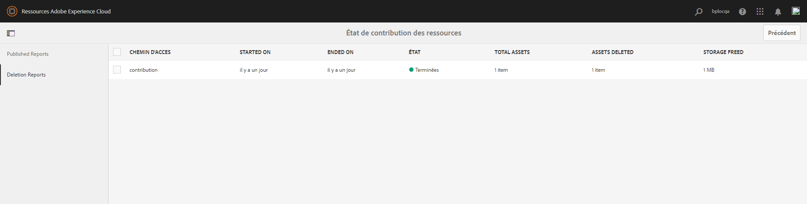

# Nouveautés d’Experience Manager Assets Brand Portal {#what-s-new-in-aem-assets-brand-portal}

Adobe Experience Manager Assets Brand Portal permet d’acquérir, de contrôler et de distribuer facilement et en toute sécurité des ressources créatives approuvées destinées à des tiers externes et aux collaborateurs de l’entreprise sur différents appareils. Brand Portal améliore l’efficacité du partage des ressources, accélère la mise sur le marché des ressources et réduit les risques de non-conformité et d’accès non autorisé. Adobe s’efforce d’améliorer l’expérience globale de Brand Portal. Vous trouverez ci-dessous un aperçu des nouvelles fonctionnalités et améliorations.

## Changements de la version 2024.10.0 {#what-changed-in-October-2024}

Brand Portal 2024.10.0 est une version interne qui comprend des correctifs pour les problèmes critiques. Consultez les dernières [Notes de mise à jour de Brand Portal](brand-portal-release-notes.md).

## Changements de la version 2024.02.0 {#what-changed-in-February-2024}

Brand Portal 2024.02.0 est une version interne qui comprend des correctifs pour les problèmes critiques. Consultez les dernières [Notes de mise à jour de Brand Portal](brand-portal-release-notes.md).

## Changements de la version 2023.10.0 {#what-changed-in-October-2023}

Brand Portal 2023.10.0 est une version interne qui comprend des correctifs pour les problèmes critiques. Consultez les dernières [Notes de mise à jour de Brand Portal](brand-portal-release-notes.md).

## Changements de la version 2023.08.0 {#what-changed-in-August-2023}

Brand Portal 2023.08.0 est une version interne qui comprend des correctifs pour les problèmes critiques. Consultez les dernières [Notes de mise à jour de Brand Portal](brand-portal-release-notes.md).

## Changements de la version 2023.05.0 {#what-changed-in-May-2023}

Brand Portal 2023.05.0 est une version interne qui comprend des correctifs pour les problèmes critiques. Consultez les dernières [Notes de mise à jour de Brand Portal](brand-portal-release-notes.md).

## Changements de la version 2023.02.0 {#what-changed-in-February-2023}

Brand Portal 2023.02.0 est une version interne qui comprend des correctifs pour les problèmes critiques. Consultez les dernières [Notes de mise à jour de Brand Portal](brand-portal-release-notes.md).

## Changements de la version 2022.10.0 {#what-changed-in-October-2022}

Brand Portal 2022.10.0 est une version interne qui comprend des correctifs pour les problèmes critiques. Consultez les dernières [Notes de mise à jour de Brand Portal](brand-portal-release-notes.md).

## Changements de la version 2022.08.0 {#what-changed-in-August-2022}

Brand Portal 2022.08.0 est une version interne qui comprend des correctifs pour les problèmes critiques. Consultez les dernières [Notes de mise à jour de Brand Portal](brand-portal-release-notes.md).

## Changements de la version 2022.05.0 {#what-changed-in-May-2022}

Brand Portal exécute désormais des tâches automatiques toutes les douze heures afin de supprimer toutes les ressources Brand Portal publiées sur AEM. Par conséquent, vous n’avez pas besoin de supprimer manuellement les ressources du dossier Contribution pour que la taille du dossier reste inférieure à la limite de seuil. Vous pouvez également surveiller le statut des tâches de suppression exécutées automatiquement à l’aide de l’option **[!UICONTROL Outils]** > **[!UICONTROL Statut de la contribution des ressources]** > **[!UICONTROL Rapports de suppression]** dans Brand Portal. Le rapport relatif à une tâche fournit les détails suivants :

* Heure de début de la tâche.
* Heure de fin de la tâche.
* Statut de la tâche.
* Total des ressources incluses dans une tâche.
* Nombre total de ressources supprimées dans une tâche.
* Stockage total mis à disposition suite à l’exécution de la tâche.

Vous pouvez également afficher plus de détails sur chaque ressource incluse dans un traitement de suppression. Des détails tels que le titre, la taille, l’auteur, le statut de suppression et la durée de suppression de la ressource sont inclus dans le rapport.

En outre, Brand Portal 2022.05.0 comprend des correctifs pour les problèmes critiques. Consultez les dernières [Notes de mise à jour de Brand Portal](brand-portal-release-notes.md).

## Changements dans la version 2022.02.0 {#what-changed-in-Feb-2022}

Brand Portal 2022.02.0 est une version interne qui comprend des correctifs pour les problèmes critiques. Consultez les dernières [Notes de mise à jour de Brand Portal](brand-portal-release-notes.md).

## Changements dans la version 2021.10.0 {#what-changed-in-october-2021}

Brand Portal 2021.10.0 est une version interne qui comprend des correctifs pour les problèmes critiques. Consultez les dernières [Notes de mise à jour de Brand Portal](brand-portal-release-notes.md).

## Changements dans la version 2021.08.0 {#what-changed-in-august-2021}

Brand Portal 2021.08.0 est une nouvelle version interne qui présente les profils Entreprise pour les clients Grands comptes et Équipes afin de permettre aux organisations de mieux contrôler leurs ressources. Les personnes disposent désormais de droits spécifiques à une organisation pour les nouvelles organisations et les organisations migrées. Lors de la migration, tous les comptes Adobe ID existants sont migrés vers les Business ID.

* Des Business ID pour toutes les organisations nouvelles et existantes une fois migrées.
* Les Business ID ne nécessitent aucune configuration spécifique, comme la demande d’un domaine ou la configuration d’une connexion unique.
* Vous pouvez ajouter des utilisateurs avec n’importe quelle adresse e-mail, y compris les domaines de messagerie publics tels que gmail.com ou outlook.com.

**Impact sur les utilisateurs de Brand Portal**

La migration n’a aucune incidence sur votre jeu de données, vos ressources, vos utilisateurs ou les paramètres existants. La seule modification interne qui a lieu pendant la migration est le droit de votre organisation existante aux profils Entreprise.

>[!NOTE]
>
>Les profils Entreprise sont actuellement utilisables pour les nouvelles organisations créées après le 16 août 2021.
>
>Jusqu’à la fin de la migration de votre organisation, vous pourrez continuer à utiliser les Adobe ID, Enterprise ID et Federated ID pour accéder à l’organisation.

### Articles de référence {#reference-articles}

* [Présentation des profils Adobe](https://helpx.adobe.com/fr/enterprise/kb/introducing-adobe-profiles.html)

* [Gestion des profils Adobe](https://helpx.adobe.com/fr/enterprise/using/manage-adobe-profiles.html)

* [Mise à jour de l’expérience de connexion pour les utilisateurs et les administrateurs](https://helpx.adobe.com/fr/enterprise/using/storage-for-business.html#new-admin-sign-in-exp)

* [Restriction de connexion pendant la migration](https://helpx.adobe.com/fr/enterprise/kb/account-temporarily-unavailable.html)

* [Gestion des utilisateurs dans Admin Console](https://helpx.adobe.com/fr/enterprise/using/manage-users-individually.html)

* [Gestion des profils de produit pour les utilisateurs Grands comptes](https://helpx.adobe.com/fr/enterprise/using/manage-product-profiles.html#assign-users)

* [Propriété d’un domaine](https://helpx.adobe.com/enterprise/admin-guide.html/enterprise/using/set-up-identity.html#directory-trusting)

<!--   
### Add new users to T2E organization   {#add-users-to-T2E-org}

On adding a new user in Admin Console for a new or migrated T2E organization, the user will have to perform an additional step **Join Team** to get entitled to the T2E organization. 

The user is entitled only if the user chooses to **Join Team**, otherwise the user won't get access to the selected T2E organization in Brand Portal. 

>[!NOTE]
>
>The workflow is not applicable to the existing Brand Portal users.

### Additional screen while navigating to Admin Console   {#navigate-to-admin-console}

The administrators will have to perform an additional step of selecting the T2E organization while navigating from Brand Portal to Admin Console. The workflow applies on the new and migrated T2E organizations.   

Selection of the T2E organization is a one-time activity and is not required everytime the administrator navigates from Brand Portal to Admin Console.

1. Log in to a T2E organization in Brand Portal as administrator.
1. Go to **[!UICONTROL Tools]** > **[!UICONTROL Users]** > **[!UICONTROL Management]** and click on the link **[!UICONTROL Launch Admin Console]**. 

   Or, go to **[!UICONTROL Unified Shell]** > **[!UICONTROL Administration]** and click on the link **[!UICONTROL Launch Admin Console]**. 
1. Search the T2E organization to login to Admin Console.

   

### Restriction during migration of an organization   {#login-restriction}

When an organization is undergoing T2E migration, the users of that organization will not be able to login to Brand Portal. The following error message appears on the screen. However, the migration won't impact the active user session until the token expires. 

Once the migration is complete, the users can login to Brand Portal. The users will receive an email notification containing the entitlement changes. If the users are entitled to more than one organization, they will have to select the organization at the time of login. 
-->

<!--
For a new or migrated T2E orgnization, the users will have an organization specific entitlement. A user can have multiple entitlements with the same email id for different T2E organizations. 
-->

## Changements dans la version 2021.06.0 {#what-changed-in-june-2021}

Brand Portal 2021.06.0 est une version interne qui comprend des correctifs pour les problèmes critiques. Consultez les dernières [Notes de mise à jour de Brand Portal](brand-portal-release-notes.md).

## Changements dans la version 2021.02.0 {#what-changed-in-feb-2021}

Brand Portal 2021.02.0 améliore AEM Assets as a Cloud Service avec le workflow d’activation et la fonctionnalité d’approvisionnement des ressources. Elle améliore également l’expérience de téléchargement des ressources et inclut des correctifs critiques. Cette version permet également aux administrateurs et administratrices de configurer le comportement de téléchargement par défaut des dossiers, des collections et des ressources téléchargées en masse au niveau du client. Le **[!UICONTROL rapport d’utilisation]** de Brand Portal a également été modifié pour refléter les utilisateurs actifs de Brand Portal.

>[!IMPORTANT]
>
> * Brand Portal est en mode de maintenance. Toutes les nouvelles innovations sont disponibles sur [Content Hub](https://experienceleague.adobe.com/fr/docs/experience-manager-cloud-service/content/assets/content-hub/product-overview).
> * Si vous devez encore activer Brand Portal, contactez votre représentant Adobe pour obtenir des détails sur votre cas d’utilisation et les autres exigences spécifiques.
> * Brand Portal n’est pas disponible avec [Assets Prime](https://experienceleague.adobe.com/en/docs/experience-manager-cloud-service/content/assets/assets-prime) ou [Assets Ultimate](https://experienceleague.adobe.com/fr/docs/experience-manager-cloud-service/content/assets/assets-ultimate-overview). Cependant, les clients Assets as a Cloud Service existants, qui ont déjà accès à Brand Portal, peuvent continuer à l’utiliser lorsqu’ils passent à Assets Ultimate.

<!--

### Activate Brand Portal on AEM Assets as a Cloud Service {#bp-automation-on-cloud-service}

AEM Assets as a Cloud Service is now entitled to have a pre-configured Brand Portal instance. The Cloud Manager user can activate Brand Portal on the AEM Assets as a Cloud Service instance.

Earlier, AEM Assets as a Cloud Service was manually configured with Brand Portal using Adobe Developer Console.

The Cloud Manager user triggers the activation workflow that creates the required configurations at the backend and activates Brand Portal on the same IMS org as of the AEM Assets as a Cloud Service instance. 

To activate Brand Portal on your AEM Assets as a Cloud Service instance:

1. Log in to Adobe Cloud Manager and navigate to **[!UICONTROL Environments]**.
1. Select the environments (one by one) from the list. Once you find the environment associated with Brand Portal, click on the **[!UICONTROL Activate Brand Portal]** button to begin the activation workflow. 
1. Once the Brand Portal tenant is activated, the status changes to Activated.

See [activate Brand Portal on AEM Assets as a Cloud Service](https://experienceleague.adobe.com/en/docs/experience-manager-cloud-service/content/assets/brand-portal/configure-aem-assets-with-brand-portal).

### Asset Sourcing on AEM Assets as a Cloud Service {#asset-sourcing-on-cloud-service}

The Asset Sourcing feature is now available on AEM Assets as a Cloud Service. The feature is by default enabled for all the cloud service users. The permitted Brand Portal users can contribute to Asset Sourcing by uploading new assets to the contribution folders and publish the contribution folder from Brand Portal to AEM Assets as a Cloud Service instance. Administrators can review and approve contributions from Brand Portal users before distributing them to other users.     

Earlier, Asset Sourcing was only available on AEM Assets (on premise and managed service). 

See [Asset Sourcing in Brand Portal](https://experienceleague.adobe.com/en/docs/experience-manager-brand-portal/using/asset-sourcing-in-brand-portal/brand-portal-asset-sourcing).
-->

### Téléchargement de ressources {#asset-download-setting}

Outre les **[!UICONTROL Paramètres de téléchargement]** existants, les administrateurs de Brand Portal peuvent désormais configurer le paramètre **[!UICONTROL Téléchargement de ressources]**. Ce paramètre permet aux administrateurs de contrôler le comportement de téléchargement par défaut des dossiers, des collections et des ressources téléchargées en masse (plus de 20 ressources) au niveau du client.

<!--
Earlier, all the asset renditions were directly downloaded in a zip folder in case of folder, collection, and bulk download of assets. As the **[!UICONTROL Download]** dialog box is skipped for folders or collections, there was no mechanism to control the downloading behaviour of the assets. Due to this, the users were finding it difficut to search for a particular asset rendition from a folder containing huge bunch of downloaded renditions. 
-->

Auparavant, tous les rendus de ressources étaient directement téléchargés dans un dossier zip. La boîte de dialogue **[!UICONTROL Télécharger]** a été ignorée pour les dossiers et les collections. Il n’existait aucune méthode pour contrôler le comportement de téléchargement des ressources, ce qui rendait difficile la recherche d’un rendu particulier à partir d’un grand nombre de téléchargements.

Le paramètre **[!UICONTROL Téléchargement de ressources]** permet désormais de créer un dossier distinct pour chaque ressource lors du téléchargement des dossiers, des collections ou du téléchargement en masse des ressources.

Si le paramètre **[!UICONTROL Téléchargement de ressources]** est désactivé, les dossiers ou collections sont téléchargés dans un dossier zip contenant tous les rendus de ressources sous le même dossier, à l’exception du téléchargement des ressources à l’aide du lien de partage.

Connectez-vous à votre client Brand Portal en tant qu’administrateur et accédez à **[!UICONTROL Outils]** > **[!UICONTROL Télécharger]**. Les administrateurs et administratrices peuvent activer le paramètre **[!UICONTROL Téléchargement de ressources]** pour créer un dossier distinct pour chaque ressource lors du téléchargement de dossiers, de collections et de téléchargements en masse de ressources.

Consultez [Téléchargement des ressources à partir de Brand Portal](https://experienceleague.adobe.com/fr/docs/experience-manager-brand-portal/using/download/brand-portal-download-assets).
<!--
### Download using Share link {#download-using-share-link}

The default behavior of downloading the assets using share link is now independent of the **[!UICONTROL Download Settings]**. A separate folder is created for each asset while downloading the assets using share link. 
-->

### Rapport d’utilisation {#usage-report}

Le **[!UICONTROL rapport d’utilisation]** de Brand Portal a été modifié pour refléter uniquement les utilisateurs actifs de Brand Portal. Les utilisateurs de Brand Portal qui ne sont affectés à aucun profil de produits dans Admin Console sont considérés comme des utilisateurs inactifs et ne sont pas reflétés dans le **[!UICONTROL rapport d’utilisation]**.

Auparavant, les utilisateurs actifs comme inactifs figuraient dans le rapport d’utilisation.

## Changements dans la version 2020.10.0 {#what-changed-in-oct-2020}

La version 2020.10.0 de Brand Portal est une version améliorée qui se concentre sur la simplification de l’expérience de téléchargement des ressources et comprend des correctifs critiques. Cette amélioration introduit un workflow nouveau et amélioré pour les téléchargements de ressources, avec des options permettant d’exclure les rendus et les téléchargements directs du panneau **[!UICONTROL Rendus]**. Il permet également de configurer les droits d’accès et de téléchargement pour des groupes de personnes spécifiques et offre une navigation facile vers les fichiers, les collections et les liens partagés de toutes les pages Brand Portal. Consultez les dernières [Notes de mise à jour de Brand Portal](brand-portal-release-notes.md).

### Expérience de téléchargement simplifiée {#download-dialog}

Auparavant, la boîte de dialogue **[!UICONTROL Télécharger]** offrait plusieurs options, telles que la création de dossiers distincts pour chaque ressource, l’envoi de ressources par e-mail, la sélection de ressources d’origine, etc. Ces options prêtaient à confusion pour les profils non techniques ou les nouvelles personnes, en particulier lors du téléchargement de plusieurs ressources ou dossiers. En outre, la personne ne pouvait pas afficher tous les rendus de ressources ni exclure un rendu personnalisé ou dynamique spécifique.

La nouvelle boîte de dialogue **[!UICONTROL Télécharger]** généralise le processus de sélection et de filtrage des ressources, ce qui permet aux personnes utilisant Brand Portal de prendre des décisions efficaces lors du téléchargement des rendus de ressources. Elle liste toutes les ressources sélectionnées et leurs rendus en fonction de la configuration de [**[!UICONTROL Téléchargement]**](brand-portal-download-assets.md) et des paramètres de **[!UICONTROL Téléchargement]**.

>[!NOTE]
>
>Le **[!UICONTROL téléchargement rapide]** est désormais activé par défaut pour toutes les personnes et IBM® [Aspera Connect 3.9.9](https://www.ibm.com/support/fixcentral/swg/selectFixes?parent=ibm~Other%20software&product=ibm/Other+software/IBM+Aspera+Connect&release=3.9.9&platform=All&function=all) doit être installé dans l’extension de leur navigateur avant de télécharger les ressources à partir de Brand Portal.

<!--
If any of the **[!UICONTROL Custom Rendition]** or **[!UICONTROL System Rendition]** is enabled in the [**[!UICONTROL Download]**](brand-portal-download-assets.md) configuration and **[!UICONTROL Download]** settings are enabled for the group users, the new **[!UICONTROL Download]** dialog box appears with all the renditions of the selected assets or folders containing assets in a List View. 
-->

Dans la boîte de dialogue **[!UICONTROL Télécharger]**, les actions suivantes sont possibles :

* afficher tous les rendus disponibles de toutes les ressources dans la liste de téléchargement ;
* exclure les rendus des ressources qui ne sont pas nécessaires pour le téléchargement ;
* appliquer le même jeu de rendus à tous les types de ressource similaires en un seul clic ;
* appliquer différents ensembles de rendus pour différents types de ressources ;
* créez un dossier distinct pour chaque ressource ;
* télécharger les ressources sélectionnées et leurs rendus.

Le workflow de téléchargement reste le même pour les ressources uniques ou multiples, les dossiers contenant des ressources, les ressources qui sont ou non sous licence, ainsi que le téléchargement de ressources à l’aide d’un lien de partage. Consultez la [procédure de téléchargement des ressources à partir de Brand Portal](https://experienceleague.adobe.com/fr/docs/experience-manager-brand-portal/using/download/brand-portal-download-assets).

### Navigation rapide {#quick-navigation}

Auparavant, l’option nécessaire pour afficher **[!UICONTROL Fichiers]**, **[!UICONTROL Collections]** et **[!UICONTROL Liens partagés]** était masquée et il fallait plusieurs clics pour que l’utilisateur puisse passer à une autre vue.

Dans Brand Portal 2020.10.0, les utilisateurs peuvent accéder en un seul clic à **[!UICONTROL Fichiers]**, **[!UICONTROL Collections]** et **[!UICONTROL Liens partagés]** à partir de toutes les pages de Brand Portal en utilisant les liens de navigation rapide.

### Panneau de rendu amélioré {#rendition-panel}

Auparavant, les utilisateurs et utilisatrices ne pouvaient afficher que la ressource d’origine et ses rendus dans le panneau **[!UICONTROL Rendus]** si l’un des **[!UICONTROL rendus personnalisés]** ou le **[!UICONTROL rendu système]** était activé dans la configuration de **[!UICONTROL Téléchargement]**. En outre, les personnes devaient télécharger tous les rendus de ressources, car il n’existait aucun filtre pour exclure des rendus personnalisés ou dynamiques spécifiques qui n’étaient pas requis.

<!--
Earlier, if any of the custom or system renditions was enabled in the **[!UICONTROL Download]** settings, an additional **[!UICONTROL Download]** dialog box appeared on clicking the **[!UICONTROL Download]** button wherein the user had to manually select the set of renditions (original asset, custom renditions, dynamic renditions) to download.
There was no filter to exclude specific custom or dynamic renditions which were not required for download.
-->

Dans Brand Portal 2020.10.0, les pesonnes peuvent exclure des rendus spécifiques et [télécharger directement les rendus sélectionnés à partir du panneau Rendus](brand-portal-download-assets.md#download-assets-from-asset-details-page) de la page de détails de la ressource sans avoir à ouvrir la boîte de dialogue **[!UICONTROL Télécharger]**.

<!-- 
In Brand Portal 2020.10.0, direct download and exclude renditions features are introduced in the **[!UICONTROL Renditions]** panel on the asset details page. All the renditions (original asset, custom renditions, dynamic renditions) under the rendition panel are now associated with a check box and are enabled by default. 

The user can clear the check boxes to exclude the renditions which are not required for download. And can click on the **[!UICONTROL Download]** button in the **[!UICONTROL Renditions]** panel to directly download the selected set of renditions in a zip folder without having to open the **[!UICONTROL Download]** dialog box.
-->

### Configuration des paramètres de téléchargement {#download-permissions}

Les administrateurs et administratrices de Brand Portal peuvent désormais configurer des paramètres pour que les groupes de personnes puissent afficher ou télécharger des ressources et des rendus d’origine, ou les deux, à partir de la page des détails de la ressource, en plus des configurations de **[!UICONTROL Téléchargement]** existantes.

Connectez-vous à votre client Brand Portal en tant qu’administrateur et accédez à **[!UICONTROL Outils]** > **[!UICONTROL Utilisateurs]**.

Dans la page **[!UICONTROL Rôles utilisateur]**, accédez à l’onglet **[!UICONTROL Groupes]** pour configurer la vue ou les paramètres de téléchargement des groupes d’utilisateurs.

Auparavant, les paramètres étaient disponibles uniquement pour restreindre le nombre d’utilisateurs du groupe pouvant télécharger la ressource d’origine.

L’onglet **[!UICONTROL Groupes]** de la page **[!UICONTROL Rôles utilisateur]** permet aux administrateurs de configurer les paramètres d’affichage et de téléchargement :

* Si les paramètres **[!UICONTROL Télécharger l’original]** et **[!UICONTROL Télécharger les rendus]** sont activés, les utilisateurs du groupe sélectionné peuvent afficher et télécharger les ressources d’origine et leurs rendus.
* Si les deux paramètres sont désactivés, les utilisateurs peuvent uniquement afficher les ressources d’origine. Les rendus de ressources ne sont pas visibles par les utilisateurs sur la page des détails de la ressource.
* Si seul le paramètre **[!UICONTROL Télécharger l’original]** est activé, les utilisateurs peuvent afficher et télécharger uniquement les ressources d’origine à partir de la page des détails de la ressource.
* Si seul le paramètre **[!UICONTROL Télécharger les rendus]** est activé, les utilisateurs peuvent afficher la ressource d’origine, mais ne peuvent pas la télécharger. Cependant, l’utilisateur peut afficher et télécharger les rendus de ressources.

Consultez [Configuration du téléchargement de ressource](https://experienceleague.adobe.com/fr/docs/experience-manager-brand-portal/using/download/brand-portal-download-assets#configure-download-permissions).

>[!NOTE]
>
>Si une personne est ajoutée à plusieurs groupes, et si l’un de ces groupes présente des restrictions, les restrictions s’appliquent à cette personne.

<!--
>Restrictions to access the original asset and their renditions do not apply to administrators even if they are members of restricted groups.
 >
 >The users can always download assets and their renditions from the repository using a `curl` request even if the download configurations are turned-off.
 >
-->

## Changements dans la version 6.4.7 {#what-changed-in-647}

La version 6.4.7 de Brand Portal intègre la visionneuse de document, améliore l’expérience de téléchargement des ressources et inclut des correctifs critiques. Consultez les dernières [Notes de mise à jour de Brand Portal](brand-portal-release-notes.md).

<!--
Brand Portal 6.4.7 release brings in the Document Viewer, leverages the Brand Portal administrators to configure asset download, and centers top customer requests. See latest [Brand Portal Release Notes](brand-portal-release-notes.md).
-->

### Visionneuse de document {#doc-viewer}

La visionneuse de document améliore l’expérience d’affichage des PDF. Elle offre une expérience similaire à celle d’Adobe Document Cloud lors de l’affichage des fichiers PDF dans Brand Portal.

Auparavant, seules des options limitées étaient disponibles pour consulter les fichiers PDF.

Les personnes utilisant Brand Portal peuvent utiliser la visionneuse de documents pour afficher les pages et les signets, rechercher du texte, effectuer un zoom avant ou arrière et parcourir les pages. Elles peuvent passer à une page spécifique, s’adapter à une fenêtre ou à un écran, et activer/désactiver la visibilité de la barre d’outils.

>[!NOTE]
>
>L’expérience d’affichage des autres formats de documents reste inchangée.

### Expérience de téléchargement {#download-configurations}

Le processus de téléchargement des ressources a été repensé de façon à simplifier l’expérience de la personne lorsqu’elle [télécharge des ressources à partir de Brand Portal](brand-portal-download-assets.md).

Le workflow actuel de téléchargement de ressources à partir de Brand Portal est nécessairement suivi de l’apparition d’une boîte de dialogue **[!UICONTROL Télécharger]** avec plusieurs options de téléchargement.

Dans Brand Portal 6.4.7, l’équipe d’administration de Brand Portal peuvent configurer les paramètres de **[!UICONTROL Téléchargement]** des ressources. Les configurations disponibles sont les suivantes :

* **[!UICONTROL Téléchargement rapide]**
* **[!UICONTROL Rendus personnalisés]**
* **[!UICONTROL Rendus du système]**

L’administrateur Brand Portal peut activer n’importe quelle combinaison pour configurer le téléchargement de ressources.

<!--In Brand Portal 6.4.7, fast download, custom renditions, and system renditions are the three configurations available.-->

* Si les configurations **[!UICONTROL Rendus personnalisés]** et **[!UICONTROL Rendus du système]** sont désactivées, les rendus originaux des ressources sont téléchargés sans boîte de dialogue supplémentaire, ce qui simplifie le téléchargement pour les personnes utilisant Brand Portal.

* Si l’une des options **[!UICONTROL Rendu personnalisé]** ou **[!UICONTROL Rendu du système]** est activée, la boîte de dialogue **[!UICONTROL Télécharger]** s’affiche, et la ressource d’origine ainsi que ses rendus sont téléchargés. L’activation de la configuration de **[!UICONTROL Téléchargement rapide]** accélère le processus de téléchargement.

Selon la configuration, le workflow de téléchargement reste constant pour les ressources autonomes, les ressources multiples et les dossiers contenant des ressources. Il inclut également les ressources sous licence ou non, ainsi que le téléchargement de ressources à l’aide d’un lien de partage.

## Changements dans la version 6.4.6 {#what-changed-in-646}

Dans Brand Portal 6.4.6, le canal d’autorisation entre AEM Assets et Brand Portal a été modifié. Brand Portal est désormais pris en charge sur AEM Assets as a Cloud Service, AEM Assets 6.3 et versions ultérieures. Dans AEM Assets 6.3 et les versions ultérieures, Brand Portal a d’abord été configuré dans l’interface d’utilisation classique à l’aide de la passerelle OAuth héritée. Cette passerelle utilise l’échange de jetons JWT pour obtenir un jeton d’accès IMS en vue de l’autorisation. AEM Assets est désormais configuré avec Brand Portal via Adobe Developer Console, qui fournit un jeton IMS pour autoriser votre client Brand Portal.

<!-- The steps to configure integration are different depending on your AEM version, and whether you are configuring for the first-time, or upgrading the existing integration:
-->

<!--
  
   | **AEM Version** |**New Integration** |**Upgrade Integration** |
|---|---|---|
| **AEM 6.5** |[Create new integration](../using/brand-portal-configure-integration-65.md) |[Upgrade existing integration](../using/brand-portal-configure-integration-65.md#upgrade-integration-65) | 
| **AEM 6.4** |[Create new integration](../using/brand-portal-configure-integration-64.md) |[Upgrade existing integration](../using/brand-portal-configure-integration-64.md#upgrade-integration-64) | 
| **AEM 6.3** |[Create new integration](../using/brand-portal-configure-integration-63.md) |[Upgrade existing integration](../using/brand-portal-configure-integration-63.md#upgrade-integration-63) | 
| **AEM 6.2** | | 

   -->

Les étapes de configuration d’AEM Assets avec Brand Portal sont différentes selon votre version d’AEM et selon que vous effectuez une configuration pour la première fois ou une mise à niveau des configurations existantes :

<!--| **AEM Version** |**New Configuration** |**Upgrade Configuration** |
|---|---|---|
| **AEM 6.5 (6.5.4.0 and above)** |[Create configuration](../using/brand-portal-configure-integration-65.md) |[Upgrade configuration](../using/brand-portal-configure-integration-65.md#upgrade-integration-65) | 
| **AEM 6.4 (6.4.8.0 and above)** |[Create configuration](../using/brand-portal-configure-integration-64.md) |[Upgrade configuration](../using/brand-portal-configure-integration-64.md#upgrade-integration-64) | 
| **AEM 6.3 (6.3.3.8 and above)** |[Create configuration](../using/brand-portal-configure-integration-63.md) |[Upgrade configuration](../using/brand-portal-configure-integration-63.md#upgrade-integration-63) | 

-->

<!-- AEM Assets configuration with Brand Portal on Adobe I/O is supported on:
* AEM 6.5.4.0 and above
* AEM 6.4.8.0 and above
* AEM 6.3.3.8 and above -->

| **Version d’AEM** | **Nouvelle configuration** | **Mise à niveau de la configuration** |
|---|---|---|
| **AEM Assets as a Cloud Service** | [Création d’une configuration](https://experienceleague.adobe.com/fr/docs/experience-manager-cloud-service/content/assets/brand-portal/configure-aem-assets-with-brand-portal) | - |
| **AEM 6.5 (6.5.4.0 et versions ultérieures)** | [Création d’une configuration](https://experienceleague.adobe.com/en/docs/experience-manager-65/content/assets/brandportal/configure-aem-assets-with-brand-portal) | [Mise à niveau de la configuration](https://experienceleague.adobe.com/fr/docs/experience-manager-65/content/assets/brandportal/configure-aem-assets-with-brand-portal#upgrade-integration-65) |

>[!NOTE]
>
>Adobe vous recommande de mettre à jour votre instance AEM pour utiliser le dernier pack de services.

Consultez les [Notes de mise à jour de Brand Portal](brand-portal-release-notes.md).

Consultez les [questions fréquentes relatives à Brand Portal](brand-portal-faqs.md).

## Changements dans la version 6.4.5 {#what-changed-in-645}

Brand Portal 6.4.5 permet aux agences et aux équipes externes de charger du contenu vers Brand Portal et de le publier sur AEM Assets, sans accéder à l’environnement de création. Cette fonctionnalité, qui est appelée **[Approvisionnement des ressources dans Brand Portal](brand-portal-asset-sourcing.md)**, améliore l’expérience client en permettant aux utilisateurs de contribuer et de partager des ressources avec d’autres utilisateurs de Brand Portal répartis dans le monde entier.

### Approvisionnement des ressources dans Brand Portal {#asset-sourcing-in-bp}

L’approvisionnement des ressources permet aux utilisateurs d’AEM (administrateurs/non-administrateurs) de créer des dossiers avec une propriété **Contribution des ressources** supplémentaire, en s’assurant que les dossiers s’ouvrent lorsque des utilisateurs Brand Portal envoient des ressources. Cela déclenche automatiquement un workflow qui crée deux sous-dossiers supplémentaires, appelés NEW et SHARED, dans le dossier **Contribution** nouvellement créé.

L’utilisateur ou l’utilisatrice AEM charge un résumé et des ressources de base dans le dossier **SHARED**. Cette personne définit les types de ressources nécessaires dans le dossier de contribution, en veillant à ce que les utilisateurs et utilisatrices de Brand Portal disposent des informations de référence requises. L’administrateur ou l’administratrice peut alors octroyer aux utilisateurs et utilisatrices actifs de Brand Portal l’accès au dossier de contribution avant de publier le nouveau dossier **Contribution** sur Brand Portal.

Après avoir ajouté du contenu dans le dossier **NEW**, l’utilisateur ou l’utilisatrice peut republier le dossier de contribution dans l’environnement de création AEM. L’import du nouveau contenu publié dans AEM Assets et la prise en compte de cette opération peuvent prendre quelques minutes.

En outre, toutes les fonctionnalités existantes restent inchangées. Les utilisateurs de Brand Portal peuvent afficher, rechercher et télécharger des ressources à partir du dossier de contribution, ainsi que des autres dossiers autorisés. Quant aux administrateurs et administratrices, ils peuvent partager le dossier de contribution de manière plus avancée, modifier les propriétés et ajouter des ressources aux collections.

>[!NOTE]
>
>L’approvisionnement des ressources dans Brand Portal est pris en charge dans AEM 6.5.2.0 et versions ultérieures.
>
>Cette fonctionnalité n’est pas prise en charge dans les versions antérieures : AEM 6.3 et AEM 6.4.

### Charger des ressources dans le dossier de contribution {#upload-assets-in-bp}

Les utilisateurs de Brand Portal qui disposent des autorisations appropriées peuvent charger individuellement des ressources ou des dossiers (fichier .zip) contenant plusieurs ressources vers le dossier de contribution. Un utilisateur peut charger plusieurs ressources dans un dossier de contribution. Cependant, un seul dossier peut être créé à la fois.

Notez que les utilisateurs de Brand Portal peuvent uniquement charger des ressources vers le dossier **NEW**. Le dossier **SHARED** est destiné à la distribution des exigences et des ressources de base.

### Publication du dossier de contribution sur AEM Assets {#publish-assets-to-aem}

Une fois le chargement terminé dans le dossier **NEW**, les utilisateurs de Brand Portal peuvent republier le dossier de contribution dans AEM. L’import des ressources ou du contenu publiés dans AEM Assets et la prise en compte de cette opération peuvent prendre quelques minutes. Voir [Publication du dossier de contribution sur AEM Assets](brand-portal-publish-contribution-folder-to-aem-assets.md).

## Changements dans la version 6.4.4 {#what-changed-in-644}

La version 6.4.4 de Brand Portal est axée sur les améliorations apportées à la recherche de texte et les principales demandes des clientes et clients. Consultez les dernières [Notes de mise à jour de Brand Portal](brand-portal-release-notes.md).

### Améliorations de la recherche

Brand Portal 6.4.4 et les versions ultérieures prennent en charge la recherche de texte partielle dans le prédicat de propriété du volet de filtrage. Pour permettre la recherche de texte partielle, activez l’option **Recherche partielle** dans le prédicat de propriété du formulaire de recherche.

Lisez les sections suivantes pour en savoir plus sur la recherche de texte partielle et la recherche par caractères génériques.

#### Recherche par expression partielle {#partial-phrase-search}

Vous pouvez désormais rechercher des ressources en spécifiant uniquement une partie (un mot ou deux) de l’expression recherchée dans le volet de filtrage.

**Cas d’utilisation**
La recherche par expression partielle s’avère utile lorsque vous avez des doutes sur la combinaison exacte des mots apparaissant dans l’expression recherchée.

Par exemple, si votre formulaire de recherche dans Brand Portal utilise le prédicat de propriété pour une recherche partielle sur le titre des ressources, la spécification du terme **camp** renvoie toutes les ressources contenant le mot « camp » dans l’expression de leur titre.

#### Recherche par caractères génériques {#wildcard-search}

Brand Portal permet d’utiliser un astérisque (&#42;) avec une partie d’un mot dans votre requête.

Si vous n’avez pas de certitude quant aux mots exacts apparaissant dans l’expression recherchée, vous pouvez utiliser une recherche par caractères génériques pour remplir les trous de votre requête.

Par exemple, la requête **climb&#42;** renvoie toutes les ressources avec des mots commençant par les caractères **climb** dans leur titre si le formulaire de recherche dans Brand Portal utilise le prédicat de propriété pour une recherche partielle sur le titre des ressources.

De même, la spécification de :

* **&#42;climb** renvoie toutes les ressources ayant des mots se terminant par les caractères **climb** dans l’expression de leur titre.

* **&#42;climb&#42;** renvoie toutes les ressources avec des mots comprenant les caractères **climb** dans l’expression de leur titre.

>[!NOTE]
>
>Lorsque vous cochez la case **Recherche partielle**, l’option **Ignorer la casse** est sélectionnée par défaut.

## Changements dans la version 6.4.3 {#what-changed-in}

Brand Portal 6.4.3 introduit un autre alias pour les URL d’accès, une nouvelle hiérarchie de dossiers et des améliorations de la prise en charge vidéo. Cette version introduit également la publication planifiée de l’instance de création AEM vers Brand Portal, les améliorations opérationnelles et répond aux demandes des clientes et clients.

### Navigation dans la hiérarchie de dossiers pour les non-administrateurs

Les administrateurs peuvent maintenant configurer la façon dont les dossiers s’affichent pour les utilisateurs non-administrateurs (éditeurs, observateurs et utilisateurs invités) lors de leur connexion. La configuration [Activer la hiérarchie de dossiers](../using/brand-portal-general-configuration.md) a été ajoutée dans **Paramètres généraux** au sein du panneau des outils d’administration. Si la configuration est :

* **activée**, l’arborescence de dossiers à partir du dossier racine est visible par les utilisateurs et les utilisatrices ne disposant pas de droits d’administration. Ces utilisateurs et utilisatrices bénéficient ainsi d’une expérience de navigation similaire à celle des administrateurs et administratrices.
* **désactivée**, seuls les dossiers partagés sont affichés sur la page de destination.

La fonctionnalité [Activer la hiérarchie de dossiers](../using/brand-portal-general-configuration.md) (lorsqu’elle est activée) vous aide à différencier les dossiers portant les mêmes noms, mais qui sont partagés depuis différentes hiérarchies. Lorsqu’ils se connectent, les utilisateurs non-administrateurs voient maintenant les dossiers parents (et ancêtres) virtuels des dossiers partagés.

Les dossiers partagés sont organisés dans les répertoires respectifs des dossiers virtuels. Vous pouvez identifier ces dossiers virtuels grâce à leur icône de cadenas.

La miniature par défaut des dossiers virtuels est l’image de miniature du premier dossier partagé.

### Recherche dans un chemin ou une hiérarchie de dossiers spécifique

Le prédicat **Explorateur de chemins d’accès** a été introduit dans le formulaire de recherche pour permettre la recherche de ressources dans un répertoire spécifique. Le chemin de recherche par défaut du prédicat pour l’Explorateur de chemins d’accès est `/content/dam/mac/<tenant-id>/`, mais il peut être configuré en modifiant le formulaire de recherche par défaut.

* Les utilisateurs administrateurs peuvent utiliser l’explorateur de chemins d’accès pour accéder à n’importe quel répertoire de dossiers sur Brand Portal.
* Les utilisateurs non-administrateurs peuvent utiliser l’explorateur de chemins d’accès pour accéder uniquement aux dossiers partagés avec eux, et revenir vers les dossiers parents.

  `/content/dam/mac/<tenant-id>/folderA/folderB/folderC`, par exemple, est partagé avec un utilisateur non administrateur. L’utilisateur peut rechercher des ressources dans le folderC à l’aide de l’explorateur de chemins d’accès. Cet utilisateur peut également accéder à folderB et folderA (puisqu’il s’agit de parents du folderC partagé avec l’utilisateur).

Vous pouvez maintenant restreindre la recherche de ressources au sein d’un dossier spécifique auquel vous avez accédé, au lieu de partir du dossier racine.

La recherche sous ces dossiers renvoie des résultats provenant seulement des ressources qui ont été partagées avec l’utilisateur.

### Prise en charge des rendus vidéo Dynamic Media

Les utilisateurs et utilisatrices dont l’instance de création AEM est en mode hybride Dynamic Media peuvent prévisualiser et télécharger les rendus Dynamic Media, en plus des fichiers vidéo originaux.

Pour activer la prévisualisation et le téléchargement des rendus Dynamic Media sur des comptes de clientes ou clients spécifiques, les administrateurs et administratrices spécifient une **Configuration de Dynamic Media**. Cette étape comprend l’URL du service vidéo et l’ID d’enregistrement dans la configuration **Vidéo** à partir du panneau des outils d’administration.

Vous pouvez prévisualiser les vidéos Dynamic Media sur :

* la page des détails de la ressource :
* l’affichage de la carte de la ressource ;
* la page de prévisualisation du partage de lien.

Les codes vidéo Dynamic Media peuvent être téléchargés à partir de :

* Brand Portal
* Lien partagé

### Publication planifiée sur Brand Portal

Le workflow de publication des ressources (et dossiers) de l’instance de création d’AEM 6.4.2.0 sur Brand Portal peut être planifié à des dates et heures ultérieures.

De façon similaire, les ressources publiées peuvent être supprimées du portail à une date ultérieure, en planifiant le workflow Dépublier de Brand Portal.

### Alias du client ou de la cliente configurable dans l’URL

Les organisations peuvent personnaliser l’URL de leur portail en y ajoutant un autre préfixe. Pour obtenir un alias pour le nom de client ou cliente dans l’URL de leur portail existant, les organisations doivent contacter le service clientèle.

Seul le préfixe de l’URL Brand Portal peut être personnalisé et non l’URL entière.\
Par exemple, une entreprise avec le domaine existant **geomettrix.brand-portal.adobe.com** peut demander et obtenir la création de **geomettrixinc.brand-portal.adobe.com**.

Cependant, l’instance de création AEM peut uniquement être [configurée](https://experienceleague.adobe.com/en/docs/experience-manager-65/content/assets/brandportal/configure-aem-assets-with-brand-portal) avec l’URL d’ID de client ou cliente et non avec l’URL d’alias de client ou cliente (alternative).

Les organisations peuvent répondre à leurs besoins en matière de branding en personnalisant l’URL de leur portail, au lieu de se contenter de l’URL fournie par Adobe.

### Améliorations de l’expérience de téléchargement

La version simplifie l’expérience de téléchargement avec un nombre réduit de clics et d’avertissements lors du :

* choix du téléchargement des rendus seuls (et non des ressources originales) ;
* téléchargement des ressources quand l’accès aux rendus originaux est restreint.

## Changements dans la version 6.4.2 {#what-changed-in-1}

Brand Portal 6.4.2 introduit des fonctionnalités pour répondre aux besoins de distribution des ressources des organisations, permettant une portée mondiale par le biais de l’accès de personnes invitées et des téléchargements plus rapides. Cette version offre également un contrôle amélioré avec de nouvelles configurations d’administration, un rapport ajouté et répond aux demandes des clientes et clients.

### Accès des personnes invitées

AEM Brand Portal permet aux personnes invitées d’accéder au portail. Une personne invitée n’a pas besoin d’identifiants pour accéder au portail et peut consulter et télécharger tous les dossiers et collections publics. Les utilisateurs invités peuvent ajouter des ressources à leur Lightbox (collection privée) et les télécharger. Ils peuvent aussi voir les prédicats de recherche de balises intelligentes ou non définis par les administrateurs. La session de personne invitée ne permet pas aux utilisateurs et utilisatrices de créer des collections et des recherches enregistrées ou de les partager, d’accéder aux paramètres des dossiers et des collections et de partager des ressources sous forme de liens.

Dans une organisation, plusieurs sessions de personne invitée simultanées sont autorisées, avec une limite de 10 % du nombre total d’utilisateurs et utilisatrices par organisation.

Une session de personne invitée reste active pendant deux heures. Par conséquent, l’état de la Lightbox est également conservé jusqu’à deux heures à compter du début de la session. Au bout de deux heures, la session d’invité doit redémarrer et l’état de Lightbox est donc perdu.

### Accélération des téléchargements

Les utilisateurs et utilisatrices de Brand Portal peuvent appliquer des téléchargements rapides reposant sur IBM® Aspera Connect pour obtenir des vitesses jusqu’à 25 fois plus rapides et profiter d’une expérience de téléchargement transparente quel que soit leur emplacement. Pour télécharger les ressources plus rapidement à partir de Brand Portal ou du lien partagé, les utilisateurs et utilisatrices doivent sélectionner l’option **Activer l’accélération des téléchargements** dans la boîte de dialogue de téléchargement, à condition que l’accélération des téléchargements soit activée dans leur organisation.

Pour activer l’accélération des téléchargements reposant sur IBM® Aspera, les administrateurs et administratrices doivent sélectionner l’option **Activer l’accélération des téléchargements** (qui est désactivée par défaut) dans [Paramètres généraux](brand-portal-general-configuration.md#allow-download-acceleration) au niveau du panneau des outils d’administration.

Pour en savoir plus sur les conditions préalables et les étapes de dépannage pour télécharger plus rapidement des fichiers de ressources à partir de Brand Portal et des liens partagés, consultez le [Guide d’accélération des téléchargements à partir de Brand Portal](../using/accelerated-download.md#main-pars-header).

### Rapport sur les connexions des utilisateurs et utilisatrices

Un nouveau rapport permettant de suivre les connexions des utilisateurs et des utilisatrices a été ajouté. Le rapport **Connexions des utilisateurs et utilisatrices** peut être essentiel pour permettre aux entreprises de réaliser un audit et de garder un œil sur les administrateurs et administratrices délégués et d’autres utilisateurs et utilisatrices de Brand Portal.

Le rapport consigne les noms d’affichage, les adresses e-mail, les personas (administrateur/administratrice, observateur/observatrice, éditeur/éditrice et personne invitée), les groupes, la dernière connexion, l’état d’activité et le nombre de connexions de chaque utilisateur et utilisatrice à partir du déploiement de Brand Portal 6.4.2 jusqu’au moment de la génération du rapport. Les administrateurs et administratrices peuvent exporter le rapport au format .csv. À l’instar d’autres rapports, le rapport Connexions des utilisateurs et utilisatrices permet aux organisations de surveiller étroitement les interactions des utilisateurs et utilisatrices avec les ressources de marque approuvées, assurant ainsi la conformité aux bureaux de conformité d’entreprise.

### Accéder aux rendus originaux

Les administrateurs et administratrices peuvent restreindre l’accès aux fichiers image d’origine et fournir l’accès aux rendus basse résolution à télécharger à partir de Brand Portal ou de liens partagés. Cet accès peut être contrôlé au niveau du groupe d’utilisateurs et d’utilisatrices à partir de l’onglet Groupes de la page Rôles d’utilisateur ou d’utilisatrice.

* Par défaut, tous les utilisateurs et utilisatrices peuvent télécharger les rendus originaux, car l’option Accès aux fichiers originaux est activée pour tous.
* Les administrateurs et administratrices doivent décocher les cases correspondantes pour empêcher un groupe d’utilisateurs et d’utilisatrices d’accéder aux rendus originaux.
* Si un utilisateur ou une utilisatrice est membre de plusieurs groupes, mais qu’un seul d’entre eux présente des restrictions, les restrictions s’appliquent à cet utilisateur ou à cette utilisatrice.
* Les restrictions ne s’appliquent pas aux administrateurs et administratrices, même s’ils sont membres de groupes restreints.
* Les autorisations de l’utilisateur partageant des ressources sous forme de liens s’appliquent aux utilisateurs qui téléchargent des ressources à partir de liens partagés.

### Chemin de hiérarchie de dossiers dans les vues Carte et Liste

En mode Carte, les cartes de dossiers affichent désormais des informations sur la hiérarchie de dossiers pour les utilisateurs et utilisatrices sans droits d’administration (éditeur/éditrice, observateur/observatrice et personne invitée). Cette fonctionnalité permet aux personnes de connaître l’emplacement des dossiers auxquels elles accèdent par rapport à la hiérarchie parente.

Les informations sur la hiérarchie des dossiers sont particulièrement utiles pour différencier les dossiers. Les dossiers concernés sont ceux dont les noms sont similaires à ceux d’autres dossiers partagés à partir d’une hiérarchie de dossiers différente. Si les personnes sans droits d’administration ne connaissent pas la structure de dossiers des ressources partagées avec elles, les ressources/dossiers aux noms similaires peuvent prêter à confusion.

* Les chemins affichés sur les cartes respectives sont tronqués pour s’adapter à la taille de celles-ci. Toutefois, les utilisateurs et utilisatrices peuvent afficher le chemin complet sous forme d’info-bulle en pointant sur le chemin tronqué.

La vue Liste affiche le chemin du dossier des ressources dans une colonne pour les utilisateurs et utilisatrices de Brand Portal.

### Option Vue d’ensemble pour afficher les propriétés des ressources

Brand Portal fournit aux personnes sans droits d’administration (éditeurs/éditrices, observateurs/observatrices et personnes invitées) l’option Vue d’ensemble qui leur permet d’afficher les propriétés de ressources/dossiers sélectionnés. L’option Vue d’ensemble est visible :

1. en haut de la barre d’outils lors de la sélection d’une ressource/d’un dossier ;
2. dans le menu déroulant, lors de la sélection du sélecteur de rail.

Si les personnes choisissent l’option Vue d’ensemble lorsqu’une ressource est sélectionnée/qu’un dossier est sélectionné, elles peuvent voir le titre, le chemin et l’heure de création de la ressource. En revanche, sur la page des détails de la ressource, l’option Vue d’ensemble permet aux personnes d’afficher les métadonnées de la ressource.

## Nouvelles configurations

Six nouvelles configurations sont ajoutées pour permettre aux administrateurs et administratrices d’activer et de désactiver les fonctionnalités suivantes pour des clientes et clients spécifiques :

* Autoriser l’accès des invités
* Autoriser les utilisateurs et utilisatrices à demander l’accès à Brand Portal
* Autoriser la suppression des ressources de Brand Portal par les utilisateurs et utilisatrices disposant de droits d’administration
* Autoriser la création de collections publiques
* Autoriser la création de collections dynamiques publiques
* Autoriser l’accélération des téléchargements

Les configurations ci-dessus sont disponibles dans les paramètres d’accès et généraux du panneau des outils d’administration.

### Interface d’utilisation `Adobe I/O` pour configurer les intégrations OAuth

À compter de la version 6.4.2, Brand Portal utilise l’interface OAuth héritée (`https://legacy-oauth.cloud.adobe.io/`) pour créer l’application JWT qui permet de configurer des intégrations OAuth pour intégrer AEM Assets à Brand Portal. Auparavant, l’IU de configuration des intégrations OAuth était hébergée à l’adresse `https://marketing.adobe.com/developer/`. Pour en savoir plus sur l’intégration d’AEM Assets à Brand Portal pour publier des ressources et des collections sur Brand Portal, consultez [Configuration de l’intégration d’AEM Assets à Brand Portal](https://experienceleague.adobe.com/en/docs/experience-manager-65/content/assets/brandportal/configure-aem-assets-with-brand-portal).

## Améliorations de la recherche

Les administrateurs et administratrices peuvent rendre les prédicats de propriétés non sensibles à la casse en utilisant le prédicat de propriété mis à jour qui dispose d’une case à cocher pour l’option Ignorer la casse. Cette option est disponible pour les prédicats de propriété et les prédicats de propriété à plusieurs valeurs.\
Toutefois, la recherche non sensible à la casse est comparativement plus lente que la recherche par défaut de prédicat de propriété. La multiplication de prédicats non sensibles à la casse dans le filtre de recherche peut ralentir la recherche. Adobe vous recommande d’utiliser judicieusement la recherche non sensible à la casse.

## Changements dans la version 6.4.1 {#what-changed-in-2}

Brand Portal 6.4.1 est une version de mise à niveau de la plateforme. Elle introduit plusieurs nouvelles fonctionnalités et améliorations essentielles, telles que la navigation, la recherche et les améliorations de performances.

### Améliorations de la navigation

* Nouveau rail d’arborescence de contenu permettant aux personnes de parcourir rapidement une hiérarchie de ressources.

* Nouveaux raccourcis clavier, comme _(p)_ pour accéder à la page Propriétés, _(e)_ pour la fonction Modifier et _(Ctrl+c)_ pour Copier.
* Amélioration du défilement et de l’expérience de chargement différé dans les vues Carte et Liste afin de parcourir un grand nombre de ressources.
* Amélioration du mode Carte avec la prise en charge de cartes de différentes dimensions en fonction du paramètre d’affichage.

* La vue Carte affiche maintenant un horodatage lorsque vous pointez sur le libellé de la date.

* Amélioration de la vue Colonne avec l’option **Plus de détails** affichée sous l’instantané de la ressource, ce qui vous permet d’accéder à la page des détails d’une ressource.

* La vue Liste affiche désormais par défaut les noms de fichier des ressources dans la première colonne. Elle affiche également les paramètres régionaux, le type de ressource, les dimensions, la taille, l’évaluation et les informations de publication. La nouvelle option **Paramètres d’affichage** peut être utilisée pour configurer la quantité de détails à afficher dans la vue Liste.

* Amélioration de l’expérience des détails des ressources avec la possibilité de naviguer entre les ressources à l’aide de nouveaux boutons de navigation et d’afficher le nombre de ressources.

* Nouvelle fonctionnalité de prévisualisation de fichiers audio, téléchargés à partir d’AEM, dans la page des détails de la ressource.
* Nouvelle fonctionnalité de ressources liées fournie dans les propriétés des ressources. Les ressources liées publiées sur Brand Portal à partir d’AEM conservent désormais leurs relations, avec des liens vers ces ressources associées disponibles sur la page des propriétés.
* Introduction d’une nouvelle configuration pour empêcher la création de collections publiques par les personnes ne disposant pas de droits d’administration. Les entreprises peuvent collaborer avec l’équipe du service clientèle pour configurer cette fonctionnalité sur des comptes spécifiques.

### Améliorations de la recherche

* Introduction d’une fonctionnalité permettant de revenir à la même position dans les résultats de recherche, après avoir accédé à un élément de recherche, sans avoir à relancer la requête.
* Nouveau nombre de résultats de recherche ajouté pour afficher le nombre de résultats de recherche.
* Le filtre de recherche de type de fichier amélioré vous permet désormais de filtrer les résultats de la recherche par types MIME spécifiques tels que .jpg, .png et .psd, plutôt que par catégories générales telles que Images, Documents et Multimédia.
* Amélioration des filtres de recherche pour les collections, avec des horodatages précis au lieu de la fonctionnalité précédente de curseur temporel.
* Nouveaux filtres de type Accès ajoutés pour rechercher les collections publiques ou non publiques.

### Optimisations des téléchargements

* Un seul fichier volumineux est directement téléchargé, sans créer de fichier compressé, afin d’améliorer la vitesse et le débit.
* La limite de téléchargement par taille de fichier pour la fonction de partage de lien est de **1** Go.

* Les utilisateurs et les utilisatrices peuvent désormais choisir de télécharger uniquement les fichiers personnalisés et originaux et d’empêcher les rendus prêts à l’emploi lors du téléchargement de ressources à partir de Brand Portal ou via la fonctionnalité de liens partagés.

### Améliorations des performances

* Vitesse de téléchargement des ressources jusqu’à 100 % plus rapide.
* Réponse de la recherche des ressources jusqu’à 40 % plus efficace.
* Performances de navigation jusqu’à 40 % plus réactives.

**Remarque** : Les améliorations citées sont celles constatées lors des tests effectués en laboratoire.

### Amélioration des fonctionnalités de création de rapports

**Ajout du rapport Partage de liens**
Un nouveau rapport, destiné à fournir des informations sur les liens partagés, a été ajouté. Le rapport Partage de liens répertorie toutes les URL vers les ressources partagées avec des utilisateurs et utilisatrices internes et externes. Il rend compte aux utilisateurs et utilisatrices de l’ensemble de l’organisation dans la période spécifiée. Il indique également quand le lien a été partagé, par qui et quand il expire.

**Modification du point d’entrée pour accéder au rapport Utilisation**
Le rapport Utilisation est désormais consolidé avec d’autres rapports et peut désormais être affiché à partir de la console Rapports de ressources. Pour accéder à la console Rapports de ressources, naviguez jusqu’à **Créer/Gérer des rapports** dans le panneau des outils d’administration.

**Amélioration de l’expérience d’utilisation pour la création de rapports**
L’interface de création de rapports sur Brand Portal est devenue plus intuitive et offre un bien meilleur contrôle aux entreprises. Hormis la création de divers rapports, les administrateurs peuvent désormais reconsulter les rapports générés et les télécharger ou les supprimer, car ils sont enregistrés dans Brand Portal.

Chaque rapport créé peut être personnalisé en ajoutant ou en supprimant des colonnes par défaut. De plus, des colonnes personnalisées peuvent être ajoutées aux rapports Téléchargement, Expiration et Publication pour contrôler leur degré de granularité.

### Outils d’administration améliorés

Amélioration du sélecteur de propriétés dans les outils d’administration pour les métadonnées, la recherche et les rapports avec saisie semi-automatique et fonctionnalité de navigation afin de simplifier l’expérience d’administration.

### Autres améliorations

* Les ressources publiées sur Brand Portal à partir d’AEM 6.3.2.1 et 6.4 peuvent désormais être rendues disponibles publiquement en cochant la case Publication du dossier public dans la boîte de dialogue Réplication d’AEM Assets Brand Portal.

* Lorsqu’une personne demande à accéder à Brand Portal, l’équipe d’administration en est informée par des e-mails de demande d’accès, en plus des notifications de la zone de notification de Brand Portal.

## Changements dans la version 6.3.2 {#what-changed-in-3}

Brand Portal 6.3.2 comprend des fonctionnalités nouvelles et améliorées qui répondent aux principales demandes des clients, ainsi que des améliorations de performances générales.

### Demande d’accès à Brand Portal {#request-access-to-brand-portal}

Les utilisateurs peuvent maintenant demander l’accès à Brand Portal à l’aide de la nouvelle option **Besoin d’un accès** disponible sur l’écran de connexion de Brand Portal.

Selon qu’ils disposent ou non d’un Adobe ID, les utilisateurs peuvent suivre le workflow adéquat pour envoyer une demande. Les administrateurs et administratrices de produit Brand Portal reçoivent ces demandes dans leur zone de notification et accordent l’accès via Adobe Admin Console.

Pour plus d’informations, consultez [Demande d’accès à Brand Portal](../using/brand-portal.md#requestaccesstobrandportal).

### Amélioration apportée au rapport sur les ressources téléchargées {#enhancement-in-the-assets-downloaded-report}

Le rapport sur les ressources téléchargées comporte désormais le nombre de téléchargements de ressources par personne pendant la période (date et heure) spécifiée. Les utilisateurs et utilisatrices peuvent télécharger ce rapport au format .csv pour compiler des données telles que le nombre total de téléchargements pour une ressource sous licence.

Pour plus d’informations, voir les étapes 3 et 6 de la section [Créer et gérer des rapports supplémentaires](../using/brand-portal-reports.md#createandmanageadditionalreports).

### Notification de maintenance de Brand Portal {#brand-portal-maintenance-notification}

Brand Portal affiche désormais une bannière de notification quelques jours avant une activité de maintenance à venir. Exemple de notification :

Pour plus d’informations, consultez [Notification de maintenance de Brand Portal](https://experienceleague.adobe.com/fr/docs/experience-manager-brand-portal/using/introduction/brand-portal).

### Amélioration des ressources sous licence partagées à l’aide de la fonctionnalité de partage de liens {#enhancement-for-licensed-assets-shared-using-the-link-share-feature}

Lorsque vous téléchargez des ressources sous licence à l’aide de la fonctionnalité de partage de liens, vous êtes désormais invité à accepter le contrat de licence de ces ressources.

Pour plus d’informations, voir l’étape 12 dans [Partage de ressources en tant que lien](../using/brand-portal-link-share.md#shareassetsasalink).

### Amélioration du sélecteur d’utilisateur {#user-picker-enhancement}

Les performances du sélecteur d’utilisateur ou d’utilisatrice ont été améliorées afin de prendre en compte les besoins des clientes et clients avec une base d’utilisateurs et d’utilisatrices volumineuse.

### Modifications du branding Experience Cloud {#experience-cloud-branding-changes}

Brand Portal se conforme désormais à la nouvelle valorisation de marque Adobe Experience Cloud.

## Changements dans la version 6.3.1 {#what-changed-in-4}

Brand Portal 6.3.1 comprend de nouvelles fonctionnalités améliorées orientées vers l’alignement de Brand Portal sur AEM.

### Mise à niveau de l’interface utilisateur {#upgraded-user-interface}

Pour aligner l’expérience d’utilisation de Brand Portal sur AEM, Adobe passe à l’interface d’utilisation Coral 3. Ce changement améliore l’utilisation générale, y compris la navigation et l’aspect.

#### Amélioration de l’expérience de navigation {#enhanced-navigational-experience}

* Accès rapide aux outils d’administration par le biais du nouveau logo Adobe :

* Navigation dans le produit à travers un recouvrement :

* Navigation rapide vers les dossiers parents :

* Recherche et navigation rapides vers le contenu et les outils requis :

### Amélioration de la navigation {#enhanced-browsing-experience}

* Nouveau mode Colonnes pour parcourir les dossiers imbriqués :

 

* Dans la liste des ressources contenues dans un dossier, les dernières ressources téléchargées apparaissent en début de liste.

### Amélioration de la recherche {#enhanced-search-experience}

* La nouvelle fonctionnalité de recherche Omni permet d’accélérer l’accès au contenu, aux fonctionnalités ou aux balises pertinents par le biais de suggestions automatiques qui s’affichent lorsque vous saisissez des mots-clés de recherche. La fonctionnalité de recherche Omni est disponible dans toutes les fonctions de recherche.

* Vous pouvez également ajouter des filtres à Omnisearch pour affiner davantage et accélérer votre recherche.

* La nouvelle recherche basée sur l’évaluation des ressources vous permet de rechercher des ressources avec des évaluations, si elles sont publiées à partir d’AEM Assets.
* La nouvelle fonctionnalité de recherche à plusieurs valeurs accepte plusieurs mots-clés avec l’opérateur AND pour découvrir des ressources plus rapidement.
* La nouvelle fonctionnalité d’optimisation des recherches permet d’améliorer la pertinence des recherches de sorte que des ressources spécifiques apparaissent en tête des résultats de la recherche.
* La nouvelle fonctionnalité de recherche basée sur les chemins d’accès vous permet de fournir le chemin d’accès à un dossier imbriqué pour pouvoir rechercher des ressources dans ce dossier.

#### Nouvelle recherche basée sur les balises intelligentes {#new-smart-tags-based-search}

Si des images avec des balises intelligentes sont publiées depuis AEM Assets vers Brand Portal, vous pouvez rechercher ces images dans Brand Portal à l’aide des noms de balises intelligentes comme mots-clés de recherche. Cette fonctionnalité n’est disponible que pour les fichiers.

### Amélioration des téléchargements {#enhanced-downloading-experience}

Après avoir téléchargé un dossier imbriqué, vous pouvez conserver la hiérarchie des dossiers d’origine. Les ressources d’un dossier imbriqué peuvent être téléchargées dans un seul dossier plutôt que dans des dossiers distincts.

### Amélioration des performances {#improved-performance}

Des améliorations apportées aux fonctionnalités de navigation, de recherche et de téléchargement accroissent de manière significative les performances de Brand Portal.

### Nouvelle technologie Digital Rights Management pour les ressources {#new-digital-rights-management-for-assets}

Les administrateurs et administratrices peuvent définir la date et l’heure d’expiration des ressources avant de les partager. Une fois qu’une ressource est arrivée à expiration, elle est visible par les observateurs et les éditeurs, mais ne peut pas être téléchargée. Lorsqu’une ressource arrive à expiration, les administrateurs et administratrices reçoivent une notification.

### Amélioration du tri des ressources {#enhanced-asset-sorting}

Le tri des ressources dans un dossier dans la vue Liste n’est plus limité au nombre de ressources affichées sur la première page. Toutes les ressources d’un dossier sont triées, qu’elles soient répertoriées ou non sur la première page.

### Amélioration de la création de rapports {#reporting-capabilities}

Les administrateurs et administratrices peuvent créer et gérer trois types de rapports : les ressources téléchargées, expirées et publiées. Vous pouvez également configurer les colonnes d’un rapport et exporter les rapports au format CSV.

### Métadonnées supplémentaires {#additional-metadata}

Brand Portal 6.3.1 comporte des métadonnées supplémentaires qui font partie d’AEM Assets 6.3. Vous pouvez utiliser le formulaire Éditeur de schéma pour contrôler les métadonnées qui doivent être visibles sur la page Propriétés des ressources. Les métadonnées des ressources ne sont pas visibles par les utilisateurs de partage de lien externes. Ceux-ci ne peuvent que prévisualiser et télécharger des ressources à l’aide de l’URL du partage de lien.

### Fonctionnalités supplémentaires pour les administrateurs {#additional-capabilities-for-administrators}

* Avant de finaliser les personnalisations sur le fond de l’écran de connexion, les administrateurs et administratrices peuvent prévisualiser les modifications.

* Lorsqu’un administrateur ou une administratrice ajoute de nouvelles personnes, celles-ci sont automatiquement incluses dans Brand Portal sans avoir besoin d’accepter d’invitations.

### Nouvelles fonctionnalités de publication d’AEM Assets 6.3 {#new-publishing-capabilities-in-aem-assets}

* Les administrateurs et administratrices AEM peuvent publier un schéma de métadonnées depuis AEM Assets sur Brand Portal à l’aide d’AEM 6.3 SP 1-CFP 1 (6.3.1.1) disponible depuis le quatrième trimestre de 2017.

* Les administrateurs et administratrices AEM peuvent publier toutes les balises depuis AEM Assets sur Brand Portal à l’aide d’AEM 6.2 SP1-CFP7 et d’AEM 6.3 SP 1-CFP 1 (6.3.1.1).

* Dans AEM Assets, vous pouvez publier des ressources et des collections qui comportent des balises, y compris des balises intelligentes. Vous pouvez ensuite rechercher ces ressources ou collections à l’aide de ces balises en tant que mots-clés de recherche dans Brand Portal.
