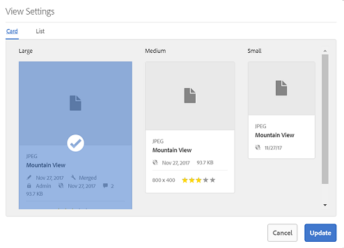
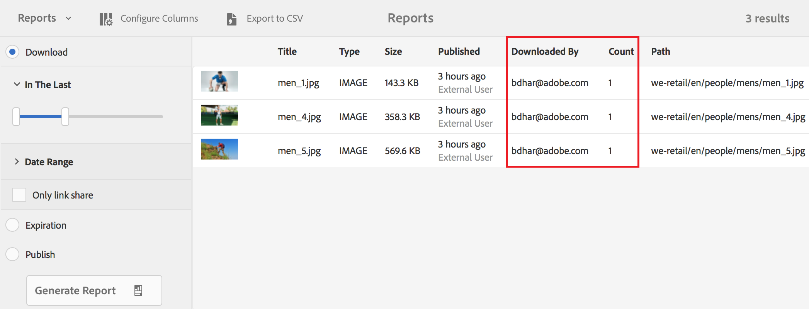

# Nouveautés d’AEM Assets Brand Portal {#what-s-new-in-aem-assets-brand-portal}

Adobe Experience Manager (AEM) Assets Portal vous permet d'acquérir, de contrôler et de distribuer facilement des ressources créatives approuvées aux utilisateurs externes et aux utilisateurs internes de l'entreprise. Brand Portal améliore l’efficacité du partage des ressources, accélère la mise sur le marché des ressources et réduit les risques de non-conformité et d’accès non autorisé. Adobe a pour objectif d’améliorer l’expérience globale de Brand Portal. Vous trouverez ci-dessous un aperçu des nouvelles fonctionnalités et améliorations.

## Changements dans la version 6.4.4 {#what-is-changing-in}

La version 6.4.4 de Brand Portal est axée sur les améliorations apportées à la recherche de texte et les principales demandes des clients. Consultez les dernières [Notes de mise à jour de Brand Portal](brand-portal-release-notes.md).

### Améliorations de la recherche {#search-enhancements}

Brand Portal 6.4.4 et les versions ultérieures prennent en charge la recherche de texte partiel sur le prédicat de propriété dans le panneau de filtrage. To allow partial text search you need to enable **Partial Search** in Property Predicate in the search form.

Lisez les sections suivantes pour en savoir plus sur la recherche de texte partiel et la recherche par caractères génériques.

#### Recherche par expression partielle {#partial-phrase-search}

Vous pouvez maintenant rechercher des ressources en spécifiant uniquement une partie (c’est-à-dire un mot ou deux) de l’expression recherchée dans le volet de filtrage.

**Cas d’utilisation**
La recherche de mots partiels est utile lorsque vous n'êtes pas sûr de la combinaison exacte des mots se produisant dans la phrase recherchée.

Par exemple, si votre formulaire de recherche dans Brand Portal utilise le prédicat de propriété pour une recherche partielle sur le titre des ressources, la spécification du terme **camp** renvoie toutes les ressources ayant le mot camp dans l’expression de leur titre.

#### Recherche par caractères génériques {#wildcard-search}

Le portail de marque permet d'utiliser l'astérisque (*) dans la requête de recherche avec une partie du mot dans votre phrase recherchée.

**Cas
d'utilisation** Si vous n'êtes pas certain des mots exacts qui se produisent dans la phrase recherchée, vous pouvez utiliser une recherche de caractères génériques pour combler les lacunes de votre requête de recherche.

For example, specifying **climb*** returns all the assets having words beginning with the characters **climb** in their title phrase if search form in Brand Portal uses Property Predicate for partial search on assets title.

De même, la spécification de :

* *** renvoie** tous les actifs dont les mots se terminent par des caractères **grimpent** dans leur expression de titre.

* *** montée *** renvoie tous les actifs dont les mots composés de caractères **augmentent** dans leur expression de titre.

>[!NOTE]
>
>Lorsque vous cochez la case **Recherche partielle**, l’option **Ignorer la casse** est sélectionnée par défaut.

## Changements dans la version 6.4.3 {#what-changed-in}

La version 6.4.3 de Brand Portal fournit aux organisations un alias alternatif en plus de leur ID de client dans l’URL d’accès à Brand Portal, une nouvelle configuration de hiérarchie de dossiers, des améliorations de la prise en charge des vidéos, la publication programmée à partir de l’instance d’auteur AEM vers Brand Portal ainsi que des améliorations opérationnelles. Elle répond également aux demandes des clients.

### Navigation dans la hiérarchie de dossiers pour les non-administrateurs

Les administrateurs peuvent maintenant configurer la façon dont les dossiers s’affichent pour les utilisateurs non-administrateurs (éditeurs, observateurs et utilisateurs invités) lors de leur connexion. [La configuration de la hiérarchie](../using/brand-portal-general-configuration.md) des dossiers est ajoutée à **Paramètres généraux** dans le panneau Outils d'administration. Si la configuration est :

* **activée**, l’arborescence de dossiers à partir du dossier racine est visible pour les utilisateurs non-administrateurs, ce qui leur procure une expérience de navigation semblable à celle des administrateurs ;
* **désactivé**, seuls les dossiers partagés sont affichés sur la page d'entrée.

**Le cas d’utilisation**

The [Enable Folder Hierarchy](../using/brand-portal-general-configuration.md) functionality (when enabled) helps you differentiate the folders with the same names shared from different hierarchies. Lorsqu’ils se connectent, les utilisateurs non-administrateurs voient maintenant les dossiers parents virtuels (et ancêtres) des dossiers partagés.
 

Les dossiers partagés sont organisés au sein des répertoires respectifs dans des dossiers virtuels. Vous pouvez identifier ces dossiers virtuels grâce à leur icône de verrou.

Notez que la miniature par défaut des dossiers virtuels est l’image de miniature du premier dossier partagé.

### Recherche dans un chemin ou une hiérarchie de dossiers spécifique

**Le prédicat Navigateur** de chemins est introduit dans le formulaire de recherche pour permettre la recherche de fichiers dans un répertoire spécifique. The default search path of search predicate for Path Browser is */content/dam/mac/&lt;tenant-id&gt;/*, which can be configured by editing the default search form.

* Les utilisateurs administrateurs peuvent utiliser l’explorateur de chemins d’accès pour accéder à n’importe quel répertoire de dossiers sur Brand Portal.
* Les utilisateurs non administrateurs peuvent utiliser le navigateur de chemins pour naviguer uniquement dans les dossiers (et revenir aux dossiers parents) partagés avec eux.
Par exemple, */content/dam/mac/ &lt; id_ client &gt;/foldera/folderb/folderc* est partagé avec un utilisateur non administrateur. L'utilisateur peut rechercher des fichiers dans folderc à l'aide du navigateur de chemins. Cet utilisateur peut également accéder à folderb et foldera (puisqu'il s'agit de parents du folderc partagé avec l'utilisateur).

**Le cas d’utilisation**

Vous pouvez maintenant restreindre la recherche de ressources au sein d’un dossier spécifique auquel vous avez accédé, au lieu de partir du dossier racine.

Notez que la recherche sous ces dossiers renvoie des résultats seulement parmi les ressources qui ont été partagées avec l’utilisateur.

### Prise en charge des rendus vidéo Dynamic Media

Les utilisateurs dont l'instance d'auteur AEM se trouve sur le mode hybride Dynamic Media peuvent prévisualiser et télécharger les rendus de médias dynamiques, en plus des fichiers vidéo d'origine.

To allow preview and download of dynamic media renditions on specific tenant accounts, administrators need to specify **Dynamic Media Configuration** (video service URL (DM-Gateway URL) and registration ID to fetch the dynamic video) in **Video** configuration from admin tools panel.

**Vous**
pouvez prévisualiser les vidéos multimédias dynamiques sur :

* Page des détails de la ressource
* Mode Carte de la ressource
* Page de prévisualisation du partage de lien

Les codes des vidéos Dynamic Media peuvent être téléchargés à partir de :

* Brand Portal
* Lien partagé

### Publication planifiée sur Brand Portal

Assets (and folders) publish workflow from [AEM (6.4.2.0)](https://helpx.adobe.com/experience-manager/6-4/release-notes/sp-release-notes.html#main-pars_header_9658011) Author instance to Brand Portal can be scheduled for a later date, time.

De façon similaire, les ressources publiées peuvent être supprimées du portail à une date (ou heure) ultérieure, en planifiant le workflow Annuler la publication sur Brand Portal.

### Alias de client configurable dans l’URL

Les organisations peuvent obtenir une URL de portail personnalisée comprenant un préfixe alternatif dans l’URL. Pour obtenir un alias pour le nom de client dans leur URL de portail existante, les organisations doivent entrer en contact avec l’assistance Adobe.

Notez que seul le préfixe de l’URL Brand Portal peut être adapté aux besoins du client, et non l’URL entière.\
For example, an organization with existing domain **geomettrix.brand-portal.adobe.com** can get **geomettrixinc.brand-portal.adobe.com** created on request.

Cependant, l’instance d’auteur AEM peut uniquement être [configurée](https://helpx.adobe.com/experience-manager/6-5/assets/using/brand-portal-configuring-integration.html) avec l’URL d’ID client et non avec l’URL (alternative) d’alias de client.

**Le cas d’utilisation**
Les organisations peuvent répondre à leurs besoins de valorisation de marque en faisant personnaliser l’URL de leur portail, au lieu de se contenter de l’URL fournie par Adobe.

### Amélioration de l’expérience de téléchargement

La version offre une expérience de téléchargement simplifiée avec un nombre réduit de clics et d’avertissements, lors du :

* choix de télécharger seulement les rendus (et pas les ressources originales) ;
* téléchargement des ressources quand l’accès aux rendus originaux est restreint.

## Changements dans la version 6.4.2 {#what-changed-in-1}

La version 6.4.2 de Brand Portal permet de répondre aux besoins de distribution des ressources des organisations et de les aider à accéder à un grand nombre d'utilisateurs distribués globalement par l'accès aux invités et l'expérience optimale avec des téléchargements accélérés. Brand Portal fournit également un meilleur contrôle aux organisations par le biais de nouvelles configurations pour les administrateurs et de nouveaux rapports, et répond aux demandes des clients.

### Accès des invités

AEM Brand Portal permet à des invités d’accéder au portail. Un utilisateur invité ne requiert pas d’informations d’identification pour accéder au portail, et il peut consulter et télécharger tous les dossiers et collections publics. Les utilisateurs invités peuvent ajouter des ressources à leur cadre lumineux (collection privée) et les télécharger. Ils peuvent aussi voir les prédicats de recherche et de recherche de balises intelligentes définis par les administrateurs. La session d’invité ne permet pas aux utilisateurs de créer des collections et des recherches enregistrées, ni de les partager à nouveau, d’accéder aux paramètres de collections et de dossiers et de partager les ressources en tant que liens.

Dans une entreprise, les sessions d’invités multiples simultanées sont permises, mais limitées à 10 % du nombre total d’utilisateurs de cette entreprise.

Une session d’invité reste active pendant deux heures. Par conséquent, l’état de Lightbox est également conservé jusqu’à deux heures à compter de l’heure de début de la session. Au bout de deux heures, la session d’invité doit redémarrer, et l’état de Lightbox est donc perdu.

### Téléchargements accélérés

Les utilisateurs de Brand Portal peuvent tirer parti des téléchargements rapides reposant sur IBM Aspera Connect pour obtenir des vitesses jusqu’à 25 fois plus rapides et profiter d’une expérience harmonieuse de téléchargement quel que soit leur emplacement dans le monde entier. Pour télécharger les ressources plus rapidement à partir de Brand Portal ou du lien partagé, les utilisateurs doivent sélectionner l’option **Activer l’accélération des téléchargements** dans la boîte de dialogue de téléchargement, pourvu que l’accélération des téléchargements soit activée dans leur organisation.

To enable IBM Aspera based accelerated download for the organization, administrators **Enable Download Acceleration** option (which is disabled by default) from [General Settings](brand-portal-general-configuration.md#allow-download-acceleration) in the administrative tools panel. Pour connaître les conditions préalables et les étapes de dépannage afin de télécharger des fichiers de ressources plus rapidement à partir de Brand Portal et de liens partagés, consultez le [Guide d’accélération des téléchargements à partir de Brand Portal](../using/accelerated-download.md#main-pars-header).

### Rapport Connexions des utilisateurs

Un nouveau rapport, pour effectuer le suivi des identifiants de connexion des utilisateurs, a été ajouté. Le rapport **Connexions des utilisateurs** peut être essentiel pour permettre aux entreprises de réaliser un audit et de maintenir un contrôle continu sur les administrateurs délégués et d’autres utilisateurs de Brand Portal.

Les journaux des rapports indiquent les noms d'affichage, les ID de courriel, les personnes (admin, viewer, éditeur, invité), les groupes, la dernière connexion, l'état de l'activité et le nombre de connexions de chaque utilisateur du déploiement de Brand Portal 6.4.2 jusqu'au moment de la génération du rapport. Les administrateurs peuvent exporter le rapport sous forme de fichier .csv. Utilisé avec les autres rapports, le rapport Connexions des utilisateurs permet aux entreprises de contrôler plus étroitement les interactions des utilisateurs avec les ressources de marque approuvées, assurant ainsi le respect des directives des bureaux de conformité d’entreprise.

### Accès aux rendus originaux

Les administrateurs peuvent restreindre l’accès des utilisateurs aux fichiers images originaux (.jpeg, .tiff, .png, .bmp, .gif, .pjpeg, x-portable-anymap, x-portable-bitmap, x-portable-graymap, x-portable-pixmap, x-rgb, x-xbitmap, x-xpixmap, x-icon, image/photoshop, image/x-photoshop, .psd, image/vnd.adobe.photoshop) et donner l’accès aux rendus de basse résolution qu’ils téléchargent à partir de Brand Portal ou d’un lien partagé. Cet accès peut être contrôlé au niveau de groupe d’utilisateurs depuis l’onglet Groupes de la page Rôles utilisateur du panneau des outils d’administration.

* Par défaut, tous les utilisateurs peuvent télécharger les rendus d'origine, car l'accès à l'original est activé pour tous.
* Les administrateurs doivent désélectionner les cases correspondantes afin d’empêcher un groupe d’utilisateurs d’accéder aux rendus originaux.
* Si un utilisateur est membre de plusieurs groupes, mais qu’un seul de ces groupes est sujet à des restrictions, celles-ci s’appliquent à cet utilisateur.
* Les restrictions ne s’appliquent pas aux administrateurs, même s’ils sont membres de groupes aux droits restreints.
* Les permissions du partage de ressources en tant que lien s'appliquent aux utilisateurs qui téléchargent des ressources à l'aide de liens partagés.

### Chemin de hiérarchie de dossiers en modes Carte et Liste

Les cartes des dossiers, en mode Carte, affichent désormais les informations de hiérarchie des dossiers à des utilisateurs non administrateurs (éditeur, observateur et utilisateur invité). Cette fonctionnalité permet aux utilisateurs de connaître l'emplacement des dossiers, y accède par rapport à la hiérarchie parent.

Les informations sur la hiérarchie des dossiers sont particulièrement utiles pour différencier les dossiers dont les noms sont similaires à ceux d'autres dossiers partagés à partir d'une hiérarchie de dossiers différente. Si les utilisateurs non administrateurs ne connaissent pas la structure de dossiers des ressources partagées avec eux, les ressources/dossiers aux noms similaires peuvent sembler confus.

* Les chemins affichés sur les cartes correspondantes sont tronqués pour s'adapter aux tailles de carte. Cependant, les utilisateurs peuvent voir le chemin complet comme info-bulle lorsque vous pointez sur le chemin tronqué.

Le mode Liste affiche le chemin du dossier des ressources dans une colonne pour tous les utilisateurs de Brand Portal.

### Option Aperçu pour afficher les propriétés des ressources

Brand Portal fournit aux utilisateurs non administrateurs (éditeurs, observateurs et utilisateurs invités) l’option Aperçu qui leur permet d’afficher les propriétés de ressources/dossiers sélectionnés. L’option Aperçu est visible :

1. dans la barre d’outils supérieure lors de la sélection d’une ressource/d’un dossier ;
2. dans le menu déroulant, lors de la sélection du sélecteur de rail.

S’ils choisissent l’option Aperçu lorsqu’une ressource/un dossier est sélectionné, les utilisateurs peuvent voir le titre, le chemin et l’heure de création de la ressource. En revanche, sur la page des détails de la ressource, l’option Aperçu permet aux utilisateurs d’afficher les métadonnées de la ressource.

## Nouvelles configurations

Six nouvelles configurations ont été ajoutées pour permettre aux administrateurs d’activer/de désactiver les fonctionnalités suivantes sur les clients spécifiques :

* Autoriser l’accès des invités
* Autoriser les utilisateurs à demander l’accès à Brand Portal
* Autoriser les administrateurs à supprimer des ressources de Brand Portal
* Autoriser la création de collections publiques
* Autoriser la création de collections dynamiques publiques
* Autoriser l’accélération des téléchargements

Les configurations ci-dessus sont disponibles sous Accès et les paramètres Général dans le panneau des outils d’administration.

### Adobe.io héberge une IU pour configurer les intégrations oAuth

Brand Portal 6.4.2 onwards uses Adobe.io [https://legacy-oauth.cloud.adobe.io/](https://legacy-oauth.cloud.adobe.io/) interface to create JWT application, which enables configuring oAuth integrations to allow AEM Assets integration with Brand Portal. Previously, the UI for configuring OAuth integrations was hosted in [https://marketing.adobe.com/developer/](https://marketing.adobe.com/developer/). To know more about integrating AEM Assets with Brand Portal for publishing assets and collections to Brand Portal refer [Configure AEM Assets integration with Brand Portal](https://helpx.adobe.com/in/experience-manager/6-4/assets/using/brand-portal-configuring-integration.html).

## Améliorations de la recherche

Les administrateurs peuvent rendre la propriété prédictive non sensible à la casse à l'aide du prédicat de propriété mis à jour, qui vérifie la casse de la casse. Cette option est disponible pour prédicat de propriété et prédicat de propriété à plusieurs valeurs.\
Toutefois, la recherche non sensible à la casse est comparativement plus lente que la recherche par défaut de prédicat de propriété. S'il y a trop de prédicats non sensibles à la casse dans le filtre de recherche, la recherche peut ralentir. Il est donc conseillé d’utiliser la fonction de recherche non sensible à la casse judicieusement.

## Changements dans la version 6.4.1 {#what-changed-in-2}

Brand Portal 6.4.1 est une version de mise à niveau de la plate-forme qui contient plusieurs nouvelles fonctionnalités et des améliorations essentielles en termes de navigation et de recherche, ainsi que des améliorations de performances pour offrir une expérience client optimale.

### Améliorations de la navigation

* Nouveau rail d’arborescence de contenu pour naviguer rapidement au sein d’une hiérarchie de ressources.

* Introduced new keyboard shortcuts, for example _(p)_ for navigation to properties page, _(e)_ for Edit, and _(ctrl+c)_ for copy operations.
* Amélioration du défilement et de l’expérience de chargement différé en modes Carte et Liste afin de parcourir un grand nombre de fichiers.
* Mode Carte amélioré avec la prise en charge d’images de différentes dimensions en fonction du paramètre d’affichage.

* Le mode Carte affiche désormais la date et l’heure lorsque vous placez le curseur sur le libellé de la date.

* Enhanced Column view with **More Details** under the asset snapshot, which lets you navigate to details page of an asset.

* La vue Liste affiche désormais les noms de fichiers des fichiers dans la première colonne par défaut, en plus des paramètres régionaux, du type de fichier, des dimensions, de la taille, de la notation et des informations de publication. New **View Settings** can be used to configure the amount of detail to display in List view.

* Amélioration apportée aux détails des ressources avec la possibilité d’effectuer des allers et retours entre les ressources à l’aide des nouveaux boutons de navigation et d’afficher le nombre de ressources.

* Possibilité de prévisualiser les fichiers audio, téléchargés depuis AEM, dans la page des détails des ressources.
* Nouvelle fonctionnalité Ressources associées dans les propriétés des ressources. Les ressources liées à d'autres ressources source/dérivées sur AEM et publiées sur le portail de marque ont maintenant leur relation intact dans le portail de marque, avec des liens vers les ressources connexes sur la page de propriétés.
* Introduction d’une nouvelle configuration pour limiter la création de collections publiques par les utilisateurs n’étant pas administrateurs. Les organisations peuvent demander à l'équipe d'assistance Adobe de configurer cette fonctionnalité sur des comptes spécifiques.

### Améliorations de la recherche

* Fonctionnalité introduite pour revenir à la même position dans les résultats de recherche, après avoir accédé à un élément de recherche sans exécuter de nouveau la requête de recherche.
* Nouveau compteur de résultats de recherche pour afficher le nombre de résultats d’une recherche.
* Amélioration du filtre de recherche de type de fichier avec la possibilité de filtrer les résultats de recherche en fonction de types MIME de granularité fine, tels que .jpg, .png et .psd par rapport aux options antérieures Images, Documents et Multimédia.
* Améliorations des filtres de recherche pour les collections avec des horodatages précis au lieu de la fonctionnalité précédente de curseur temporel.
* Introduction de nouveaux filtres Type d’accès dans la recherche des collections publiques et non publiques.

### Optimisations des téléchargements

* Un fichier volumineux est directement téléchargé, sans que le fichier ZIP ne soit créé, ce qui améliore la vitesse et le débit.
* La limite de téléchargement de fichier compressé a été augmentée de 1 Go à 5 Go.

* Les utilisateurs peuvent désormais choisir de ne télécharger que les et empêcher les rendus prêts à l'emploi, lors du téléchargement de fichiers depuis Portal Portal ou via la fonctionnalité de liens partagés.

### Amélioration des performances

* Vitesse de téléchargement des ressources jusqu’à 100 % plus rapide.
* Amélioration de 40 % de la réponse de la recherche des ressources.
* Performances de navigation jusqu’à 40 % plus rapides.

**Remarque** : Les améliorations citées sont celles constatées lors des tests effectués en laboratoire.

### Amélioration des fonctionnalités de création de rapports

**Introduction du rapport Lien partagé**
Introduction d’un nouveau rapport afin de fournir des informations sur les liens partagés. Le rapport Partage de lien répertorie toutes les URL vers les ressources partagées avec des utilisateurs internes et externes à l’organisation pendant la période spécifiée. Il indique également si le lien a été partagé, par qui et sa date d’expiration.

**Modification du point d’entrée pour accéder au rapport Utilisation**
Le rapport Utilisation est maintenant consolidé avec d’autres rapports. Il est désormais consultable dans la console Rapports de ressources. To reach Asset Reports console, navigate to **Create/Manage Reports** from administrative tools panel.

**Amélioration de l'expérience des utilisateurs avec la création de rapports**
L'interface de création de rapports sur le portail de marque est devenue plus intuitive et plus étroitement contrôlé par les entreprises. Hormis la création de divers rapports, les administrateurs peuvent désormais reconsulter les rapports générés et les télécharger ou les supprimer, car ils sont enregistrés dans Brand Portal.

Chaque rapport créé peut être personnalisé en ajoutant ou en supprimant des colonnes par défaut. De plus, des colonnes personnalisées peuvent être ajoutées aux rapports Téléchargement, Expiration et Publication pour contrôler leur degré de précision.

### Améliorations des outils d’administration

Amélioration du sélecteur de propriété dans les outils d’administration pour les métadonnées, la recherche et les rapports avec le type, et de la fonctionnalité de navigation afin de simplifier l’expérience de l’administrateur.

### Autres améliorations

* Les ressources publiées sur le portail de marque à partir d'AEM 6.3.2.1 et 6.4 peuvent désormais être rendues publiques pour les utilisateurs généraux de Brand Portal en marquant la case à cocher Public Folder Publish (Publication de dossiers publics) sur la boîte de dialogue de réplication de la marque d'AEM Assets.

* Les administrateurs sont informés par des e-mails de demande d’accès, en plus des notifications de la zone de notification de Brand Portal, si une personne a demandé l’accès à Brand Portal.

## Changements dans la version 6.3.2 {#what-changed-in-3}

Brand Portal 6.3.2 comprend des fonctionnalités nouvelles et améliorées qui répondent aux principales demandes des clients, ainsi que des améliorations de performances générales.

### Demande d’accès à Brand Portal {#request-access-to-brand-portal}

Les utilisateurs peuvent désormais demander l'accès au portail de marque à l'aide du nouveau****. La fonctionnalité d'accès doit être disponible sur l'écran de connexion de Brand Portal.

Selon que les utilisateurs disposent ou non d’un Adobe ID, ils peuvent suivre la procédure adéquate pour envoyer une demande. Les administrateurs de produit Brand Portal reçoivent ces demandes dans la zone de notification et accordent l’accès via Adobe Admin Console.

Pour plus d’informations, voir [Demande d’accès à Brand Portal](../using/brand-portal.md#requestaccesstobrandportal).

### Amélioration apportée au rapport sur les ressources téléchargées {#enhancement-in-the-assets-downloaded-report}

Le rapport sur les ressources téléchargées comporte maintenant le nombre de téléchargements de ressources par utilisateur pendant la période (date et heure) spécifiée. Les utilisateurs peuvent télécharger ce rapport au format .csv et compiler des données telles que le nombre total de téléchargements pour une ressource sous licence.

Pour plus d’informations, reportez-vous aux étapes 3 et 6 dans [Création et gestion de rapports supplémentaires](../using/brand-portal-reports.md#createandmanageadditionalreports).

### Notification de maintenance de Brand Portal {#brand-portal-maintenance-notification}

Brand Portal affiche désormais une bannière de notification quelques jours avant une activité de maintenance. Exemple de notification :

For more information, see [Brand Portal maintenance notification](https://helpx.adobe.com/experience-manager/brand-portal/using/brand-portal.html#BrandPortalmaintenancenotification).

### Amélioration des ressources sous licence partagées à l’aide de la fonctionnalité de partage de lien {#enhancement-for-licensed-assets-shared-using-the-link-share-feature}

Lorsque vous téléchargez des ressources sous licence à l’aide de la fonctionnalité de partage de lien, vous êtes maintenant invité à accepter le contrat de licence de ces ressources.

For more information, see Step 12 in [Share assets as a link](../using/brand-portal-link-share.md#shareassetsasalink).

### Amélioration du sélecteur d’utilisateur {#user-picker-enhancement}

Les performances du sélecteur d’utilisateur ont été améliorées pour prendre en compte les besoins des clients avec une base volumineuse d’utilisateurs.

### Modifications de la marque Experience Cloud {#experience-cloud-branding-changes}

Brand Portal se conforme désormais à la nouvelle marque Adobe Experience Cloud.

## Changements dans la version 6.3.1 {#what-changed-in-4}

Brand Portal 6.3.1 comprend des fonctionnalités nouvelles et améliorées orientées vers l’alignement de Brand Portal sur AEM.

### Amélioration de l’interface utilisateur {#upgraded-user-interface}

Pour aligner l’expérience utilisateur de Brand Portal sur AEM, Adobe passe à l’interface utilisateur Coral 3. Ce changement améliore l’utilisation générale, y compris la navigation et l’aspect.

#### Amélioration de l’expérience de navigation {#enhanced-navigational-experience}

* Accès rapide aux outils d’administration par le biais du nouveau logo Adobe :

* Navigation dans le produit via un recouvrement :

* Accès rapide aux dossiers parents :

* Recherche et accès rapides au contenu et aux outils requis :

### Amélioration de la navigation {#enhanced-browsing-experience}

* Nouveau mode Colonnes pour parcourir les dossiers imbriqués :

 

* Dans la liste des ressources contenues dans un dossier, les dernières ressources téléchargées apparaissent en début de liste.

### Amélioration de la recherche {#enhanced-search-experience}

* La nouvelle fonctionnalité d’omni-recherche permet d’accéder rapidement et facilement au contenu, aux fonctionnalités ou aux balises adéquates par le biais de suggestions automatiques qui s’affichent lorsque vous saisissez des mots-clés de recherche. La fonctionnalité d’omni-recherche est disponible dans toutes les fonctions de recherche.

* Vous pouvez également ajouter des filtres à l’omni-recherche pour affiner davantage et accélérer votre recherche.

* La nouvelle recherche basée sur l’évaluation des ressources permet de rechercher des ressources avec des évaluations, si elles ont été publiées depuis AEM Assets.
* La nouvelle fonctionnalité de recherche à valeurs multiples accepte plusieurs mots-clés avec l’opérateur ET pour trouver des ressources plus rapidement.
* La nouvelle fonctionnalité d’amélioration des recherches permet d’améliorer la pertinence des recherches de sorte que des ressources spécifiques apparaissent en haut des résultats de la recherche.
* La nouvelle fonctionnalité de recherche basée sur le chemin d’accès permet de fournir le chemin d’accès à un dossier imbriqué afin de pouvoir rechercher les ressources contenues dans ce dossier.

#### Nouvelle recherche basée sur les balises intelligentes {#new-smart-tags-based-search}

Si des images avec des balises intelligentes sont publiées depuis AEM Assets vers Brand Portal, vous pouvez rechercher ces images dans Brand Portal à l’aide des noms des balises intelligentes en tant que mots-clés. Cette fonctionnalité n’est disponible que pour les fichiers.

### Amélioration des téléchargements {#enhanced-downloading-experience}

Après avoir téléchargé un dossier imbriqué, vous pouvez conserver la hiérarchie des dossiers d’origine. Les ressources situées dans un dossier imbriqué peuvent être téléchargées dans un seul dossier au lieu de plusieurs dossiers distincts.

### Amélioration des performances {#improved-performance}

Des améliorations apportées aux fonctionnalités de navigation, de recherche et de téléchargement accroissent de manière significative les performances de Brand Portal.

### Nouvelle gestion des droits numériques (rights management) pour les ressources {#new-digital-rights-management-for-assets}

Les administrateurs peuvent définir la date et l’heure d’expiration des ressources avant de les partager. Une fois qu’une ressource est arrivée à expiration, elle est visible par les visualisateurs et les éditeurs, mais ne peut pas être téléchargée. Lorsqu’une ressource arrive à expiration, les administrateurs reçoivent une notification.

### Amélioration du tri des ressources {#enhanced-asset-sorting}

Le tri des ressources dans un dossier en mode Liste n’est plus limité au nombre de ressources affichées sur la première page. Toutes les ressources d’un dossier sont triées, qu’elles soient répertoriées ou non sur la première page.

### Création de rapports améliorée {#reporting-capabilities}

Les administrateurs peuvent créer et gérer trois types de rapports : ressources téléchargées, ressources arrivées à expiration et ressources publiées. Il est également possible de configurer les colonnes d’un rapport et d’exporter des rapports au format CSV.

### Métadonnées supplémentaires {#additional-metadata}

Brand Portal 6.3.1 introduit des métadonnées supplémentaires, qui font partie d’AEM Assets 6.3. Vous pouvez utiliser le formulaire Éditeur de schéma pour contrôler les métadonnées qui doivent être visibles sur la page Propriétés des ressources. Les métadonnées des ressources ne sont pas visibles par les utilisateurs de partage de lien externes. Ceux-ci ne peuvent que prévisualiser et télécharger des ressources à l’aide de l’URL du partage de lien.

### Fonctionnalités supplémentaires pour les administrateurs {#additional-capabilities-for-administrators}

* Avant de finaliser les personnalisations du papier peint de l’écran de connexion, les administrateurs peuvent prévisualiser les modifications.

* Lorsqu’un administrateur ajoute de nouveaux utilisateurs, ils n’ont pas besoin d’accepter d’invitations pour être ajoutés au compte Brand Portal ; ils sont automatiquement ajoutés.

### Nouvelles fonctionnalités de publication d’AEM Assets 6.3 {#new-publishing-capabilities-in-aem-assets}

* Les administrateurs d’AEM peuvent publier un schéma de métadonnées depuis AEM Assets sur Brand Portal à l’aide d’AEM 6.3 SP 1-CFP 1 (6.3.1.1), qui sera disponible au quatrième trimestre de 2017.

* Les administrateurs AEM peuvent publier toutes les balises d'AEM Assets sur Brand Portal à l'aide d'AEM 6.2 SP 1-CFP 7 et d'AEM 6.3 SP 1-CFP 1 (6.3.1.1).

* Dans AEM Assets, vous pouvez publier des ressources et des collections qui comportent des balises, notamment des balises intelligentes. Vous pouvez ensuite rechercher ces ressources ou collections en utilisant ces balises en tant que mots-clés dans Brand Portal.

## Questions fréquentes {#frequently-asked-questions}

**Qus. Est-ce que je n’aurai plus accès aux ressources et fonctionnalités existantes ou aux configurations que j’ai créées ?****Ans.** Toutes les fonctionnalités et configurations existantes ne sont pas modifiées. Les utilisateurs finaux ne sont pas affectés. De plus, le contenu reste intact.

**Caractères. Quand vais-je passer à la nouvelle version de Brand Portal ?****Ans.** Brand Portal 6.4.4 a été publié en production en février 2019. La version du portail de marque suivante devrait être publiée au troisième trimestre 2019.

>[!NOTE]
>
>Le calendrier de version est provisoire et susceptible d’être modifié. Contactez votre gestionnaire de compte ou le service clientèle Adobe pour obtenir le calendrier de version mis à jour.

**Caractères. Cela aura-t-il une incidence pour mes utilisateurs ?****Ans.** Ce changement est exclusivement au sein de Brand Portal. Il n’y a donc aucune incidence pour les utilisateurs finaux.

**Caractères. Dois-je effectuer une action particulière ?****Ans.** Aucune action ne doit être effectuée par l’administrateur. Une fois que vous avez accès au nouveau portail Brand Portal, consultez la documentation pour découvrir toutes les fonctionnalités.

**Caractères. Qui dois-je contacter en cas de questions ?****Ans.** Contactez le gestionnaire de compte Adobe ou le service à la clientèle.
